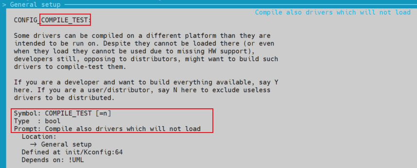

# Kconfig 语法和结构介绍

Kconfig就是对应着内核的配置菜单。如果要想添加新的驱动到内核的源码中，可以修改Kconfig,这样就可以选择这个驱动，如果想使这个驱动被编译，要修改Makefile。

Kconfig的语法在 [Kconfig-language](https://www.kernel.org/doc/Documentation/kbuild/kconfig-language.txt) 中做了详细的说明

## 内核中的 Kconfig 结构介绍

1. 内核源码的顶层 linux-4.20.17/Kconfig 文件

    ```bash
    # SPDX-License-Identifier: GPL-2.0
    #
    # For a description of the syntax of this configuration file,
    # see Documentation/kbuild/kconfig-language.txt.
    #
    mainmenu "Linux/$(ARCH) $(KERNELVERSION) Kernel Configuration"

    comment "Compiler: $(CC_VERSION_TEXT)"

    source "scripts/Kconfig.include"

    source "init/Kconfig"

    source "kernel/Kconfig.freezer"

    source "fs/Kconfig.binfmt"

    source "mm/Kconfig"

    source "net/Kconfig"

    source "drivers/Kconfig"

    source "fs/Kconfig"

    source "security/Kconfig"

    source "crypto/Kconfig"

    source "lib/Kconfig"

    source "lib/Kconfig.debug"
    ```

    menuconfig 顶层菜单：

    

    可以看出：
    - mainmenu 对应标题 1；
    - comment 对应标题 2；
    - source 对应目录下的次级 Kconfig 文件。

2. 

## Kconfig 语法条目

### config 条目

表示一个配置选项的开始，后面接该配置选项包含的内容；除变量类型，其他词条为可选。
下面为常用词条的一般设置顺序。

`menuconfig` 形式有：
- `()  Local version - append to kernel release`
- `[ ] Automatically append version information to the version string`
- `[*] Support for paging of anonymous memory (swap)`
- `[M] Automatically append version information to the version string`

`Kconfig` 格式为：
```bash
config COMPILE_TEST
	bool "Compile also drivers which will not load"
	depends on !UML
	default n
    # select ${CONFIG_XXX}
	help
	  Some drivers can be compiled on a different platform than they are
	  intended to be run on. Despite they cannot be loaded there (or even
	  when they load they cannot be used due to missing HW support),
	  developers still, opposing to distributors, might want to build such
	  drivers to compile-test them.

	  If you are a developer and want to build everything available, say Y
	  here. If you are a user/distributor, say N here to exclude useless
	  drivers to be distributed.
```




1. `config` : 表示一个配置选项的开始，后面接配置选项标签 Symbol；

2. `bool/tristate/string/hex/int` : 指示变量类型，即 Type ，后面接提示符 Prompt，即 `make menuconfig` 时展示的选项名称：
    - `bool`: 布尔变量，可选值为： y和n；
    - `tristate`: 三态变量，可选值为：y、n和m；
    - `string`: 字符串变量，值为： 字符串；
    - `hex` ：十六进制数据，取值为 0x 开头的十六进制数据；
    - `int` ：十进制数据，取值为十进制数据。

3. `depends on` : 表示依赖关系，后面接依赖的xxxx配置选项。一般为两种：
    - `depends on COMPILE_TEST` ：表示只有选中 `COMPILE_TEST` 配置时当前选项才有效；如果用 `menuconfig` 则是在选中 `COMPILE_TEST` 对应的配置选项时，当前配置选项才会出现。
    - `depends on !COMPILE_TEST` ：与上述词条选项相反，不配置该配置选项时，当前选项出现。
    - 特殊词条：
        - `depends on !UML` ：该词条出现在 `linux-4.20.17/arch/um/Kconfig` 中；

4. `select` ：是反向依赖关系的意思，即当前配置选项被选中，则xxxx就会被选中。

5. `default` ：配置选项的默认值：
    - 一般设置 bool/tristate 变量的默认值为 y/n/m；
    - int 可以为默认数字

5. `help` ：它其中的文字将作为配置界面中的帮助信息；

### menu/endmenu 条目
menu条目用于生成菜单，在 menuconfig 中的形式为：

- `General setup  --->`

其 Kconfig 格式如下：
```bash
menu "General setup"

config `config_1`
...
source "kernel/irq/Kconfig"
...
config `config_n`

endmenu

```

### choice 条目
与menu条目不同，choice条目是将多个 config 选项组合在一起，供用户单选或多选。

`menuconfig` 形式如下：
- Compiler optimization level (Optimize for performance)  ---> 
    - (X) Optimize for performance
    - ( ) Optimize for size

    

`Kconfig` 格式如下：
```bash
choice
	prompt "Compiler optimization level"
	default CC_OPTIMIZE_FOR_PERFORMANCE

config CC_OPTIMIZE_FOR_PERFORMANCE
	bool "Optimize for performance"
	help
	  This is the default optimization level for the kernel, building
	  with the "-O2" compiler flag for best performance and most
	  helpful compile-time warnings.

config CC_OPTIMIZE_FOR_SIZE
	bool "Optimize for size"
	help
	  Enabling this option will pass "-Os" instead of "-O2" to
	  your compiler resulting in a smaller kernel.

	  If unsure, say N.

endchoice
```

### comment 条目
标记注释或提示内容，主要形式为：
- `*** Compiler: gcc (Ubuntu 7.5.0-3ubuntu1~18.04) 7.5.0 ***`

在 Kconfig 中的内容为：
```bash
comment "Compiler: $(CC_VERSION_TEXT)"
```

### source 条目
用于读取另一个Kconfig文件。
```bash
# SPDX-License-Identifier: GPL-2.0
#
# For a description of the syntax of this configuration file,
# see Documentation/kbuild/kconfig-language.txt.
#
mainmenu "Linux/$(ARCH) $(KERNELVERSION) Kernel Configuration"

comment "Compiler: $(CC_VERSION_TEXT)"

source "scripts/Kconfig.include"

source "init/Kconfig"

source "kernel/Kconfig.freezer"

source "fs/Kconfig.binfmt"

source "mm/Kconfig"

source "net/Kconfig"

source "drivers/Kconfig"

source "fs/Kconfig"

source "security/Kconfig"

source "crypto/Kconfig"

source "lib/Kconfig"

source "lib/Kconfig.debug"
```

### menuconfig 条目
menuconfig XXX 和 config XXX 类似， 唯一不同的是该选项除了能设置y/m/n外，还可以实现菜单效果(能回车进入该项内部)。


menuconfig 常用格式有2种：
```bash
menuconfig M
if M
    config C1
    config C2
endif
```
或者
```bash
menuconfig M
config C1
    depends on M
config C2
    depends on M
```
第1项 menuconfig M 跟 config M 语法是一样的， 不同之处在于 menuocnfig M 后面可以跟着好几个依赖于 M 的 config C1 、config C2 等子配置项。

