# Power_ePAPR_APPROVED_v1.1.pdf 文档中文翻译

参考文档：
1. https://elinux.org/images/c/cf/Power_ePAPR_APPROVED_v1.1.pdf
2. https://elinux.org/Device_Tree_Usage

CSDN中文翻译地址：
https://blog.csdn.net/OnlyLove_/article/details/121962246

# 1. 设备树术语定义
- `AMP`. 非对称多处理。一种计算机架构，其中两个或更多个CPU执行不同的任务。通常情况下，AMP系统在不同的CPU上执行不同的操作系统映像。
- `boot CPU`. 引导程序指向客户程序入口点的第一个CPU。
- `Book III-E`. 嵌入式环境。Power ISA的一部分，定义了在嵌入式Power处理器实现中使用的监管指令和相关设施。
- `boot program`. 用于泛指初始化系统状态并执行另一个被称为客户程序的软件组件的软件组件。引导程序的示例包括：固件、引导加载程序和虚拟化程序。客户程序的示例包括：引导加载程序、虚拟化程序、操作系统和特定目的程序。
- `client program`. 通常包含应用程序或操作系统软件的程序。
- `cell`. 由32位组成的信息单元。
- `DMA`. 直接内存访问。
- `DTB`. 设备树二进制块。设备树的紧凑二进制表示。
- `DTC`. 设备树编译器。用于从DTS文件创建DTB文件的开源工具。
- `DTS`. 设备树语法。设备树的文本表示，由DTC解析。参见附录A 设备树源格式（版本1）。
- `effective address`. 处理器存储访问或分支指令计算得出的内存地址。
- `physical address`. 处理器用于访问外部设备（通常是内存控制器）的地址。Power ISA在提到物理地址时使用真实地址。
- `Power ISA`. Power指令集架构。
- `interrupt specifier`. 描述中断的属性值。通常包含指定中断号、灵敏度和触发机制的信息。
- `secondary CPU`. 除引导CPU外，属于客户程序的其他CPU被视为次要CPU。
- `SMP`. 对称多处理。一种计算机架构，其中两个或更多个相同的CPU可以执行相同的任务。通常情况下，SMP系统执行单个操作系统映像。
- `SOC`. 系统芯片。一个单一的计算机芯片，集成了一个或多个CPU核心以及其他外设。
- `unit address`. 节点名称中指定节点在父节点地址空间中的地址部分。
- `quiescent CPU`. 静止CPU处于一种状态，不能干扰其他CPU的正常运行，其他正在运行的CPU的状态也不能影响它，除非通过显式方法启用或重新启用静止CPU。

# 2. 设备树
## 2.1 总览
设备树是一种树状数据结构，其中的节点用来描述系统中的设备。每个节点都有属性值对，用于描述所代表的设备的特征。除了没有父节点的根节点，每个节点都有一个父节点。

符合ePAPR标准的设备树描述了系统中的设备信息，这些信息不能通过客户端程序动态检测到。例如，PCI的架构使客户端能够探测和检测附加的设备，因此可能不需要描述PCI设备的设备树节点。然而，如果PCI主机桥设备在系统中无法通过探测检测到，就需要一个设备节点来描述它。

例如：下图展示了一个简单设备树的示例，几乎足以启动简单操作系统，其中描述了平台类型、CPU和内存。设备节点旁边显示了属性和值。
    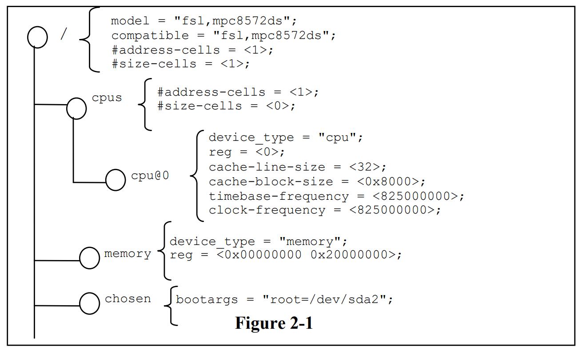

## 2.2 设备树机构和约定
### 2.2.1 Node Names 节点名称
#### 2.2.1.1 Node Name Requirements 节点名称要求
根据以下惯例命名设备树中的每个节点：
```dts
node-name@unit-address
```
node-name 组件指定节点的名称。长度为**1 ~ 31个字符**，且仅由表2-1中的字符集中的字符组成。
    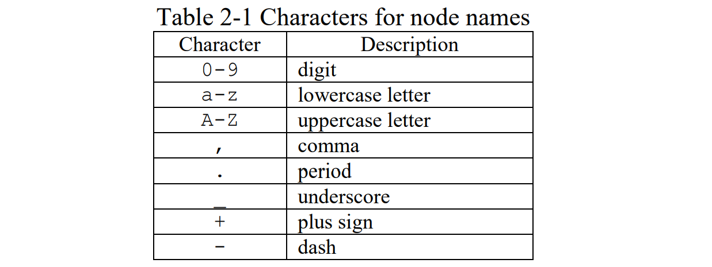

节点名应以小写或大写字母开头，并应描述设备的一般类别。

名称的单元地址组件特定于节点所在的总线类型。它由表 2-1 中的一个或多个ASCII字符组成。单元地址必须匹配节点的 reg 属性中指定的第一个地址。如果节点没有 reg 属性，则必须省略 @ 和单元地址，仅使用节点名将节点与树中同一级别的其他节点区分开来。绑定一个特定的总线可能指定额外的，更具体的 reg 格式和单元地址的要求。

根节点没有节点名或单元地址。它由一个正斜杠( / )标识。

例如：
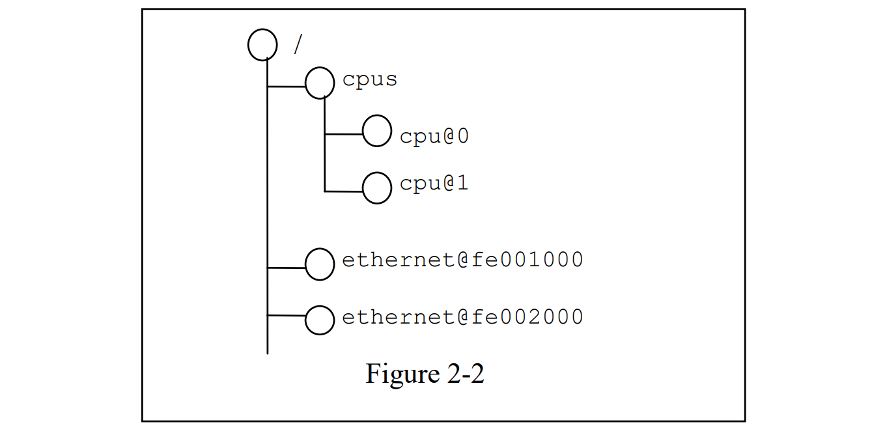

在示例中：
- 名称为 cpu 的节点通过其单元地址值 0 和 1 来区分。
- 名称为 ethernet 的节点通过其单元地址值 FE001000 和 FE002000 来区分。

### 2.2.2 Generic Names Recommendation 通用名称建议
节点的名称应该是通用的，反映设备的功能，而不是其精确的编程模型。如果合适，该名称应该是以下选项之一：
- atm
- cache-controller
- compact-flash
- can
- cpu
- crypto
- disk
- display
- dma-controller
- ethernet
- ethernet-phy
- fdc
- flash
- gpio
- i2c
- ide
- interrupt-controller
- isa
- keyboard
- mdio
- memory
- memory-controller
- mouse
- nvram
- parallel
- pc-card
- pci
- pcie
- rtc
- sata
- scsi
- serial
- sound
- spi
- timer
- usb
- vme
- watchdog

### 2.2.3 Path Names 路径名
设备树中的一个节点可以通过指定从根节点到所有后代节点到所需节点的完整路径来唯一标识。

指定设备路径的约定为：
```dts
/node-name-1/node-name-2/node-name-N
```

例如，在图 2-2 中，设备到 cpu #1 的路径是：
```dts
/cpus/cpu@1
```

根节点的路径为 / 。

如果到节点的完整路径是明确的，则单元地址可以省略。

如果客户机程序遇到一个模糊路径，它的行为是未定义的。

### 2.2.4 Properties 属性
设备树中的每个节点都有描述该节点特征的属性。属性由名称和值组成。

#### 2.2.4.1 Property Names 属性名称
属性名由以下字符组成，长度范围是 1 ~ 31 个字符。
    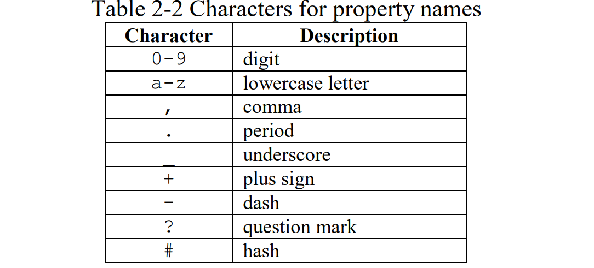

非标准属性名应该指定唯一的字符串前缀，例如股票代号，标识定义该属性的公司或组织的名称。例子：
```dts
fsl,channel-fifo-len
ibm,ppc-interrupt-server#s
linux,network-index
```

#### 2.2.4.2 Property Values 属性值
属性值是一个包含 0 个或多个字节的数组，其中包含与属性相关的信息。

属性在传递真假信息时可能为空值。在这种情况下，属性的存在或不存在是充分描述性的。

ePAPR 定义的基本值类型如表2-3所示。
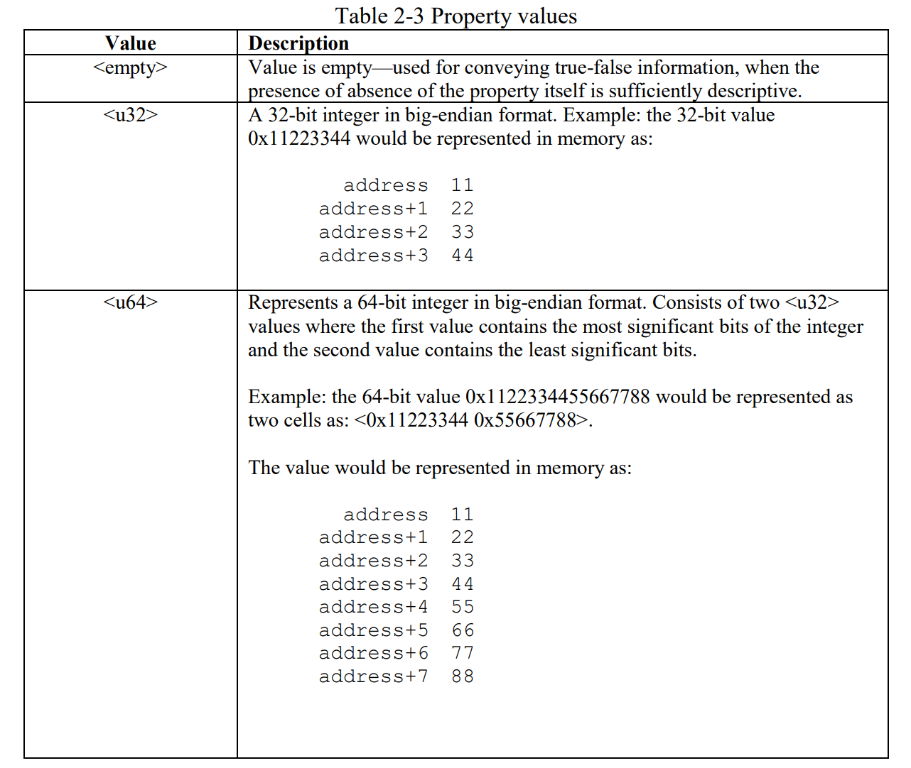
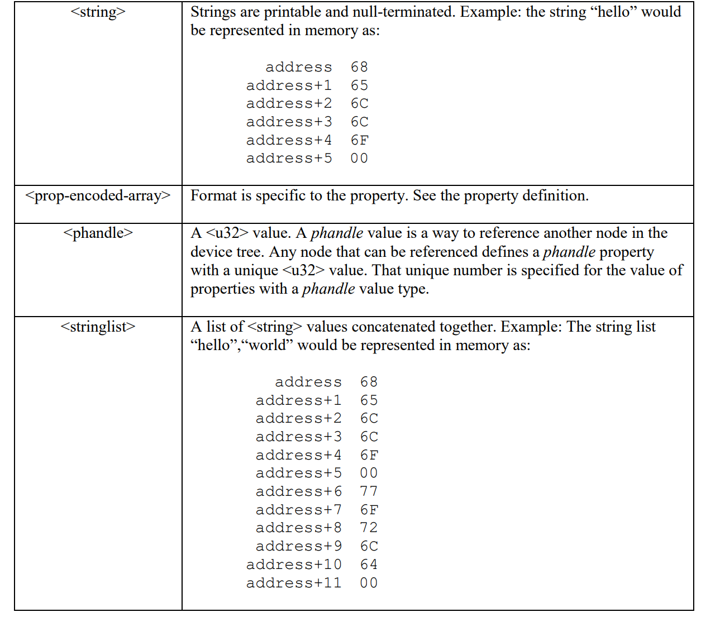

## 2.3 Standard Properties 标准属性
ePAPR 为设备节点指定一组标准属性。本节将详细描述这些属性。ePAPR 定义的设备节点(参见第 3 章设备节点要求)可能指定关于使用标准属性的额外要求或约束。描述特定设备表示的设备绑定(第 6 章)也可能指定额外的要求。

注意：本文档中所有的设备树节点示例都使用设备树源(DTS)格式来指定节点和属性。

### 2.3.1 compatible 
```property
属性: compatible
属性值的类型: <stringlist>
描述:
    compatible属性值由一个或多个字符串组成，这些字符串定义了设备的特定编程模型。
    客户端程序应该使用这个字符串列表来选择设备驱动程序。
    属性值由一组以空结尾的串接字符串组成，从最特定的到最一般的。
    它们允许设备表达其与一系列类似设备的兼容性，可能允许单个设备驱动程序与多个设备匹配。

    推荐的格式是 “manufacturer,model”,
    manufacturer 是描述制造商名称的字符串（如股票代码），
    model 指定型号。

示例:
    compatible = “fsl,mpc8641-uart”, “ns16550";

    在这个例子中，操作系统首先尝试定位支持 fsl 的设备驱动程序 mpc8641-uart 。
    如果没有找到驱动程序，那么它将尝试定位支持更通用的 ns16550 设备类型的驱动程序。
```

### 2.3.2 model 
```property
属性: model
属性值的类型: <string>
描述:
    model 属性值是一个字符串，用于指定设备的制造商型号号码。

    推荐的格式是 “manufacturer,model”,
    manufacturer 是描述制造商名称的字符串（如股票代码），
    model 属性值被需要引用与属性相关联的节点的其他节点使用。

示例:
    model = “fsl,MPC8349EMITX”;
```

### 2.3.3 phandle
```property
属性: phandle
属性值的类型: <u32>
描述:
    phandle 属性为节点指定一个在设备树中唯一的数字标识符。
    phandle 属性值由需要引用与该属性关联的节点的其他节点使用。

示例:
    参见以下设备树摘录:

        pic@10000000 {
            phandle = <1>;
            interrupt-controller;
        };

    定义了一个phandle值 1 。另一个设备节点可以使用 phandle 值1引用 pic 节点：

        interrupt-parent = <1>;
```
**兼容性说明：**  
较老的设备树版本可能包含一个已经被废弃的 linux,phandle 属性形式。为了兼容性，如果 phandle 属性不存在，客户端程序可能需要支持 linux,phandle。这两个属性的含义和使用完全相同。

**编程说明：**
大多数设备树语法（Device Tree Syntax，DTS）中的设备树（见附录A）不会包含显式的句柄属性。DTS 编译为二进制 DTB 格式时，DTC 工具会自动插入句柄属性。

### 2.3.4 status
```property
属性: status 
属性值的类型: <string>
描述:
    status 属性表示设备的操作状态。有效值在下表中列出：
```
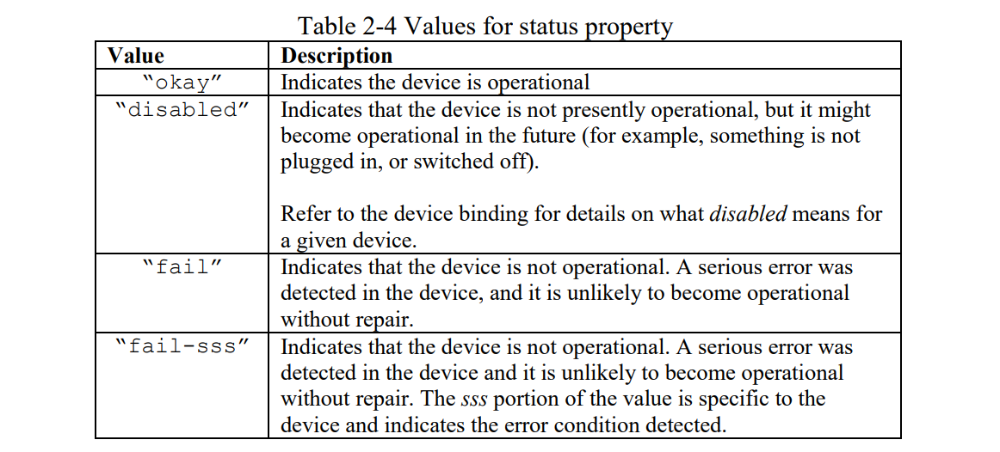

### 2.3.5 #address-cells and #size-cells
```property
属性: #address-cells, #size-cells 
属性值的类型: <u32>
描述:
    #address-cells 和 #size-cells 属性可以用于在设备树层次结构中有子设备的任何设备节点，并描述如何寻址子设备节点。
    #address-cells属性定义了用于在一个子节点的 reg 属性中编码地址字段的u32个单元的数量。
    #size-cells属性定义了用于在子节点的 reg 属性中编码 size 字段的u32个单元格的数量。
    
    #address-cells和#size-cells属性不会从设备树中的祖先继承。它们应明确界定。

    一个符合epapr的引导程序应该在所有有子节点的节点上提供#address-cells和#size-cells。

    如果缺失，客户端程序应该假定#address-cells的默认值为2，#size-cells的默认值为1。

示例：
    如图2-3所示。
```
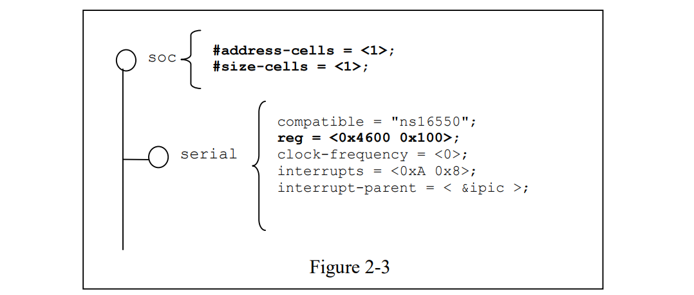
在图2-3中，soc节点的#address-cells和#size-cells属性都设置为1。此设置指定需要一个单元来表示地址，需要一个单元来表示此节点的子节点的大小。

串行设备的reg属性必须遵循父(soc)节点中的这个规范集，地址由单个单元表示(0x4600)，大小由单个单元表示(0x100)。

### 2.3.6 reg
```property
属性: reg
属性值的类型: <prop-encoded-array> 编码为任意数量的（地址，长度）对。
描述:
reg 属性描述由其父总线定义的地址空间内设备资源的地址。
最常见的是，这意味着内存映射IO寄存器块的偏移量和长度，但在某些总线类型
上可能有不同的含义。根节点定义的地址空间中的地址为cpu实地址。

    该值是一个<prop-encoded-array>，由任意数量的地址和长度对<address length>组成。指定地址和长度所需的<u32>个数取决于总线类型，并由设备节点父节点中的 #address-cells 和 #size-cells 属性指定。如果父节点为#size-cells指定为0，则在reg的值中省略长度字段。

示例：
    假设系统芯片中的一种设备有两个块寄存器——一个位于SOC偏移地址0x3000的32字节块，另一个位于SOC偏移地址0xFE00的256字节块。如果假定#address-cells和#size-cells值均为1，则reg属性将被编码如下：
        reg = <0x3000 0x20 0xFE00 0x100>;
```

### 2.3.7 virtual-reg
```property
属性: virtual-reg
属性值的类型: <u32>
描述:
    虚拟寄存器属性指定了一个有效地址，将映射到设备节点的 reg 属性中指定的第一个物理地址。该属性使得引导程序能够为客户程序提供已设置好的虚拟到物理地址映射。
```

### 2.3.8 ranges
```property
属性: ranges
属性值的类型: <empty> 或 <prop-encoded-array> 被编码为任意数量的三元组(child-bus5地址, parent-bus地址, 长度)。
描述:
    ranges 属性提供了一种定义总线地址空间（子地址空间）与总线节点父节点地址空间（父地址空间）之间映射或转换的方式。

    ranges属性的值格式为任意数量的三元组（子总线12位地址，父总线地址，长度）

    • child-bus-address 是子总线地址空间中的物理地址。表示地址的单元格数与总线相关，可以从此节点（显示 ranges 属性的节点）的 #address 单元确定。

    • parent-bus-address 是父总线地址空间中的物理地址。表示父地址的单元数与总线相关，可以通过定义父地址空间的节点的 #address-cells 属性来确定。

    如果使用<empty>值定义该属性，则它指定父地址空间和子地址空间相同，并且不需要地址转换。

    如果总线节点中不存在该属性，则假定该节点的子节点与父地址空间之间不存在映射。

See the example in Figure 2-4
```
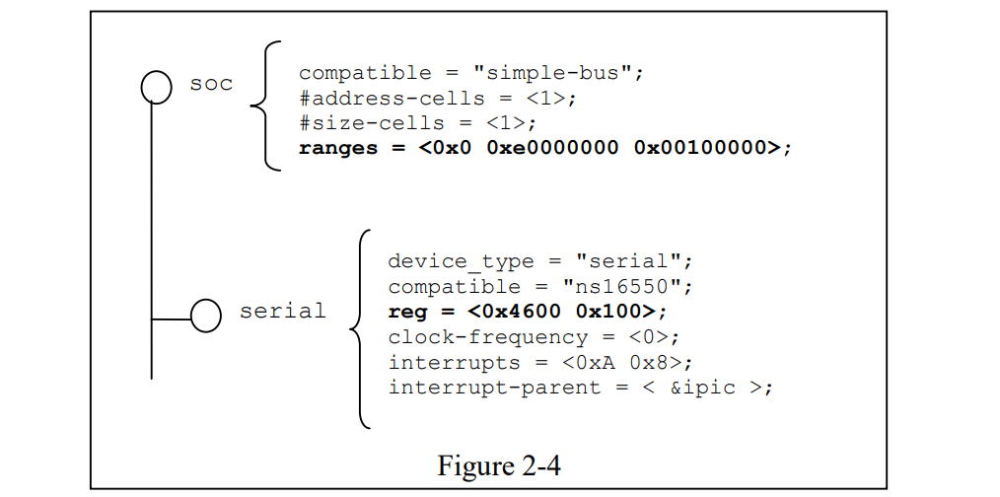
Figure 2-4 中, soc 节点指定了一个 ranges 属性

    <0x0 0xe0000000 0x00100000>;

此属性值指定对于 1024KB 范围的地址空间，在物理0x0寻址的子节点映射到物理0xe0000000的父地址。通过此映射，串行设备节点可以通过加载地址或存储地址进行寻址 0xe0004600，偏移量为 0x4600（在 reg 中指定）加上 range 中指定的0xe0000000映射。


### 2.3.9 dma-ranges
```property
属性: dma-ranges
属性值的类型: <empty> or <prop-encoded-array> 编码为任意数量的三元组（child-bus-address、parent-bus-address、length）。
描述:
    dma-ranges 属性用于描述内存映射总线的直接内存访问 （DMA） 结构，其设备树父级可以从源自总线的 DMA 操作进行访问。它提供了一种定义总线的物理地址空间和父总线的物理地址空间之间的映射或转换的方法。

    dma-ranges 属性值的格式是任意数量的三元组（child-bus-address、parent-bus-address、length）。指定的每个三元组都描述了一个连续的 DMA 地址范围。

    • child-bus-address 是子总线地址空间中的物理地址。表示地址的单元数取决于总线，可以从此节点（显示 dma-ranges 属性的节点）的 #address 单元确定。

    • parent-bus-address 是父总线地址空间中的物理地址。表示父地址的单元数与总线相关，可以通过定义父地址空间的节点的 #address-cells 属性来确定。

    • 长度指定子地址空间中范围的大小。表示大小的单元格数可以从此节点（显示 dma-ranges 属性的节点）的 #size 单元格中确定。
```

### 2.3.10 name （Compatibility Note）
```property
属性: name
属性值的类型: <string>
描述:
    name 属性是指定节点名称的字符串。此属性已弃用，并且不建议使用它。但是，它可能用于较旧的不符合 ePAPR 的设备树。
    
    操作系统应根据节点名称的名称部分确定节点的名称（请参阅第 2.2.1 节）。
```

### 2.3.11 device_type
```property
属性: device_type
属性值的类型: <string>
描述:
    IEEE 1275 中使用 device_type 属性来描述设备的 FCode 编程模型。由于 ePAPR 没有 FCode，因此不推荐使用该属性，并且应仅将其包含在 cpu 和内存节点上，以便与IEEE 1275 派生的设备树。
```


## 2.4 Interrupts and Interrupt Mapping 中断和中断映射
ePAPR采用开放固件中指定的表示中断的中断树模型推荐做法：中断映射，版本 0.9 [7]。在设备树中，存在一个逻辑中断树，它表示平台硬件中中断的层次结构和路由。虽然通常称为中断树，但从技术上讲，它是有向无环图。

中断源到中断控制器的物理接线在设备树中用中断父属性表示。表示中断生成设备的节点包含一个中断父属性，该属性具有指向设备中断路由到的设备（通常是中断控制器）的 phandle 值。如果中断生成设备没有中断父属性，则假定其中断父设备是其设备树父设备。

每个中断生成设备都包含一个中断属性，该属性具有描述该设备的一个或多个中断源的值 - 每个源都用称为中断说明符的信息表示。中断说明符的格式和含义是中断域特定的，即，它取决于其中断域根节点的属性。 #interrupt-cells 属性由中断域的根使用来定义单元的数量。编码中断说明符所需的值。例如，对于 Open PIC 中断控制器，中断说明符需要两个
32 位值，由中断号和中断的级别/感应信息组成。

中断域是解释中断说明符的上下文。域的根是 (1) 中断控制器或 (2) 中断关系。

1. 中断控制器是物理设备，需要一个驱动程序来处理通过它路由的中断。它还可能级联到另一个中断域。中断控制器由设备树中该节点上是否存在中断控制器属性来指定。
2. 中断关系定义一个中断域与另一个中断域之间的转换。该转换基于特定于域和特定于总线的信息。域之间的转换是通过中断映射属性来执行的。例如，PCI 控制器设备节点可以是一个中断连接，它定义从 PCI 中断命名空间（INTA、INTB 等）到具有中断请求 (IRQ) 的中断控制器的转换。
数字。

当中断树的遍历到达没有中断属性且因此没有显式中断父的中断控制器节点时，确定中断树的根。

请参阅图 2-5，了解显示中断父关系的设备树的图形表示示例。图 2-6 显示了相应的中断树。
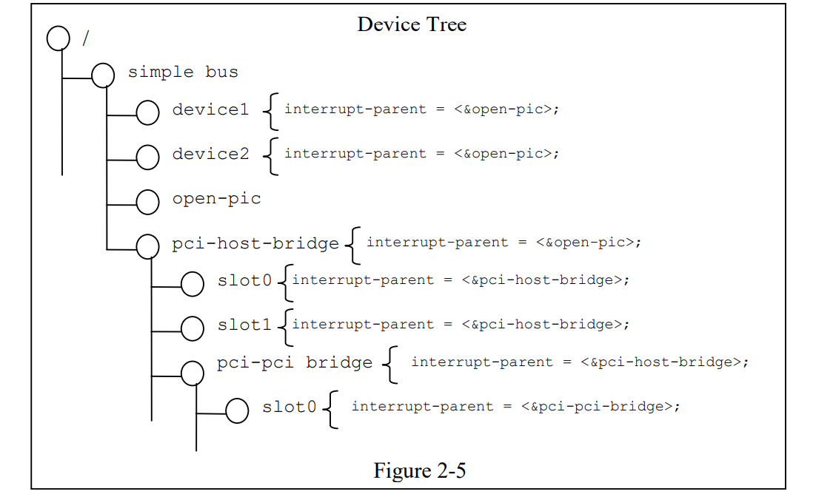
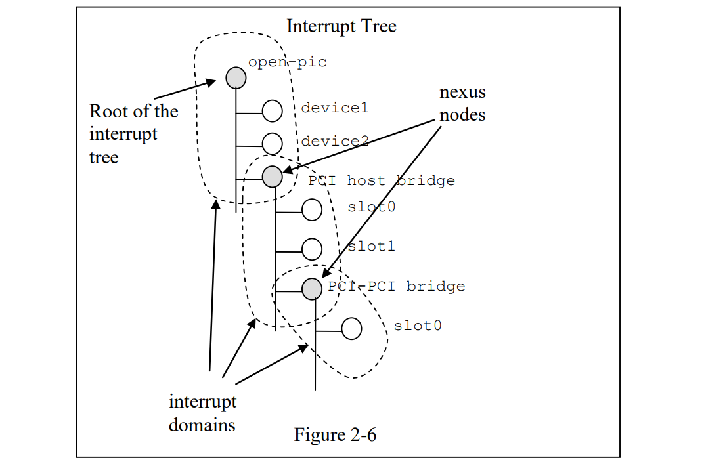

在图 2-5 和图 2-6 所示的示例中：
- open-pic 中断控制器是中断树的根。
- 中断树根有三个子项 — 将其中断直接路由到 open-pic
    - device1 
    - device2 
    - PCI 总线控制器
- 存在三个中断域 — 一个根植于 open-pic 节点，一个植根于 PCI 主机桥接节点，另一个植根于 PCI-PCI 桥接节点。
- 有两个结点节点 — 一个在 PCI 主机桥接器上，一个在 PCI-PCI 桥接器

### 2.4.1 Properties for Interrupt Generating Devices 中断生成设备的属性
#### 2.4.1.1 interrupts
```property
属性: interrupts
属性值的类型: <prop-encoded-array> 编码为任意数量的中断说明符
描述:
    设备节点的 interrupts 属性定义设备生成的一个或多个中断。interrupts 属性的值由任意数量的中断说明符组成。中断说明符的格式由中断域根的绑定定义。

示例：
    在与 PIC 兼容的开放中断域中，中断说明符的常见定义由两个单元组成：中断编号和电平/检测信息。请参阅以下示例，该示例定义了一个中断说明符，中断数为 0xA，电平/检测编码为 8。

        interrupts = <0xA 8>;
```

#### 2.4.1.2 interrupt-parent
```property
属性: interrupt-parent
属性值的类型: <phandle>
描述:
    由于中断树中节点的层次结构可能与设备树不匹配，因此可以使用中断父属性来明确定义中断父项。
    该值是中断父级的 phandle。如果设备中缺少此属性，则假定其中断父级是其设备树父级。
```

### 2.4.2 Properties for Interrupt Controllers 中断控制器的属性
#### 2.4.2.1 #interrupt-cells
```property
属性: #interrupt-cells
属性值的类型: <u32>
描述:
    #interrupt-cells 属性定义对中断域的中断说明符进行编码所需的单元数。
```

#### 2.4.2.2 interrupt-controller
```property
属性: interrupt-controller
属性值的类型: <empty>
描述:
    interrupt-controller （中断控制器）属性的存在将节点定义为中断控制器节点。
```

### 2.4.3 Interrupt Nexus Properties 中断 Nexus 属性
#### 2.4.3.1 interrupt-map
```property
属性: interrupt-map
属性值的类型: <prop-encoded-array> 编码为任意数量的中断映射条目。
描述:
    中断映射（interrupt-map）是 nexus 节点上的一个属性，它将一个中断域与一组父中断域
    桥接起来，并指定子域中的中断说明符映射到其各自的父域。

    中断映射是一个表，其中每行是一个映射条目，由五个组件组成：子单元地址、子中断说明符、中断父单元、父单元地址、父中断说明符。

    • child unit address 子单元地址。要映射的子节点的单元地址。指定此值所需的 32 位单元数由子节点所在的总线节点的 #address-cells 属性描述。
    
    • child interrupt specifier 子中断说明符。正在映射的子节点的中断说明符。指定此组件所需的 32 位单元数由此节点的 #interrupt-cells 属性描述，该节点是包含 interrupt-map 属性的 nexus 节点。
    
    • interrupt-parent 中断父 . 指向子域映射到的中断父级的单个 <phandle> 值。

    • parent unit address 父单元地址。 中断父节点域中的单元地址。 指定该地址所需的 32 位单元数量由该节点的 #address4 cells 属性描述,该节点由 interrupt-parent 字段指向。

    • parent interrupt specifier 父中断说明符。父域中的中断说明符。指定此组件所需的 32 位单元格数由此节点的 #interrupt-cells 属性描述 - 包含中断映射属性的连接节点。

    通过将单元地址/中断说明符对与中断映射中的子组件相匹配，在中断映射表上执行查找。由于单元中断说明符中的某些字段可能不相关，因此在查找完成之前会应用掩码。该掩码在中断映射掩码属性中定义（见第2.4.3.2节）。

    注意：子节点和中断父节点都需要定义#地址单元和#中断单元属性。如果不需要单元地址组件，则#地址单元应明确定义为零。
```

#### 2.4.3.2 interrupt-map-mask 
```property
属性: interrupt-map-mask 
属性值的类型:  <prop-encoded-array> 编码为位掩码
描述:
    中断映射掩码属性是为中断树中的nexus节点指定的。此属性指定应用于在中断映射属性中指定的表中查找的传入单元中断说明符的掩码
```

#### 2.4.3.3 #interrupts-cells
```property
属性: #interrupts-cells
属性值的类型: <u32>
描述:
    #interrupt-cells 属性定义对中断域的中断说明符进行编码所需的单元数。
```

### 2.4.4 Interrupt Mapping Example 中断映射举例
图2-7显示了具有PCI总线控制器的设备树片段的表示，以及用于描述两个PCI插槽（IDSEL 0x11,0x12）的中断路由的示例中断映射。插槽1和2的INTA、INTB、INTC和INTD引脚连接到Open PIC中断控制器。

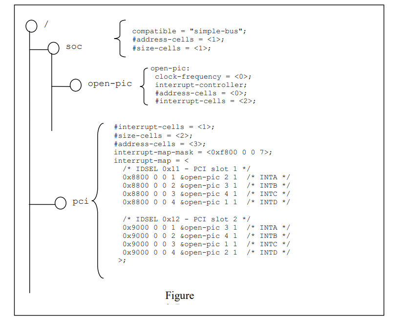

- 表示一个Open PIC中断控制器，并将其标识为具有中断控制器属性的中断控制器;
- 中断映射表中的每一行都由五个部分组成——子单元地址和中断说明符，它被映射到具有指定父单元地址和打断说明符的中断父节点。


