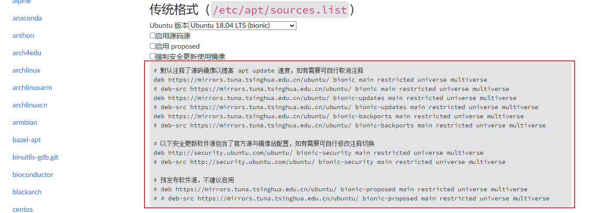

#  apt 指令

apt工具是 Linux发行版 Ubuntu 系统对应的包管理工具，apt 包管理工具包含了如下内容：
- `apt-get` 工具：主要负责软件包的的安装、卸载以及更新等事务。
- `apt-cache` 工具：用于查询软件包的相关信息。
- `apt-config` 工具：用于配置所有 apt 工具。

## 1. `apt` 常用命令
### 1.1. `apt-get` 安装与删除软件包
|序号|命令格式|功能|
|:-:|:-:|:-:|
|1|apt-get install <package_name>|安装指定的软件包|
|2|apt-get remove <package_name>|删除指定的软件包|
|3|apt-get update|检索新的包列表|
|4|apt-get upgrade <package_name>|执行升级|
|5|apt-get purge <package_name>|删除包和配置文件|
|6|apt-get autoremove|自动删除所有未使用的软件包|
|7|apt-get clean|擦除下载的存档文件|
|8|apt-get check <package_name>|验证没有损坏的依赖项|
|9|apt-get download <package_name>|将二进制包下载到当前目录下|
|10|apt-get autoremove <package_name>|自动删除指定的软件包和依赖|

### 1.2. `apt-cache` 查询软件包信息
|序号|命令格式|功能|
|:-:|:-:|:-:|
|1|apt-cache showsrc <package_name>|显示源记录
|2|apt-cache search <package_name>|在软件包列表中搜索正则表达式模式
|3|apt-cache depends <package_name>|显示包的原始依赖项信息
|4|apt-cache rdepends <package_name>|显示包的反向依赖项信息
|5|apt-cache show <package_name>|显示包的可读记录
|6|apt-cache pkgnames|列出系统中所有软件包的名称
|7|policy <package_name>|显示策略设置

## 2. apt 的软件源修改
### 2.1. apt 源修改
使用apt-get install安装软件时，默认官方的软件仓库都设置在国外，这种情况下经常出现安装更新缓慢甚至下载超时等异常。 实际上，国内有许多第三方软件仓库镜像源，可以从这些国内仓库安装软件工具，加快下载速度。

常用的国内镜像源有：

清华大学镜像源： https://mirrors.tuna.tsinghua.edu.cn

中国科技大学镜像源： https://mirrors.ustc.edu.cn

阿里云镜像源： https://opsx.alibaba.com/mirror

### 2.2. 修改软件源镜像地址
以清华大学镜像站为例：

1. 进入镜像站的帮助页面：https://mirrors.tuna.tsinghua.edu.cn/help/ubuntu/ 

2. 根据 Ubuntu 的系统版本，复制对应的镜像源文件内容：
    

3. 修改 Ubuntu 系统的 `/etc/apt/sources.list`文件，将文件中的所有源镜像地址都替换为新的源镜像地址。
    ```bash
    sudo nano /etc/apt/sources.list
    ```

4. 修改完软件源地址或镜像地址后，需要更新软件源，使修改后的软件源生效。
    ```bash
    sudo apt-get update
    ```
