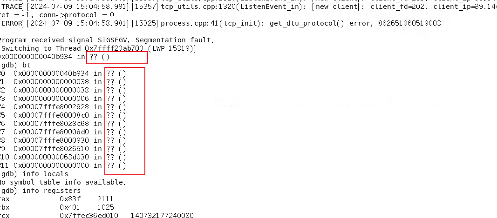
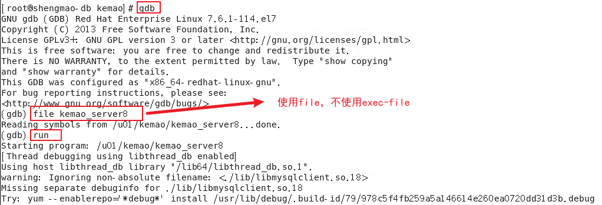
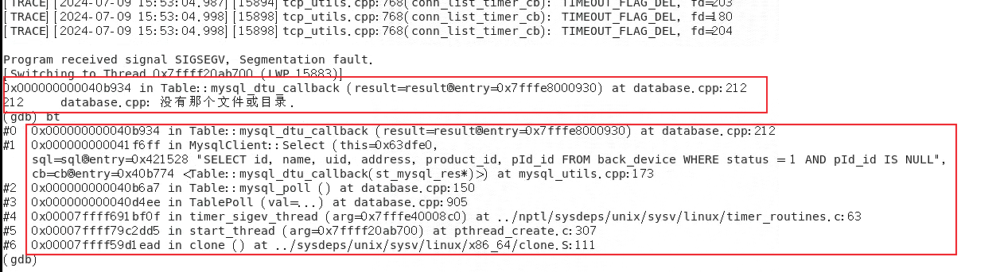

#  GDB 调试工具的使用

GDB（GNU Debugger）是一款强大的开源调试工具，它允许用户在Linux和其他类Unix操作系统上调试程序。GDB可以帮助开发者定位和修复程序中的错误，也可以用来执行程序并监视其执行状态。

## 1. `GBD` 的使用条件
### 1.1. 编译时需要包含调试信息

为了使用GDB进行调试，程序必须在编译时包含调试信息。这通常通过在GCC（GNU编译器集合）中使用-g选项来实现。例如：

```bash
gcc -g -o myprogram mysourcefile.c
```

这将编译 mysourcefile.c 并生成包含调试信息的可执行文件 myprogram .

## 2. GBD 的使用过程
### 2.1. GBD 快速使用寻找段错误
1. 在命令行启动 GDB ，进入 GDB 命令行；
    ```bash
    $ gdb
    ```
2. 将程序添加到 gdb 调试器。
    ```bash
    (gdb) file myprogram
    ```

3. （可选）如果需要，可以指定程序的传递参数；
    ```bash
    (gdb) set args arg1 arg2
    ```
4. （可选）如果需要，可以设置断点；
    ```bash
    (gdb) break main
    (gdb) break function_name
    (gdb) break file_name:line_number
    ```

5. 在 GBD 调试命令窗口运行程序。
    ```bash
    (gdb) run
    # 或
    (gdb) run myprogram
    ```

6. 当程序崩溃时，GDB 会自动停止，并显示错误信息。例如，如果程序崩溃是因为段错误，GDB 会显示错误信息：
7. 使用命令 `quit` 退出 GDB。

### 2.2. 常用调试命令
1. **设置断点**：在GDB中，可以使用break命令来设置断点。例如：
    ```bash
    (gdb) break main
    ```
    这将设置一个断点在main函数的入口处。

2. **单步执行**：在GDB中，可以使用step命令来单步执行程序。例如：
    ```bash
    (gdb) step
    ```
    这将执行下一行代码，并进入函数调用。

3. **查看变量**：在GDB中，可以使用print命令来查看变量的值。例如：
    ```bash
    (gdb) print x
    ```
    这将打印变量x的值。

4. **继续执行**：在GDB中，可以使用continue命令来继续执行程序。例如：
    ```bash
    (gdb) continue
    ```
    这将继续执行程序，直到遇到下一个断点。

5. **查看参数和局部变量**：使用info locals命令查看当前栈帧的局部变量，或者使用print命令查看特定变量的值。
    ```bash
    (gdb) info locals    # 查看局部变量
    (gdb) print myvariable  # 打印特定变量的值
    ```
    如果你想查看函数的参数，你可以直接打印参数名，就像打印局部变量一样。例如，如果函数定义如下：
    ```bash
    void myfunction(int param1, float param2) {
        // ...
    }
    ```
    那么，你可以使用以下命令查看参数值：
    ```bash
    (gdb) print param1
    (gdb) print param2
    ```

6. **查看当前执行的代码**：当程序在断点处停止时，你可以使用list命令查看当前执行行附近的代码。
    ```bash
    (gdb) list
    (gdb) list 25        # 显示第25行附近的代码
    ```

7. **查看调用栈**：如果你想查看调用栈，可以使用backtrace命令。
    ```bash
    (gdb) backtrace # 或者简写为 bt
    ```

8. **查看错误信息**：如果程序因为错误而停止（例如，段错误或总线错误），GDB通常会显示错误信息和停止的位置。你可以使用info命令来获取更多关于错误的详细信息。
    ```bash
    (gdb) info signal
    ```


## 3. 常见的 GBD 使用错误
### 3.1. GBD 段错误不显示函数名（？？）
在使用 GBD 调试段错误时，可能存在不显示错误函数，只显示内存地址的情况：



这种情况通常是由于编译时没有包含调试信息，或者编译器优化了代码导致的。可以通过在编译时添加-g选项来包含调试信息，并使用-O0选项来关闭优化。例如：

```bash
gcc -g -O0 -o myprogram mysourcefile.c
```

这将编译 mysourcefile.c 并生成包含调试信息和关闭优化的可执行文件 myprogram 。

如果仍然无法显示函数名，可能是启动 GDB 调试器的过程出现问题，可以参照以下方式重新启动：



可以看到能正常显示函数名和错误了：

