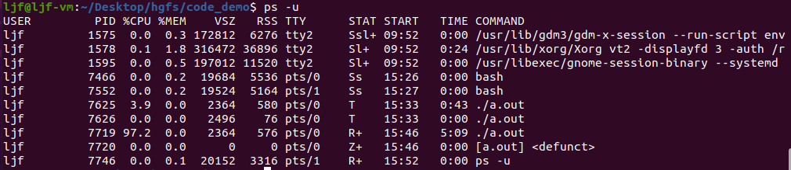

#  ps指令 #

ps指令是process status的缩写。它用于列出当前系统中正在运行的进程信息，包括进程ID、进程状态、占用CPU和内存等资源的情况等。

## 可选选项 ##

- -a：显示所有用户的进程。
- -u：以用户为基础显示进程详细信息。
- -x：显示没有控制终端的进程信息。
- -e：显示所有进程信息。
- -f：用完整的格式来显示进程信息（full-format）。
- -l：用长格式显示进程信息，包括占用系统资源的情况（long-format）。
- --sort：按照指定的字段进行排序，默认是PID（process ID）。
- -r：按照CPU使用率来排序进程信息。
- -o：只显示指定字段，比如PID、COMMAND等。

## 命令使用示例 ##

其中每一列的含义分别为:

- PID：进程的ID（Process ID）。
- TTY：与进程关联的终端设备（Teletype）。
- TIME：进程占用CPU的时间（CPU time）。
- CMD/COMMAND：启动该进程的命令行（Command），显示进程的名称和启动参数。

有时候，ps命令展示出来的列也可能会包括其他信息，例如：

- USER：进程所属用户的用户名。
- %CPU：进程使用CPU的百分比。
- %MEM：进程使用内存的百分比。
- VSZ：进程使用的虚拟内存（Virtual Memory）大小。
- RSS：进程占用的实际内存（Resident Set Size）大小。
- STAT/STATE：表示进程状态（状态后面有+号表示前台进程）。在不同的操作系统中，这个列名可能会有所不同。

### STAT列详情 ###

ps命令展示出的STATE列中，常见的状态和含义如下（注意：这些状态可能会有一些平台-specific 的不同）：

- R：运行中 (Running)
- S：休眠中(Sleeping)
- D：不可中断(uninterruptible sleep)
- T：已停止(stopped)
- Z：僵尸状态(zombie)

**在ps命令展示出的STATE列中，状态后面如果带有"+"符号，表示该进程是前台进程（Foreground Process）或者正在运行的进程组的领头进程（Lead process in a process group）。**