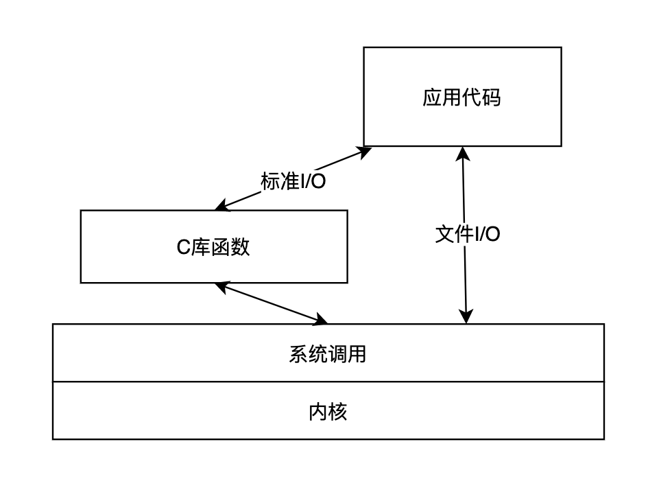

# LINUX 文件IO与标准IO区别

文件IO函数可以理解为两个缓存区：用户缓存区、内核缓存区；  
标准IO函数可以理解为三个缓存区：用户缓存区、C库函数缓存区、内核缓存区；

两者都需要使用系统调用函数来操作内核，文件IO的操作明显会更快，但是标准IO使用更简单。



1. 标准I/O函数接口在对文件进行操作时，首先操作C库函数缓存区，等待C库函数IO缓存区满足一定的条件时，然后再去执行系统调用，真正实现对文件的操作，而文件I/O不操作任何缓存区，直接执行系统调用。

2. 使用标准I/O可以减少系统调用的次数，提高系统效率。例如，将数据写入文件中，每次写入一个字符。采用文件I/O的函数接口，每调用一次函数写入字符就会产生一次系统调用；而执行系统调用时，Linux必须从用户态切换到内核态，处理相应的请求，然后再返回到用户态，如果频繁地执行系统调用会增加系统的开销。

3. 采用标准I/O的函数接口，每调用一次函数写入字符，并不着急将字符写入文件，而是放到缓存区保存，之后每一次写入字符都放到缓存区保存。直到缓存区满足刷新的条件（如写满）时，再一并将缓存区中的数据写入文件，执行一次系统调用完成此过程，这样便很大程度地减少了系统的调用次数，提高了执行效率。

## 读写函数分类

1. **行缓存**：遇到新行符 `'\n'` 或写满缓存时，即调用系统调用函数

    读：fgets、gets、printf、fprintf、sprintf
    写：fputs、puts、scanf

2. **无缓存**：只要用户调用这个函数，就会将其内容写到内核

    读：read
    写：write

3. **全缓存**：只有写满缓存再调用系统调用函数

    读：fread
    写：fwrite

### 行缓存函数的特性

在使用printf函数时，只有出现以下两种情况才会立即输出打印，否则可能会产生阻塞：
- 打印的字符或字符数组中，是以 `'\n'` 结尾的；
- 打印缓存区写满；
- 使用fclose或fflush等刷新缓存的函数，可以直接将C库函数缓存数据刷新，即直接调用系统调用函数。

```c
#include <stdio.h>

int main()
{
    printf("hello world");  /* 不会直接打印hello world，而是进入阻塞状态 */
    // printf("hello world\n");  /* 直接打印hello world */
    while(1);

    return 0;
}

```

产生此现象的原因就是上述区别的第 3 点，缓冲区未满且没出现换行字符时，C库函数并没有将自己缓存区的数据写入到内核缓存区，即未使用系统调用函数。