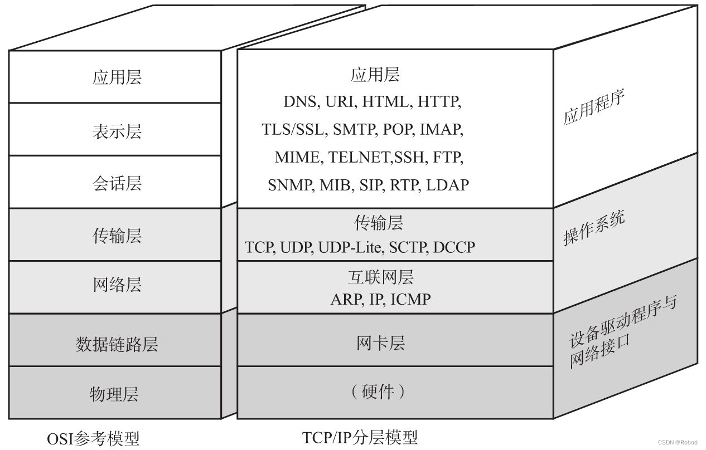
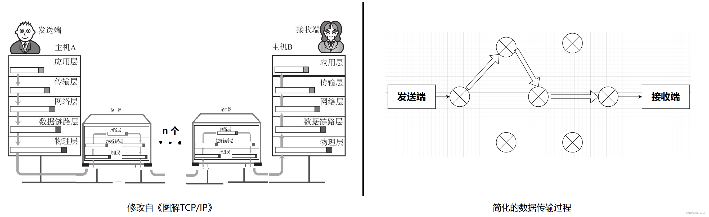

# socket 基本概念

Socket（套接字）是计算机网络编程中的一个抽象概念，它提供了一个端点，使得应用程序可以发送和接收数据。

在Linux和其他类Unix操作系统中，socket 是一种特殊的文件类型，它可以被用来在进程之间、或者通过网络在不同计算机的进程之间进行通信。

- 端点（Endpoint）：每个socket都有一个唯一的地址和端口组合，这使得数据可以准确地发送到目标位置。
- 类型：Socket有多种类型，包括流式socket（TCP）和数据报socket（UDP）等。TCP提供可靠的、面向连接的服务，而UDP提供不可靠的、无连接的服务。
- 协议：Socket可以基于不同的协议，如TCP、UDP、ICMP等。这些协议定义了数据如何在网络上传输。

socket 起源于UNIX，在 Unix 一切皆文件哲学的思想下，socket是一种"打开—读/写—关闭"模式的实现，服务器和客户端各自维护一个"文件"，在建立连接打开后，可以向自己文件写入内容供对方读取或者读取对方内容，通讯结束时关闭文件。

要想解释清楚Socket，首先要知道TCP，要想知道TCP，那就得对TCP/IP的体系结构以及每一层的大概工作有所了解，那么我们就先来说说TCP/IP的分层。

## 1. TCP/IP体系结构

OSI将网络分为七层，自下而上分别是物理层、数据链路层、网络层、传输层、会话层、表示层、应用层，而TCP/IP体系结构则将网络分为四层，自下而上分别是网络接口层、网络层、传输层、应用层。

数据包在网络中的传输过程，再来用物流的例子对照着解释一遍，你就应该能够明白每一层的作用了。

看上面的图，发送端想要发送数据到接收端。首先应用层准备好要发送的数据，然后给了传输层，传输层的主要作用就是为发送端和接收端提供可靠的连接服务，传输层将数据处理完后就给了网络层。网络层的功能就是管理网络，其中一个核心的功能就是路径的选择(路由)，从发送端到接收端有很多条路，网络层就负责管理下一步数据应该到哪个路由器。选择好了路径之后，数据就来到了数据链路层，这一层就是负责将数据从一个路由器送到另一个路由器。然后就是物理层了，可以简单的理解，物理层就是网线一类的最基础的设备。

## 2. TCP 协议

TCP（Transmission Control Protocol，传输控制协议）是一种面向连接的、可靠的、基于字节流的传输层通信协议。

TCP协议的特点：

- 面向连接：TCP协议在数据传输之前需要先建立连接，数据传输完成后需要释放连接。
- 可靠传输：TCP协议提供了可靠的数据传输服务，确保数据按顺序、无差错地传输。
- 流量控制：TCP协议提供了流量控制机制，防止发送端发送数据过快，导致接收端无法处理。
- 拥塞控制：TCP协议提供了拥塞控制机制，防止网络拥塞导致数据传输失败。

TCP协议的工作过程：

- 建立连接：客户端通过三次握手与服务器建立连接。
- 数据传输：客户端和服务器之间进行数据传输，数据按顺序、无差错地传输。
- 断开连接：数据传输完成后，客户端和服务器通过四次挥手断开连接。

## 3. socket API

socket API 是一套用于网络编程的函数，它提供了一组函数，用于创建、配置、管理和关闭socket。

socket API 的主要函数包括：

- socket()：创建一个socket
- bind()：将socket绑定到一个本地地址和端口
- listen()：将socket设置为监听模式，准备接受连接
- accept()：接受一个连接请求
- connect()：发起一个连接请求
- send()：发送数据
- recv()：接收数据
- close()：关闭socket

这些函数可以用于实现各种网络应用程序，包括客户端和服务器。

## 4. socket 类型

socket API 提供了多种类型的socket，包括TCP socket和UDP socket。

- TCP socket：TCP socket提供可靠的、面向连接的通信服务，适用于需要保证数据完整性和顺序的应用程序，如Web浏览器和电子邮件客户端。
- UDP socket：UDP socket提供不可靠的、无连接的通信服务，适用于需要快速传输数据的应用程序，如视频会议和在线游戏。
