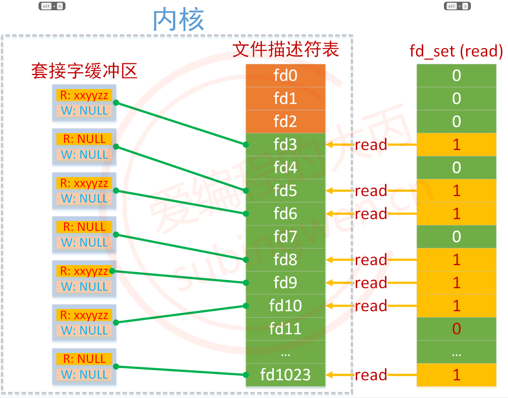
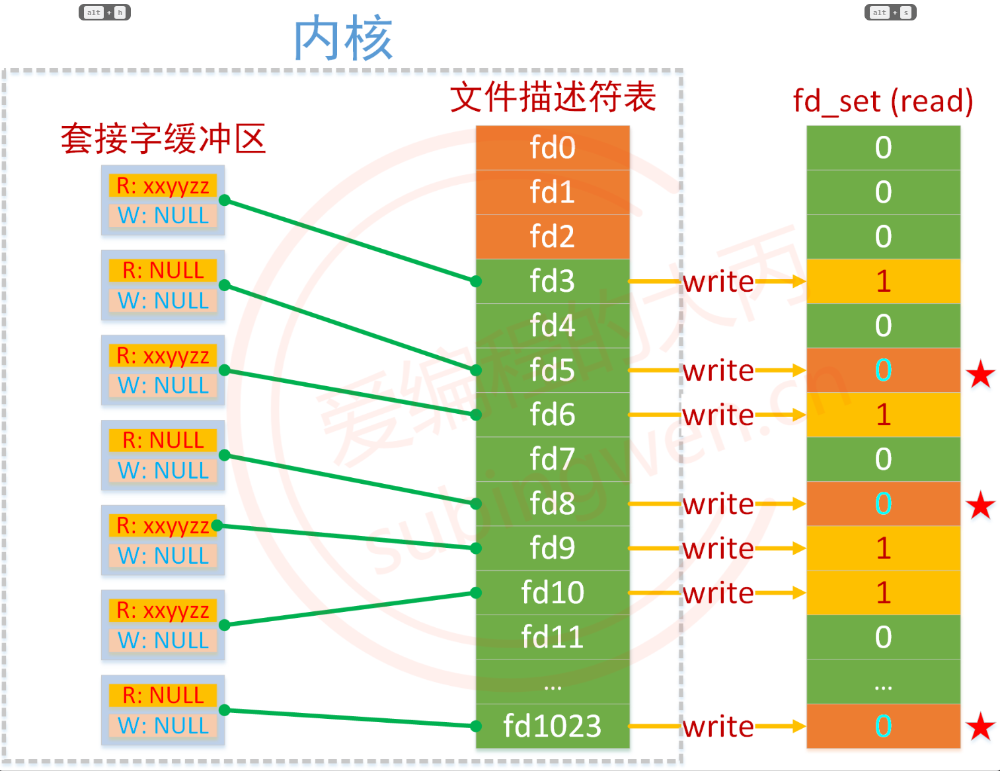

# 使用 select 模型创建一个简单的 TCP 服务端

在Linux系统中，select 是一种用于I/O多路复用的机制，它允许程序监视多个文件描述符，以发现其中的任何一个是否准备好进行I/O操作，如读或写。这种机制是传统的，但在高并发情况下可能不是最高效的选择，因为它有一些限制。以下是 select 的详细介绍：

基本原理：
select 函数允许程序阻塞，直到至少一个文件描述符准备好进行I/O操作。它通过以下步骤工作：
- 程序创建一个或多个文件描述符集合，这些集合包含了要监视的文件描述符。
- 程序调用 select 函数，并将这些集合作为参数传递。
- select 函数阻塞程序，直到其中一个文件描述符准备好进行I/O操作或者发生超时。
- 当 select 返回时，程序检查哪个文件描述符准备好了，并执行相应的I/O操作。

**关键缺点：**
- 使用 bitmap 结构保存文件描述符，其保存文件描述符的数量有 1024 的上限；
- fdset 无法做到复用，每次循环都要重新创建一个 fdset；
- 频繁的用用户态和内核态拷贝，性能开销大；
- 需要对文件描述符进行遍历，时间复杂度为 O(n)；

## 1. select 关键函数介绍
- 实例创建函数: [select() 和 pselect()](#11-select-和-pselect-阻塞函数)
- 文件描述符集合操作函数: [fd_set 的操作](#12-操作-fd_set-的宏)

### 1.1. select() 和 pselect() 阻塞函数
select 函数和 pselect 函数都是用于I/O多路复用的系统调用，允许程序监视多个文件描述符，以发现它们是否准备好进行I/O操作。不过，这两个函数之间存在一些关键的区别。

函数原型：
```c
#include <sys/select.h>

int select(int __nfds, fd_set * __readfds, fd_set * __writefds, fd_set * __exceptfds, struct timeval * __timeout)

int pselect (int __nfds, fd_set * __readfds,
		    fd_set * __writefds,
		    fd_set * __exceptfds,
		    const struct timespec * __timeout,
		    const __sigset_t * __sigmask);

typedef struct fd_set {
    unsigned int fd_count;      // 文件描述符的数量
    int fd_array[FD_SETSIZE];   // 文件描述符数组
} fd_set;
```
- 参数说明：
    - `__nfds` ：要检查的文件描述符集合并包含的最大文件描述符加1。
    - `__readfds`   ：指向 fd_set 结构的指针，文件描述符的集合, 内核只检测这个集合中文件描述符对应的读缓冲区。读集合一般情况下都是需要检测的，这样才知道通过哪个文件描述符接收数据。
    - `__writefds`  ：指向 fd_set 结构的指针，文件描述符的集合, 内核只检测这个集合中文件描述符对应的写缓冲区。如果不需要使用这个参数可以指定为NULL。
    - `__exceptfds` ：指向 fd_set 结构的指针，文件描述符的集合, 内核检测集合中文件描述符是否有异常状态。如果不需要使用这个参数可以指定为NULL。
    - `__timeout` ：指向 timespec 结构的指针，指定应该阻塞的最长时间。
        - NULL：将无限期阻塞，直到至少有一个文件描述符准备好。
        - 不等待：函数不会阻塞，直接将该参数对应的结构体初始化为0即可。
        - 等待固定时长（秒）：函数检测不到就绪的文件描述符，在指定时长之后强制解除阻塞，函数返回0
        - pselect 函数的 timespec 结构包含了秒和纳秒字段，提供了比 select 使用的 timeval 结构更高的时间分辨率。
    - `sigmask` ：指向 sigset_t 结构的指针，指定在 pselect 调用期间应该阻塞的信号集。如果设置为 NULL，则不会阻塞任何信号。

- 返回值：
    - 成功时，返回就绪的文件描述符数量。
    - 如果超时，返回0。
    - 如果发生错误，返回-1，并设置 errno 以指示错误类型。
- 区别：
    - 超时精度：pselect 提供了比 select 更高的超时精度，因为它使用 timespec 而不是 timeval。
    - 信号阻塞：pselect 允许程序在调用期间阻塞特定的信号，而 select 不提供这种功能。这意味着 pselect 可以在不受信号干扰的环境中运行。
    - 返回行为：如果 select 在超时前被信号中断，它将返回 -1 并设置 errno 为 EINTR。而 pselect 由于可以阻塞信号，通常不会因为信号中断而返回 -1。

- 使用场景：
    - pselect 更适合用于需要精确控制超时时间和需要处理信号的复杂应用程序。
    - 如果需要处理信号并且对超时精度有较高要求，pselect 是更好的选择。如果应用程序可以容忍信号中断 select 调用并且不需要高精度超时，那么使用 select 就足够了。
    - pselect 通常用于以下场景：
        - 当程序需要在等待I/O事件的同时处理实时信号时。
        - 当程序需要精确控制阻塞期间哪些信号应该被阻塞或忽略时。

### 1.2. 操作 fd_set 的宏
在Linux系统中，fd_set 是一个用于 select 和 pselect 系统调用的数据结构，它表示一组文件描述符。这四个宏 FD_SET、FD_CLR、FD_ISSET 和 FD_ZERO 是用于操作 fd_set 结构体的宏定义，它们封装了对 fd_set 的操作，使得代码更加简洁易读。

函数原型：
```c
#include <sys/select.h>

/* FD_SET 宏用于将文件描述符 fd 添加到 fdsetp 指向的 fd_set 结构体中（将fd对应的标志位设置为1）。在内部，它调用 __FD_SET 宏，该宏会将 fd 对应的位设置为1。 */
#define	FD_SET(fd, fdsetp)	__FD_SET (fd, fdsetp)
((void) (((fdsetp)->__fds_bits)[((fd) / (8 * (int) sizeof (__fd_mask)))] |= ((__fd_mask) (1UL << ((fd) % (8 * (int) sizeof (__fd_mask)))))))

/* FD_CLR 宏用于从 fdsetp 指向的 fd_set 结构体中移除文件描述符 fd（将该 fd 对应的标志位置0）。在内部，它调用 __FD_CLR 宏，该宏会将 fd 对应的位清零。 */
#define	FD_CLR(fd, fdsetp)	__FD_CLR (fd, fdsetp)
((void) (((fdsetp)->__fds_bits)[((fd) / (8 * (int) sizeof (__fd_mask)))] &= ~((__fd_mask) (1UL << ((fd) % (8 * (int) sizeof (__fd_mask)))))))

/* FD_ISSET 宏用于检查文件描述符 fd 是否在 fdsetp 指向的 fd_set 结构体中（读一下 fd 对应的标志位置是0还是1）。在内部，它调用 __FD_ISSET 宏，该宏会检查 fd 对应的位是否被设置。 */
#define	FD_ISSET(fd, fdsetp)	__FD_ISSET (fd, fdsetp)
((((fdsetp)->__fds_bits)[((fd) / (8 * (int) sizeof (__fd_mask)))] & ((__fd_mask) (1UL << ((fd) % (8 * (int) sizeof (__fd_mask)))))) != 0)

/* FD_ZERO 宏用于初始化 fd_set 结构体，即将所有的文件描述符清零（所有文件文件描述符对应的标志位设置为0），表示没有任何文件描述符被选中。在内部，它调用 __FD_ZERO 宏，通常这个宏会设置 fdsetp 指向的整个 fd_set 结构体的位掩码为0。 */
#define	FD_ZERO(fdsetp)		__FD_ZERO (fdsetp)
do { int __d0, __d1; __asm__ __volatile__ ("cld; rep; " "stosq" : "=c" (__d0), "=D" (__d1) : "a" (0), "0" (sizeof (fd_set) / sizeof (__fd_mask)), "1" (&((fdsetp)->__fds_bits)[0]) : "memory"); } while (0)
```
- 参数说明：
    - `fd` ：要操作的文件描述符。
    - `fdsetp`   ：要操作的文件描述符的集合。

- 返回值：
    - FD_ISSET 返回非零值（true）如果文件描述符 fd 在 fdsetp 指向的 fd_set 结构体中，否则返回零（false）。
    - 其他宏没有返回值。

- 注意事项：
    - 这些宏用于操作 fd_set 结构体，因此在使用它们之前，需要先定义一个 fd_set 结构体变量，例如：
    ```c
    fd_set readfds;
    ```
    - 这些宏只能用于 select 和 pselect 系统调用，不能用于其他系统调用。

## 2. 其他关键说明
### 2.1. 文件描述符和文件描述符集合的关系
在select()函数中第2、3、4个参数都是fd_set类型，它表示一个文件描述符的集合，类似于信号集 sigset_t，这个类型的数据有128个字节，也就是1024个标志位，和内核中文件描述符表中的文件描述符个数是一样的。

```c
sizeof(fd_set) = 128 字节 * 8 = 1024 bit      // int [32]
```

这并不是巧合，而是故意为之。这块内存中的每一个bit 和 文件描述符表中的每一个文件描述符是一一对应的关系，这样就可以使用最小的存储空间将要表达的意思描述出来了。

- 下图中的fd_set中存储了要委托内核检测读缓冲区的文件描述符集合。
    - 如果集合中的标志位为0代表不检测这个文件描述符状态
    - 如果集合中的标志位为1代表检测这个文件描述符状态

- 内核在遍历这个读集合的过程中，如果被检测的文件描述符对应的读缓冲区中没有数据，内核将修改这个文件描述符在读集合fd_set中对应的标志位，改为0，如果有数据那么这个标志位的值不变，还是1。

    

- 当select()函数解除阻塞之后，被内核修改过的读集合通过参数传出，此时集合中只要标志位的值为1，那么它对应的文件描述符肯定是就绪的，我们就可以基于这个文件描述符和客户端建立新连接或者通信了。

    


## 3. TCP 服务端创建流程
1. 创建并设置服务端 server_socket
    - 使用 socket() 创建 server_socket ；
    - 使用 bind() 绑定服务端口和地址到 server_socket ；
    - 使用 listen() 设置 server_socket 为监听模式；
2. 创建一个文件描述符集合 fd_set ，用于存储需要检测读事件的所有的文件描述符
    - 通过 FD_ZERO() 初始化；
    - 通过 FD_SET() 将监听的文件描述符放入检测的读集合中；
3. 主循环
    - 循环调用select()，周期性的对所有的文件描述符进行检测；
    - select() 解除阻塞返回，得到内核传出的满足条件的就绪的文件描述符集合；
        - 通过FD_ISSET() 判断集合中的标志位是否为 1；
            - 如果这个文件描述符是监听的文件描述符，调用 accept() 和客户端建立连接；
                - 将得到的新的通信的文件描述符，通过FD_SET() 放入到检测集合中。
            - 如果这个文件描述符是通信的文件描述符，调用通信函数和客户端通信
                - 如果客户端和服务器断开了连接，使用FD_CLR()将这个文件描述符从检测集合中删除
                - 如果没有断开连接，正常通信即可

## 4. TCP 服务端创建流代码
```c
#include <stdio.h>
#include <stdlib.h>
#include <string.h>
#include <unistd.h>
#include <pthread.h>
#include <signal.h>
#include <sys/socket.h>
#include <netinet/in.h>
#include <arpa/inet.h>
#include <sys/select.h>
#include <sys/time.h>

#define MAX_CLIENTS 1024
#define BUFFER_SIZE 1024
#define ADDR "10.197.210.238"
#define PORT 24040

// 创建服务器 socket 描述符，和 epoll 描述符
int server_fd = -1, maxfd;
/* read_set 用于存储原始读句柄集合，read_set_tmp 用于储存 select 函数返回值 */
fd_set read_set, read_set_tmp;
/* read_set 集合操作的互斥锁和 用于线程条件变量的互斥锁 pthread_lock */
pthread_mutex_t fd_set_lock,pthread_lock;

/* 线程条件变量用于线程同步：
 * 1. 在 read_set 对应的文件描述符的读缓冲区被读出后再进入下一个主循环；
 * 2. 防止 client_handler 线程建立过程中下一次循环已经到来，导致多次创建 client_handler 线程；
 * 3. 在下一次循环已经到来读出读缓冲区的数据后置位，处理接收下一个函数；
 */
pthread_cond_t pthread_cond = PTHREAD_COND_INITIALIZER;

/* 通过 client socket 获取客户端的 IP 和 端口信息 */
int get_client_ip_port_from_socket(int socket_fd, char *ip)
{
    struct sockaddr_in addr;
    socklen_t addr_len = sizeof(struct sockaddr_in);
    getpeername(socket_fd, (struct sockaddr *)&addr, &addr_len);

    strncpy(ip, inet_ntoa(addr.sin_addr), BUFFER_SIZE);

    return ntohs(addr.sin_port);
}

/* 信号量中断处理函数，关闭 socket */
void signal_handle(int sig) {
    int i=0, port;
    char s_ip[BUFFER_SIZE];
    // 信号处理代码
    switch (sig)
    {
    case SIGINT:
        /* 安全关闭文件描述符，防止下次启动显示占用 */
        for(i=server_fd+1; i <= maxfd; i++) {
            port = get_client_ip_port_from_socket(i, s_ip);
            printf("closed socket :: %s:%d\n", s_ip, port);
            // FD_CLR(i, &read_set);
            close(i);
        }
        close(server_fd);
        printf("closed socket :: "ADDR":""%d\n", PORT);

        pthread_cond_destroy(&pthread_cond);
        pthread_mutex_destroy(&fd_set_lock);
        break;
    
    default:
        break;
    }

    exit(0);
}

/* 获取当前时间字符串 */
void gettimestring(char * currenttime) {
    struct timeval tv;
    struct tm *timeinfo;
    // 创建一个字符串缓冲区来存储格式化的时间
    char time[128];

    // 获取当前时间，包括秒和微秒
    gettimeofday(&tv, NULL);
    
    // 转换为本地时间
    timeinfo = localtime(&tv.tv_sec);

    // 格式化本地时间为字符串，不包括微秒
    strftime(time, sizeof(time), "%Y-%m-%d %H:%M:%S", timeinfo);
    sprintf(time, "%s.%06ld", time, tv.tv_usec);

    strncpy(currenttime, time, sizeof(time));
}

/* 设置 socket 发送和接收超时 */
int set_socket_timeout(int socket, int timeout_sec) {
    struct timeval timeout;
    timeout.tv_sec = timeout_sec;
    timeout.tv_usec = 0;

    if (setsockopt(socket, SOL_SOCKET, SO_RCVTIMEO, (const char*)&timeout, sizeof(timeout)) < 0) {
        perror("setsockopt receive timeout");
        return -1;
    }

    if (setsockopt(socket, SOL_SOCKET, SO_SNDTIMEO, (const char*)&timeout, sizeof(timeout)) < 0) {
        perror("setsockopt send timeout");
        return -1;
    }

    return 0;
}

/* 设置服务器的 socket */
int setup_server_socket(void) {
    struct sockaddr_in server_addr;

    // 创建socket
    server_fd = socket(AF_INET, SOCK_STREAM, 0);
    if (server_fd == -1) {
        perror("socket");
        exit(EXIT_FAILURE);
    }

    // 设置服务器地址结构体
    memset(&server_addr, 0, sizeof(server_addr));
    server_addr.sin_family = AF_INET;
    server_addr.sin_port = htons(PORT);
    inet_aton(ADDR, &server_addr.sin_addr);

    // 绑定socket
    if (bind(server_fd, (struct sockaddr *)&server_addr, sizeof(server_addr)) == -1) {
        close(server_fd);
        perror("bind");
        
        exit(EXIT_FAILURE);
    }

    // 监听socket
    if (listen(server_fd, MAX_CLIENTS) == -1) {
        perror("listen");
        exit(EXIT_FAILURE);
    }

    return server_fd;
}

/* 接收客户端信息处理函数 */
void *client_handler(void *arg) {
    /* 分离线程 */
    pthread_detach(pthread_self());
    int client_fd = *(int *)arg;
    char s_ip[BUFFER_SIZE], buffer[BUFFER_SIZE], currenttime[BUFFER_SIZE];
    int port;
    ssize_t bytes_read;

    port = get_client_ip_port_from_socket(client_fd, s_ip);
    // 读取客户端数据
    memset(buffer, 0, sizeof(buffer));
    bytes_read = read(client_fd, buffer, BUFFER_SIZE - 1);
    
    gettimestring(currenttime);
    if (bytes_read <= 0) {
        // 客户端断开连接或发生错误
        printf("%s:Client %d disconnected or error occurred::%s:%d\n", currenttime, client_fd, s_ip, port);
        /* 将文件描述符从读集合删除，并关闭文件描述符 */
        pthread_mutex_lock(&fd_set_lock);
        FD_CLR(client_fd, &read_set);
        close(client_fd);
        maxfd--;
        pthread_mutex_unlock(&fd_set_lock);
        
        /* 无数据，关闭连接并删除客户端文件描述符后，再唤醒主线程，避免还未将文件描述符从 read_set 集合删除，下次循环就到来，导致又创建线程处理一个本该关闭的文件描述符 */
        pthread_mutex_lock(&pthread_lock);
        pthread_cond_signal(&pthread_cond);
        pthread_mutex_unlock(&pthread_lock);
    } else {
        /* 有数据，先唤醒主线程，再处理数据，缩减 select 函数处理其他文件描述符的时间 */
        pthread_mutex_lock(&pthread_lock);
        pthread_cond_signal(&pthread_cond);
        pthread_mutex_unlock(&pthread_lock);

        // 在这里处理数据...
        printf("%s::%s:%d:recv():%s\n", currenttime, s_ip, port, buffer);
        write(client_fd, buffer, bytes_read);
    }
    
    pthread_exit(NULL);
}

int main() {
    pthread_t thread_id;
    int n, i=0;

    struct sockaddr_in client_addr;
    socklen_t client_addr_len = sizeof(client_addr);

    // 设置和绑定服务器socket
    server_fd = setup_server_socket();

    // 创建 select 的 文件描述符集合
    FD_ZERO(&read_set);
    FD_SET(server_fd, &read_set);

    maxfd = server_fd;

    struct timeval timeout;
    timeout.tv_sec = 2;
    timeout.tv_usec = 0;

    pthread_mutex_init(&fd_set_lock, NULL);
    pthread_mutex_init(&pthread_lock, NULL);
    signal(SIGINT, signal_handle);
    
    // 主循环
    while (1) {
        read_set_tmp = read_set;
        n = select(maxfd+1, &read_set_tmp, NULL, NULL, &timeout);
        if(n <= 0) {
            continue;
        }

        if(FD_ISSET(server_fd, &read_set_tmp)) {
            int client_fd = accept(server_fd, (struct sockaddr *)&client_addr, &client_addr_len);
            if (client_fd == -1) {
                perror("accept");
                close(client_fd);
                continue;
            }

            pthread_mutex_lock(&fd_set_lock);
            FD_SET(client_fd, &read_set);
            pthread_mutex_unlock(&fd_set_lock);

            if(client_fd > maxfd) {
                maxfd = client_fd;
            }
            continue;
        }
        // 没有新连接, 通信
        for(i=server_fd+1; i <= maxfd; i++)
        {
			// 判断从监听的文件描述符之后到 maxfd 这个范围内的文件描述符是否读缓冲区有数据
            if(FD_ISSET(i, &read_set_tmp))
            {
                // 必需引入一个局部变量传入线程，否则可能导致所有线程接收相同的 i
                int local_fd = i;
                if(0 != pthread_create(&thread_id, NULL, client_handler, &local_fd)) {
                    printf("pthread_create err!\n");
                }
                // 等待线程创建完成并读出读缓冲区，再处理下一个请求，防止下次循环到达前读缓冲区未读完多次创建线程
                pthread_mutex_lock(&pthread_lock);
                pthread_cond_wait(&pthread_cond, &pthread_lock);
                pthread_mutex_unlock(&pthread_lock);
            }
        }
    }

    close(server_fd);
    pthread_cond_destroy(&pthread_cond);
    pthread_mutex_destroy(&fd_set_lock);
    pthread_mutex_destroy(&pthread_lock);

    return 0;
}

```

## 4. 测试结果
1. 编译并运行程序：
```bash
root@light:~/socket# gcc -O0 server3.c -o server -lpthread
root@light:~/socket# ./server 

```

2. Windows 端的 TCP 工具创建客户端，连接并发送数据：

    

3. 服务端接收数据并打印：

    

4. Windows 客户端主动断开连接，服务端打印断开连接的客户端的IP和端口信息：

    