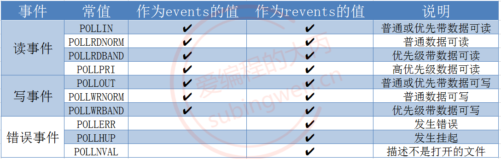
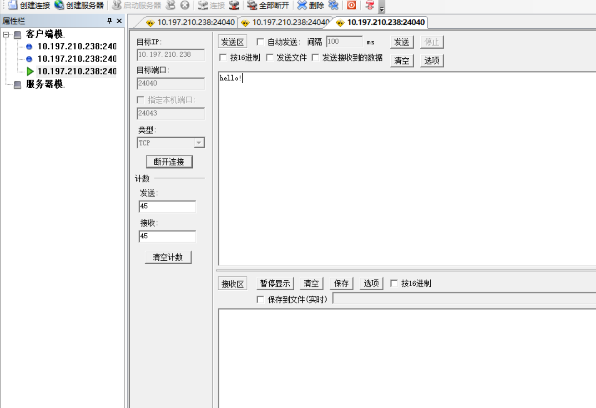
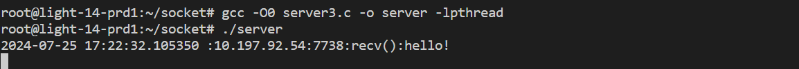
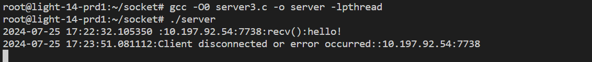

# 使用 poll 模型创建一个简单的 TCP 服务端

poll 模型是 UNIX 系统中用于 I/O 多路复用的一种机制，它与 select 模型类似，但提供了更高的性能和更大的灵活性。poll 模型允许程序监视一组文件描述符，以确定它们是否准备好进行 I/O 操作（如读或写），而不需要阻塞程序。

以下是 poll 模型的详细介绍：

基本原理：
- poll 模型基于一个称为 pollfd 的结构体，该结构体包含了要监视的文件描述符以及关注的事件类型。
- 程序创建一个 pollfd 数组，然后使用 poll 系统调用来等待这些文件描述符上的事件。

优点：
- 无文件描述符数量限制：与 select 模型不同，poll 没有文件描述符数量的限制，因此更适合处理大量并发连接。
- 高效：poll 使用一个数组来存储文件描述符和事件信息，这比 select 使用的位图更高效。
- 灵活性：poll 允许更精细地控制每个文件描述符的监视事件。

缺点：
- 复杂度：poll 模型的实现比 select 模型更复杂，需要更多的代码来管理 pollfd 数组。
- 错误处理：poll 函数在出错时不会提供详细的错误信息，这可能使得错误诊断变得困难。

使用场景：
- poll 模型适用于需要处理大量文件描述符的服务器应用程序，如网络服务器、数据库服务器等，尤其是在高并发环境下。它也适用于那些需要精细控制文件描述符事件类型的场景。

## 1. select 关键函数介绍
- pollfd 数据结构：[struct pollfd](#11-pollfd-数据结构)
- 实例创建函数: [poll()](#12-poll-函数)

### 1.1. pollfd 数据结构
原型：
```c
struct pollfd {
    int fd;         // 文件描述符
    short events;   // 要监视的事件
    short revents;  // 实际发生的事件
};
```
- fd：要监视的文件描述符。
- events：感兴趣的事件类型，可以是以下几种：
    - POLLIN：数据可读。
    - POLLOUT：数据可写。
    - POLLERR：发生错误。
    - POLLHUP：挂起（hang up）事件，比如对方关闭了连接。
    - POLLNVAL：文件描述符不是有效的。
- revents：实际发生的事件，由 poll 函数设置。

### 1.2. poll() 函数
poll 函数是 UNIX 系统中用于 I/O 多路复用的系统调用。它允许程序监视一组文件描述符，以查看是否有任何文件描述符准备好进行 I/O 操作（如读取或写入），而无需阻塞程序。这是网络服务器和高并发应用程序中常用的技术，可以同时处理多个连接。

函数原型：
```c
#include <sys/poll.h>

int poll(struct pollfd *__fds, nfds_t __nfds, int __timeout);
int ppoll (struct pollfd *__fds, nfds_t __nfds,
		  const struct timespec *__timeout,
		  const __sigset_t *__ss);
```
- 参数说明：
    - `__fds` ：指向 pollfd 数组的指针。
    - `__nfds` ：pollfd 数组中的元素数量。
    - `__timeout` ：超时时间，单位为毫秒。
        - 如果设置为 -1，则 poll 将无限期等待；
        - 如果设置为 0，则立即返回，不等待任何事件。
        - 如果设置大于0，阻塞指定的毫秒（ms）数之后，解除阻塞
    - `__ss` ：指向 sigset_t 结构体的指针，指定要阻塞的信号集合。
    - 

- 返回值：
    - 如果poll成功，它将返回自上次调用poll以来发生事件的文件描述符数量。
    - 如果发生错误，它将返回-1，并设置errno以指示错误类型。
    - 如果超时，poll将返回0。

- 区别：
    - ppoll 是较新的函数，可能在某些较旧的系统上不可用。
    - poll() 函数没有提供对信号集的阻塞控制，因此如果需要阻塞信号，需要使用 ppoll() 函数。
    - ppoll() 函数提供了对信号集的阻塞控制，可以更精细地控制哪些信号在 poll() 调用期间被阻塞。
    - poll 使用整数超时时间，单位为毫秒，而 ppoll 使用 timespec 结构体，可以提供纳秒级别的超时精度。

- 使用场景：
    - 适用于在需要同时处理多个文件描述符的场景中。
    - 它比 select 函数更灵活，因为它允许更细粒度的事件控制，并且在某些系统上可能具有更好的性能。
    - 然而，对于需要处理大量文件描述符的应用程序，epoll（在某些系统上可用）可能是更好的选择，因为它提供了更高的性能和更低的资源消耗。

## 2. TCP 服务端创建流程
- 初始化 pollfd 数组，设置每个元素的 fd 和 events 字段。
- 调用 poll 函数，传入 pollfd 数组，等待事件发生。
- poll 函数返回后，检查 pollfd 数组中每个元素的 revents 字段，以确定哪些事件已经发生。
- 根据发生的事件执行相应的 I/O 操作。
- 重复步骤 2 和 3，直到程序结束。

## 4. TCP 服务端创建流代码
```c
#include <stdio.h>
#include <stdlib.h>
#include <string.h>
#include <unistd.h>
#include <pthread.h>
#include <signal.h>
#include <sys/socket.h>
#include <netinet/in.h>
#include <arpa/inet.h>
#include <sys/poll.h>
#include <sys/time.h>

#define MAX_CLIENTS 1024
#define BUFFER_SIZE 1024
#define ADDR "10.197.210.238"
#define PORT 24040

// 创建服务器 socket 描述符，和 epoll 描述符
int server_fd = -1, maxfd;
/* read_set 集合操作的互斥锁和 用于线程条件变量的互斥锁 pthread_lock */
pthread_mutex_t fd_set_lock,pthread_lock;

// 数据初始化, 创建自定义的文件描述符集
struct pollfd fds[MAX_CLIENTS];

/* 线程条件变量用于线程同步：
 * 1. 在读缓冲区被读出后再进入下一个主循环；
 * 2. 防止 client_handler 线程建立过程中下一次循环已经到来，导致多次创建 client_handler 线程；
 * 3. 在下一次循环已经到来读出读缓冲区的数据后置位，处理接收下一个函数；
 */
pthread_cond_t pthread_cond = PTHREAD_COND_INITIALIZER;

/* 通过 client socket 获取客户端的 IP 和 端口信息 */
int get_client_ip_port_from_socket(int socket_fd, char *ip)
{
    struct sockaddr_in addr;
    socklen_t addr_len = sizeof(struct sockaddr_in);
    getpeername(socket_fd, (struct sockaddr *)&addr, &addr_len);

    strncpy(ip, inet_ntoa(addr.sin_addr), BUFFER_SIZE);

    return ntohs(addr.sin_port);
}

/* 信号量中断处理函数，关闭 socket */
void signal_handle(int sig) {
    int i=0, port;
    char s_ip[BUFFER_SIZE];
    // 信号处理代码
    switch (sig)
    {
    case SIGINT:
        /* 安全关闭文件描述符，防止下次启动显示占用 */
        for(i=1; i <= maxfd; i++) {
            if(fds[i].fd != -1)
            port = get_client_ip_port_from_socket(fds[i].fd, s_ip);
            printf("closed socket :: %s:%d\n", s_ip, port);
            close(fds[i].fd);
        }
        close(server_fd);
        printf("closed socket :: "ADDR":""%d\n", PORT);

        pthread_cond_destroy(&pthread_cond);
        pthread_mutex_destroy(&fd_set_lock);
        break;
    
    default:
        break;
    }

    exit(0);
}

/* 获取当前时间字符串 */
void gettimestring(char * currenttime) {
    struct timeval tv;
    struct tm *timeinfo;
    // 创建一个字符串缓冲区来存储格式化的时间
    char time[128];

    // 获取当前时间，包括秒和微秒
    gettimeofday(&tv, NULL);
    
    // 转换为本地时间
    timeinfo = localtime(&tv.tv_sec);

    // 格式化本地时间为字符串，不包括微秒
    strftime(time, sizeof(time), "%Y-%m-%d %H:%M:%S", timeinfo);
    sprintf(time, "%s.%06ld", time, tv.tv_usec);

    strncpy(currenttime, time, sizeof(time));
}

/* 设置 socket 发送和接收超时 */
int set_socket_timeout(int socket, int timeout_sec) {
    struct timeval timeout;
    timeout.tv_sec = timeout_sec;
    timeout.tv_usec = 0;

    if (setsockopt(socket, SOL_SOCKET, SO_RCVTIMEO, (const char*)&timeout, sizeof(timeout)) < 0) {
        perror("setsockopt receive timeout");
        return -1;
    }

    if (setsockopt(socket, SOL_SOCKET, SO_SNDTIMEO, (const char*)&timeout, sizeof(timeout)) < 0) {
        perror("setsockopt send timeout");
        return -1;
    }

    return 0;
}

/* 设置服务器的 socket */
int setup_server_socket(void) {
    struct sockaddr_in server_addr;

    // 创建socket
    server_fd = socket(AF_INET, SOCK_STREAM, 0);
    if (server_fd == -1) {
        perror("socket");
        exit(EXIT_FAILURE);
    }

    // 设置服务器地址结构体
    memset(&server_addr, 0, sizeof(server_addr));
    server_addr.sin_family = AF_INET;
    server_addr.sin_port = htons(PORT);
    inet_aton(ADDR, &server_addr.sin_addr);

    // 绑定socket
    if (bind(server_fd, (struct sockaddr *)&server_addr, sizeof(server_addr)) == -1) {
        close(server_fd);
        perror("bind");
        
        exit(EXIT_FAILURE);
    }

    // 监听socket
    if (listen(server_fd, MAX_CLIENTS) == -1) {
        perror("listen");
        exit(EXIT_FAILURE);
    }

    return server_fd;
}

/* 接收客户端信息处理函数 */
void *client_handler(void *arg) {
    /* 分离线程 */
    pthread_detach(pthread_self());
    int i = *(int *)arg;
    int client_fd = fds[i].fd;
    char s_ip[BUFFER_SIZE], buffer[BUFFER_SIZE], currenttime[BUFFER_SIZE];
    int port;
    ssize_t bytes_read;

    port = get_client_ip_port_from_socket(client_fd, s_ip);
    // 读取客户端数据
    memset(buffer, 0, sizeof(buffer));
    bytes_read = read(client_fd, buffer, BUFFER_SIZE - 1);
    
    gettimestring(currenttime);
    if (bytes_read <= 0) {
        // 客户端断开连接或发生错误
        printf("%s:Client %d disconnected or error occurred::%s:%d\n", currenttime, client_fd, s_ip, port);
        /* 将文件描述符从读集合删除，并关闭文件描述符 */
        pthread_mutex_lock(&fd_set_lock);
        fds[i].fd = -1;
        close(fds[i].fd);
        pthread_mutex_unlock(&fd_set_lock);
        
        /* 无数据，关闭连接并删除客户端文件描述符后，再唤醒主线程，避免还未将文件描述符从 read_set 集合删除，下次循环就到来，导致又创建线程处理一个本该关闭的文件描述符 */
        pthread_mutex_lock(&pthread_lock);
        pthread_cond_signal(&pthread_cond);
        pthread_mutex_unlock(&pthread_lock);
    } else {
        /* 有数据，先唤醒主线程，再处理数据，缩减 select 函数处理其他文件描述符的时间 */
        pthread_mutex_lock(&pthread_lock);
        pthread_cond_signal(&pthread_cond);
        pthread_mutex_unlock(&pthread_lock);

        // 在这里处理数据...
        printf("%s::%s:%d:recv():%s\n", currenttime, s_ip, port, buffer);
        write(client_fd, buffer, bytes_read);
    }
    
    pthread_exit(NULL);
}

int main() {
    pthread_t thread_id;
    int n, i=0;

    struct sockaddr_in client_addr;
    socklen_t client_addr_len = sizeof(client_addr);

    // 设置和绑定服务器socket
    server_fd = setup_server_socket();

    // 初始化
    for(int i=0; i<MAX_CLIENTS; ++i)
    {
        fds[i].fd = -1;
        fds[i].events = POLLIN;
    }
    fds[0].fd = server_fd;

    pthread_mutex_init(&fd_set_lock, NULL);
    pthread_mutex_init(&pthread_lock, NULL);
    signal(SIGINT, signal_handle);
    char time[128];
    // 主循环
    while (1) {
        n = poll(fds, maxfd+1, 2000);
        gettimestring(time);
        printf("%s , test\n", time);
        if(n <= 0) {
            continue;
        }
        if(fds[0].revents & POLLIN) {
            int client_fd = accept(server_fd, (struct sockaddr *)&client_addr, &client_addr_len);
            if (client_fd == -1) {
                perror("accept");
                close(client_fd);
                continue;
            }

            pthread_mutex_lock(&fd_set_lock);
            for(i=0; i<MAX_CLIENTS; ++i)
            {
                if(fds[i].fd == -1)
                {
                    fds[i].fd = client_fd;
                    break;
                }
            }
            pthread_mutex_unlock(&fd_set_lock);

            if(i > maxfd) {
                maxfd = i;
            }
            continue;
        }
        // 没有新连接, 通信
        for(i=1; i <= maxfd; i++)
        {
			// 判断从监听的文件描述符之后到 maxfd 这个范围内的文件描述符是否读缓冲区有数据
            if(fds[i].revents & POLLIN)
            {
                // 必需引入一个局部变量传入线程，否则可能导致所有线程接收相同的 i
                int local_fd = i;
                if(0 != pthread_create(&thread_id, NULL, client_handler, &local_fd)) {
                    printf("pthread_create err!\n");
                }
                // 等待线程创建完成并读出读缓冲区，再处理下一个请求，防止下次循环到达前读缓冲区未读完多次创建线程
                pthread_mutex_lock(&pthread_lock);
                pthread_cond_wait(&pthread_cond, &pthread_lock);
                pthread_mutex_unlock(&pthread_lock);
            }
        }
    }

    close(server_fd);
    pthread_cond_destroy(&pthread_cond);
    pthread_mutex_destroy(&fd_set_lock);
    pthread_mutex_destroy(&pthread_lock);

    return 0;
}

```

## 4. 测试结果
1. 编译并运行程序：
```bash
root@light:~/socket# gcc -O0 server_poll.c -o server -lpthread
root@light:~/socket# ./server 

```

2. Windows 端的 TCP 工具创建客户端，连接并发送数据：

    

3. 服务端接收数据并打印：

    

4. Windows 客户端主动断开连接，服务端打印断开连接的客户端的IP和端口信息：

    