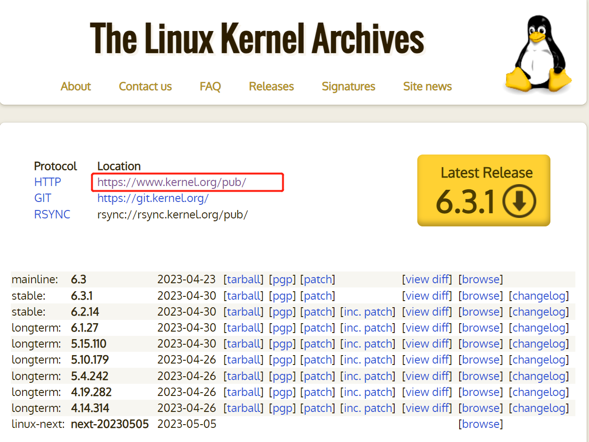
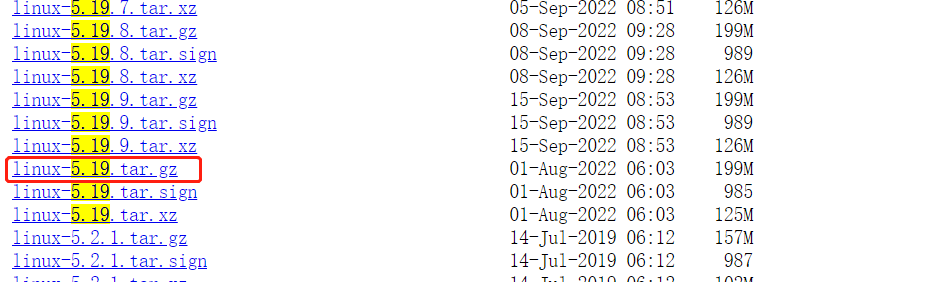

## Linux内核下载
1. 进入Linux内核官网 [kernel.org](https://kernel.org) ，选择如图所示的网址进入镜像下载页面。
 


2. 进入镜像下载网页后，这里用的是5.19.0的内核，所以在镜像网站上依次选择 `“Linux” -> “kernel” -> “v5.x” -> “linux-5.19.tar.gz”` ，点击需要的版本后就会自动开始下载内核。



3. 将内核传入虚拟机中Ubuntu系统的 `/usr/src/` 目录下
4. 用 `tar –zcvf linux-5.19.tar.gz` ，将内核源码进行解压，得到 `linux-5.19` 文件夹。

## 内核补丁（可选）
1. 在镜像网站上依次选择 `“Linux” -> “kernel” -> “projects” -> “rt”` ，点击需要的实时内核补丁后就会自动开始下载补丁，**注意实时内核补丁一定要与 Linux 内核版本一致，否则可能会失败**。
2. 将下载所得的安装包，例如 `patch-3.0.101-rt130.patch.gz ` 解压到内核源码解压的目录处（即内核源码文件夹外，即第四步中的 `patch` 指令指定目录）。
3. 进入内核源码目录：`cd linux-3.0.101`;
4. 在内核源码目录使用 `patch` 指令将补丁打入内核源码中:
   `patch -p1 < ./patches/patch-3.0.101-rt130.patch`

## 内核编译
1. 进入 linux-5.19 文件夹，用 `make menuconfig` 命令进入 `.config` 文件生成的图形界面，按照提示安装想要的模块。

2. 如果运行 `make menuconfig` 时发生错误，提示缺少链接库，则需要按照错误提示安装需要的链接库，未发生错误则忽略当前步骤，常用的链接库以及指令如下：

```shell
    sudo apt-get install libncurses5-dev openssl libssl-dev
    sudo apt-get install build-essential openssl
    sudo apt-get install pkg-config
    sudo apt-get install libc6-dev
    sudo apt-get install bison
    sudo apt-get install flex
    sudo apt-get install libelf-dev
    sudo apt-get install zlibc minizip
    sudo apt-get install libidn11-dev libidn11
```

3. 运行完成后会生成一个.config文件，使用 sudo make –j4 命令进行编译，其中-j表示指定为多线程编译，4表示指定的线程数量，根据CPU进行选择。


## 遇见过的编译错误：
**`No rule to make target ‘debian/canonical-certs.pem’, needed by ‘certs/x509_certificate_list’`**

**解决方法：**

1. 编辑.config文件
2. 修改CONFIG_SYSTEM_TRUSTED_KEYS，将其赋空值。
3. 修改CONFIG_SYSTEM_REVOCATION_KEYS，将其赋空值。
