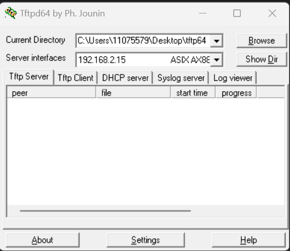

# U-Boot 烧写

## 在 U-Boot 命令行使用 TFTP 更新到 emmc

### Windows 端操作

1. 下载 TFTP64 工具：
[tftp下载网址](https://bitbucket.org/phjounin/tftpd64/wiki/Download%20Tftpd64)

2. 按提示安装（或解压）好 tftp64 工具，安装完成后：
- 将需要传输的文件放在该软件可执行文件的相同目录下（或放在其他目录下在软件中可选，默认为该运行目录）；
- 选择能够 ping 通 Linux 板的 IP 地址作为服务器，即 Linux 板端的 serverip 。



### Linux 板端操作

1. 先在启动过程中打断进入命令行模式；

2. 开启电脑的 tftp 服务器并与之能通讯的 IP 地址；

3. 在 U-Boot 命令行模式下设置好 tftp 的相关环境变量的设置（如 serverip 、ipaddr）；
```bash
    => setenv ipaddr 192.168.2.20
    => setenv serverip 192.168.2.15
```

4. 将要烧录的 U-Boot 文件传输到系统的空闲内存：
```bash
    #tftp $addr {filename}
    => tftp 80800000 u-boot-mmc.imx
    Using ethernet@20b4000 device
    TFTP from server 192.168.2.15; our IP address is 192.168.2.20
    Filename 'u-boot-mmc.imx'.
    Load address: 0x80800000
    Loading: ############################
             2.8 MiB/s
    done
    Bytes transferred = 400384 (61c00 hex)
```

5. 向eMMC中写入下载的 uboot.imx ：
- 先使用 `mmc dev 1` 命令切换操作 eMMC 的分区1.(注意，一定要执行这一命令，默认是操作分区0);
- 使用 `mmc write 80800000 2 33e`（2表示第二个block，424960/512(一个块的大小) = 0x33E）;
```bash
    => mmc dev 1
    switch to partitions #1, OK
    mmc1(part 1) is current device
    # mmc write addr blk# cnt   #写
    => mmc write 80800000 2 33e
    mmc - MMC sub system
```
- 使用reset命令重启即可生效。

