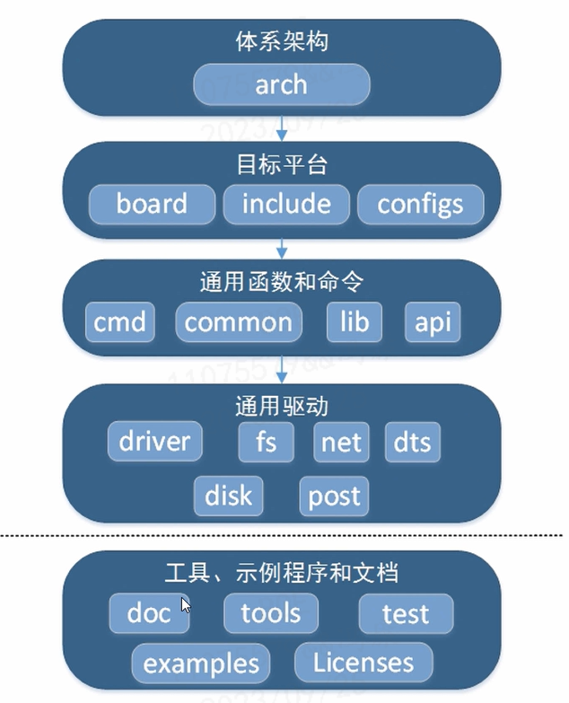

# uboot的初步认识

U-Boot 是一个用于嵌入式系统的引导加载程序（bootloader），它支持多种不同的计算机系统。U-Boot 支持多种不同的计算机系统，包括从嵌入式系统到通用计算机系统的多种不同的计算机平台。

## bootloader 的种类
- U-Boot ：universal bootloader 通用bootloader；
- vivi ：韩国mizi公司针对 ARM9 设计的bootloader；
- ppcboot ：为 PowerPC 设计的bootloader；
- ARMboot ：ARM平台的开源固件项目，依赖于 ppcboot；
- RedBoot ：由 redhat 开发，基于 eCos 实时操作系统的bootloader；

## uboot的组成

- 引导加载程序：用于从存储介质（如ROM、NOR FLASH、NAND FLASH等）加载内核到内存中，并启动内核。
- 环境初始化：用于初始化各种硬件设备，如串口、并口、LCD、网卡、USB等。
- 命令行接口：用于用户通过控制台与uboot交互，完成各种设置，如设置从哪个存储介质中加载内核到内存中，启动内核等。

## uboot的下载

[u-boot官方网址](https://u-boot.readthedocs.io/en/latest/)

[u-boot的源码下载地址](https://ftp.denx.de/pub/u-boot/)

[u-boot的ftp地址](ftp://ftp.denx.de/pub/u-boot/)

## uboot文件夹结构

这里以u-boot-2012.04.01结构为例：

- **api** 实现了基本的IO，如标准化输入输出，显示，网络API、存储API等，为cmd提供支持。
- **arch**   
    实现了不同体系结构的CPU，指令集、设备树底层抽象，利用链接绑定实现了符号入口相对位置保持不变，故才能实现将内核镜像拷贝到内存然后进行引导的功能。lib实现了初始化C运行时环境（栈/堆指针等的初始化），dts实现了设备树的底层体系架构依赖的具体抽象剥离。
- **board**  
    实现了产业链下游，设备厂商的差异性，对于产品设计而言，需要将各自在boot阶段需要严格初始化的实现放在这里，比如IO口的初始化，产品中大部分IO口必须显式设置其初始状态。
- **common** 是U-Boot 主体，如系统停留在U-Boot阶段，CPU始终在执行一个死循环，`run_main_loop()`.
- **disk** 实现了轻量级磁盘管理.
- **doc** 包含各种相关文件说明.
- **driver** 这里实现了boot阶段必要的设备驱动，如网口、显示等。
- **dts** 实现了设备树。
- **examples** 包含各种实例。
- **fs** 文件系统实现（cramfs,ext2,jffs等）
- **include** 包含各种头文件。
- **lib** 通用库，比如CRC算法，加密算法，压缩算法，字符串操作等。
- **nand_spl**
- **net** 实现网络协议层
- **onenand_ipl**
- **post**
- **spl**
- **tools** 包含各种常用工具，如gdb调试工具等。
- **machine**   
    由于同样的内核相同，各家芯片外设都不尽相同，所以将各自个性实现剥离实现于此，这主要体系在ARM体系的芯片，由于ARM公司售卖IP，各家芯片厂商在内核的基础上延伸出各自不同的芯片，所以需要将差异性剥离实现。

## uboot层次




### arch 文件夹
重要文件夹为
```shell
├── cpu     # 对应处理器的不同产品型号或系列
├── dts
├── imx-common
├── include # 处理器用到的头文件
├── lib     ：对应到处理器公用代码
└── thumb1
```

#### ARM 架构种类
进入 arch/arm/cpu/armv7 中
```shell
.
├── arm11
├── arm1136
├── arm1176
├── arm720t
├── arm920t
├── arm926ejs
├── arm946es
├── armv7
├── armv7m
├── armv8
├── Makefile
├── pxa
├── sa1100
├── u-boot.lds
└── u-boot-spl.lds
```

### board 文件夹
每个文件夹相当于一个厂家提供一个的板子，里面包含该板子对应的配置文件，Makefile，以及该板子对应的dts文件。

### configs 文件夹
板级配置选项

### driver 文件夹
驱动代码。uboot驱动不需要像内核一样对设备和驱动进行注册和匹配，而是直接调用驱动的接口函数。