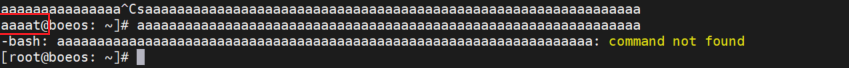
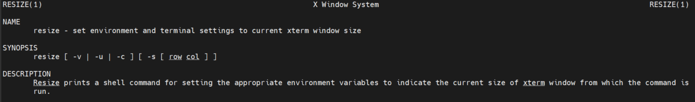
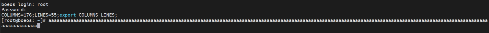

# Linux 串口终端输入长命令导致覆盖行首问题

## 错误原因

由于登录 tty 设备的的终端窗口大小和tty设置的行列不一致导致，修复了方法就是想办法让他们两个一致。
    


## 临时解决方法
在 `/etc/profile` 中设置并导出一个合理的终端大小：
```bash
# 片尾加入
COLUMNS=162;LINES=55;export COLUMNS LINES;
```

## 永久解决方法
1. resize 命令
    
    使用 `resize` 命令的输出，这个命令的功能就是重设终端的长宽参数到当前窗口大小，man 手册看一下 `resize` 命令：
    

2. 使用方法

    在 `/etc/profile` 中最后命令操作就可以解决了：
    ```bash
    resize
    ```

3. 重启后会发现系统会自动重设终端的长宽到当前窗口大小，问题解决：
    