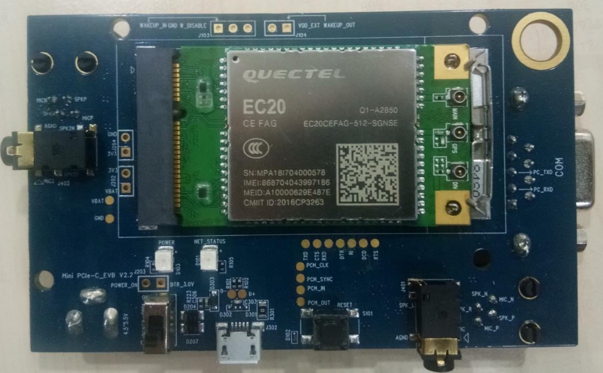
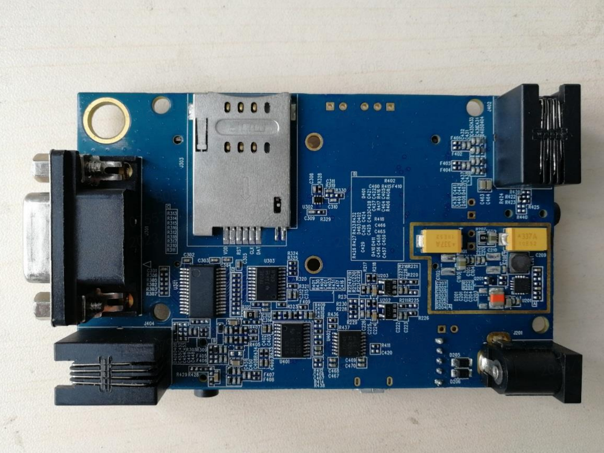
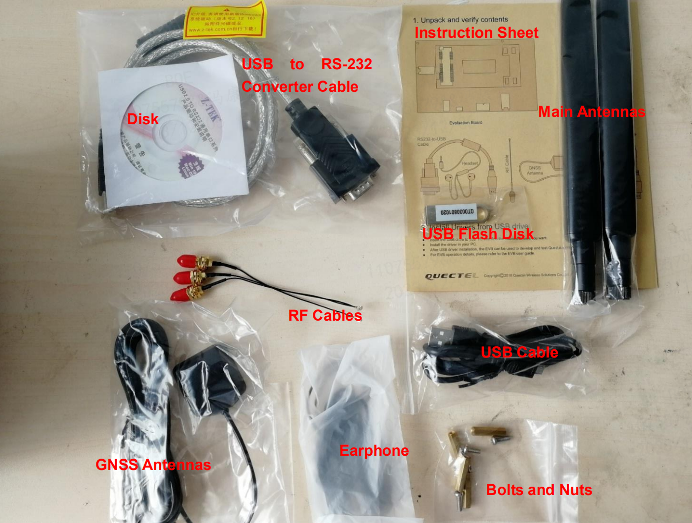
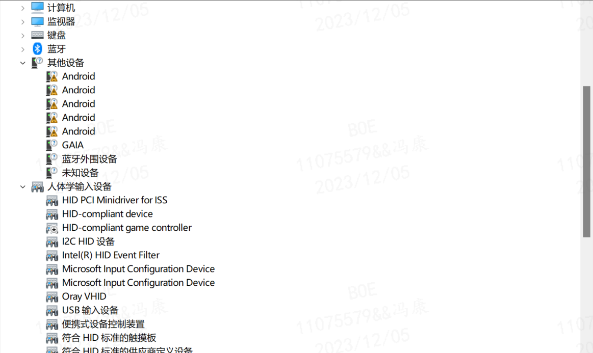
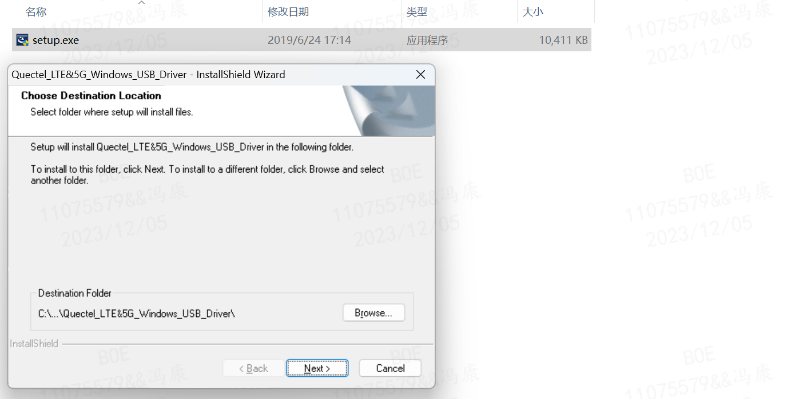
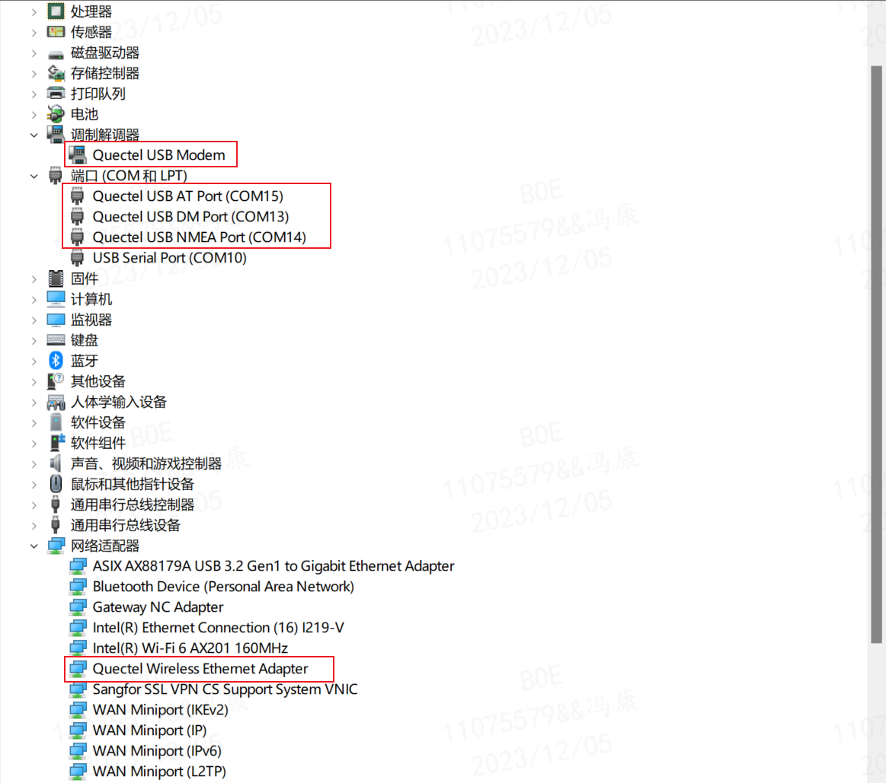
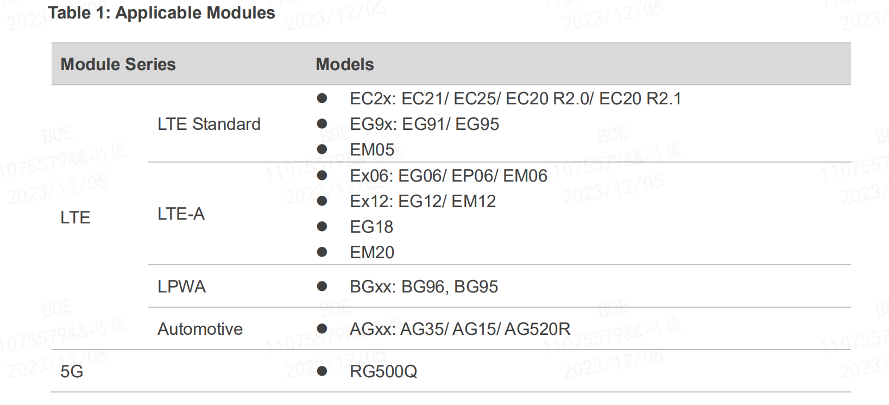
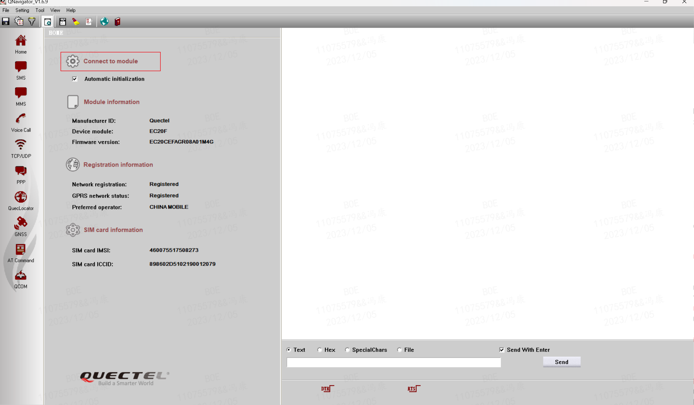
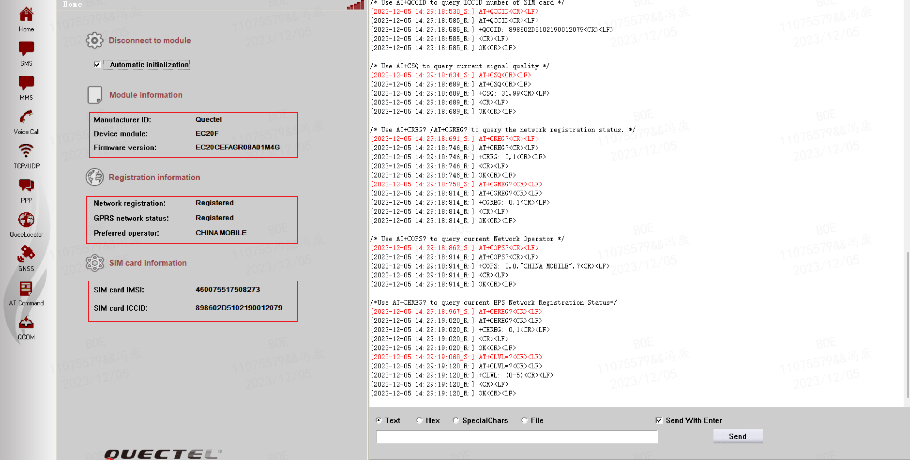
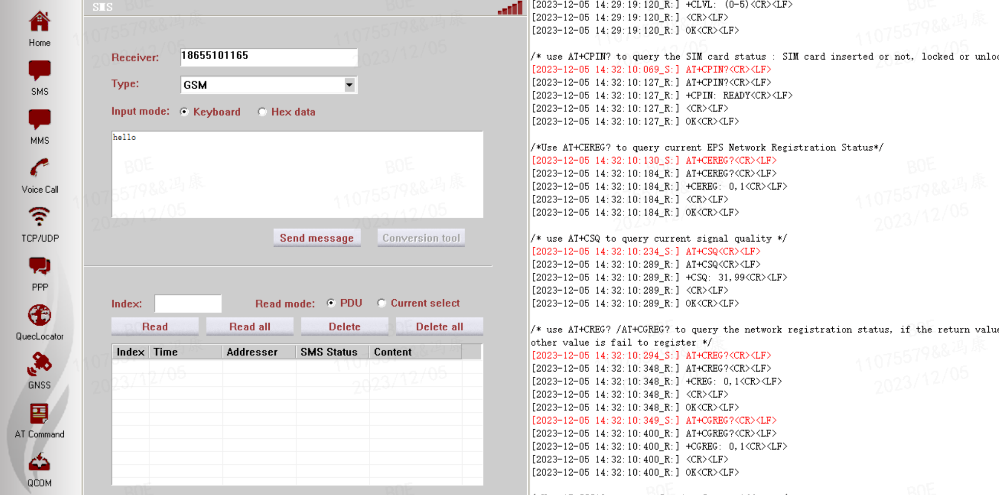

# 1. Mini PCIe-C EVB简介

- 参考文档；Quectel_Mini_PCIe-C_EVB_User_Guide_V1.0.pdf
- 下载地址：[https://www.quectel.com.cn/download/quectel_mini_pcie-c_evb_user_guide_v1-0](https://www.quectel.com.cn/download/quectel_mini_pcie-c_evb_user_guide_v1-0)
- 在线浏览地址：[https://www.quectel.com/wp-content/uploads/2021/03/Quectel_Mini_PCIe-C_EVB_User_Guide_V1.0.pdf](https://www.quectel.com/wp-content/uploads/2021/03/Quectel_Mini_PCIe-C_EVB_User_Guide_V1.0.pdf)

## 1.1 产品概述
Mini PCIe-C模块的评估板，它是开发和测试移远通信Mini PCIe-C/-D和EP200F模块的辅助工具。

上层 PCB 实物图：

底层 PCB 实物图：

其他配套工具：

## 1.2 应用模组
Mini PCIe-C EVB适用于以下模块。有关这些模块的更多详细信息，请参阅文档 [1]、[2] 或 [3]。
- UC20 Mini PCIe-C 
- EC20 R2.0 Mini PCIe-C 
- EC20 R2.1 Mini PCIe-C 
- EP200F
- EC200T Mini PCIe-C 
- EC200T-CN Mini PCIe-D

# 2. Mini PCIe-C EVB在 Windows 系统的驱动安装
- 参考文档；Drivers/Quectel_LTE&5G_Windows_USB_Driver_Installation_Guide_V2.1.pdf
- 驱动安装需要移远官方提供的开发套件 Quectel_Mini_PCIe-C_EVB_Kit_Support_Package_V1.1.zip ，该文件为在开发套件配套的 U 盘（上图的 USB Flash Disk）内的内容。

## 2.1 驱动安装
### 2.1.1. Windows 驱动安装

1. 在未安装驱动时，在设备管理器中显示如下：
    

2. 解压 `Drivers/Quectel_LTE&5G_Windows_USB_Driver_V2.1.zip` 驱动文件，根据提示安装好解压后文件夹中的驱动：
    

3. 安装完成后，在设备管理器中显示如下：
    

### 2.1.2. 指导文件解读
1. 查看`Quectel_LTE&5G_Windows_USB_Driver_Installation_Guide_V2.1.pdf` 文件指导可知 `Quectel_LTE&5G_Windows_USB_Driver_V2.1` 驱动的应用范围有如下模组：
    
2. 安装 USB 驱动程序后，客户可以通过 `QNavigator` 测试驱动程序是否可以正常工作。详细步骤请参考 `Quectel_QNavigator_User_Guide` 。

## 2.2 使用 `Tools/QNavigator` 工具测试驱动
1. 解压 `Tools/Qnavigator_V1.6.9.zip` 工具的压缩文件，打开解压后的 `Qnavigator_V1.6.9.exe` 可执行程序，根据提示向导完成相应的设置步骤，最后发现如下界面：
    

2. 在菜单栏的 setting 设置好参数后，点击上图的红框 `Connect to module` 连接到模块，如下图所示：
    

3. 可以看到连接成功后，读到了 SIM 卡的相关信息，表示驱动安装成功了。

4. `QNavigator` 软件还具有其他很多测试功能，可以通过左边的菜单栏进行选择。下面以一个 SMS 短信功能展示，通过设置可以给目标卡发送短信：
    