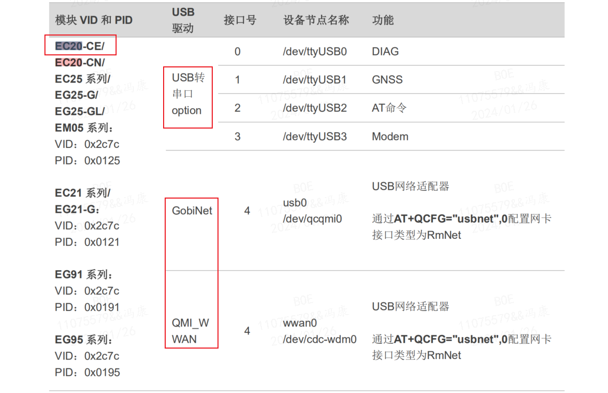
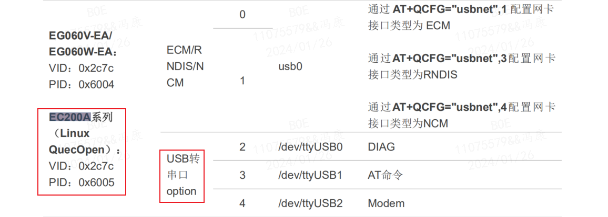
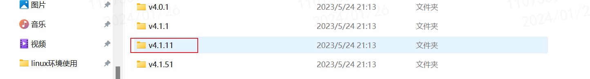
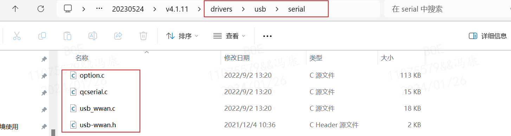
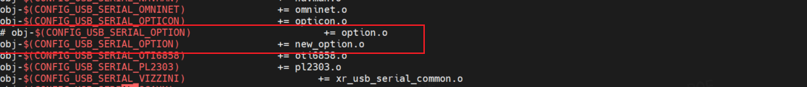
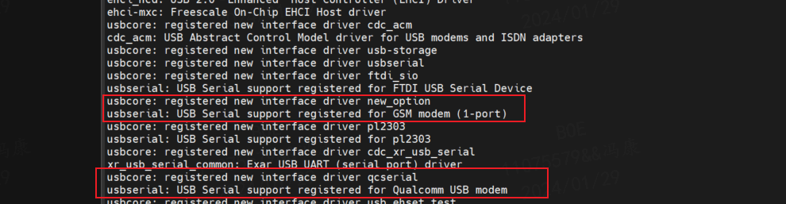
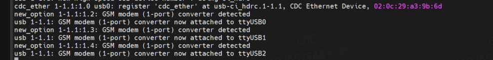
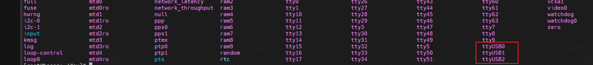

# 移远 4G 模块在 linux 系统下的驱动移植

### 参考文档；
- `Quectel_UMTS_LTE_5G_Linux_USB_Driver_用户指导_V1.0.pdf`
    - 官网查看下载界面：[Quectel_UMTS_LTE_5G_Linux_USB_Driver_用户指导_V1.0.pdf](https://www.quectel.com.cn/download/quectel_umts_lte_5g_linux_usb_driver_%e7%94%a8%e6%88%b7%e6%8c%87%e5%af%bc_v1-0)
    - 直接下载地址：[https://forumschinese.quectel.com/uploads/short-url/xpMd7lXBklBDV0FgQfqeWC4a3kw.pdf](https://forumschinese.quectel.com/uploads/short-url/xpMd7lXBklBDV0FgQfqeWC4a3kw.pdf)

安装驱动前，需要查看 `Quectel_UMTS_LTE_5G_Linux_USB_Driver_用户指导_V1.0.pdf` 文件，章节`2 Linux USB 驱动概述`中找到需要支持的模块型号，然后安装模块支持的驱动进行安装。

 



这里只使用到 EC20 和 EC200A 模块，两个模块都支持 USB 转串口驱动，所以这里主要介绍 USB 转串口驱动的安装和使用。

## 1. linux 内核的 USB 转串口驱动移植
### 1.1. linux 内核驱动源码的获取
1. 解压移远官方提供的 `Quectel_Linux_USB_Serial_Option_Driver_20230524.tgz` 驱动源码文件，根据使用环境的内核版本，选择最接近版本的内核源码文件包，如使用环境的内核版本为 4.1.15，可以选择 4.1.11 版本的内核源码包。

    

2. 进入目录后会看到 Makefile 文件和 driver 文件夹中的相关的 USB 串口驱动文件。

    

### 1.2. linux 内核驱动源码的编译
1. 将该目录下的文件添加到 linux 内核源码对应的目录中（drivers/usb/serial），可以将该文件重新命名，这里命名为 `new_option.c`；也可以直接将文件进行替换，但是直接替换前可以先对文件进行对比，确保文件没有添加过其他的 USB 串口设备驱动。

    该驱动文件中最主要的驱动文件是 `option.c` 文件，该文件修改内容是将需要添加的模块的 VID 和 PID 信息。用于识别正确的设备，模块具体的 VID 和 PID 可以在 `Quectel_UMTS_LTE_5G_Linux_USB_Driver_用户指导_V1.0.pdf` 文档中的 `2 Linux USB 驱动概述` 章节中查看，EC20-CE 和 EC200A 模块的信息在文章开头图片中已经指出。

    在 `option.c` 文件中添加模块信息的方式以 EC25 系列模块为例，具体的可以用官方提供的文件进行对比后再做出自定义修改：
    ```C
    static const struct usb_device_id option_ids[] = {
    #if 1 //Added by Quectel
    { USB_DEVICE(0x2C7C, 0x0125) },
    #endif
    ```

2. 修改 `serial` 目录下的 `Makefile` 文件。
    
    这里将原本编译并添加 `option.c` 文件的命令注释，添加一行编译并添加 `new_option.c` 文件的命令，这样就无需再修改目录下的 `Kconfig` 文件配置宏定义信息了。

    

3. 由于上述步骤是采用并将原来编译的 `option.c` 的宏定义处直接替换为编译 `new_option.c` 文件的方式，所以无需再修改上级目录中是 `Makefile` 和 `Kconfig` 文件。如果采用新增宏定义的方式进行编译，则需要在本级以及上级目录中的 `Makefile` 和 `Kconfig` 文件中新增对应的配置选项。

4. 重新编译内核，并烧写到开发板中。


## 2. USB 转串口驱动的验证
将上述步骤编译好的内核烧写到开发板中，并重新启动开发板，在 debug 串口打印的信息中可以看到如下内容：



- 打印信息中可以看到上面移植的驱动 `new_option` 已经为移远 4G 模块成功注册了 USB 串口相关驱动。

插入 USB 接口的 4G 模块后，会生成对应模组型号的设备节点。

这里以 EC200A 模组为例测试，会生成 `/dev/ttyUSB0` 、 `/dev/ttyUSB1` 、 `/dev/ttyUSB2` 三个设备节点，linux 的 debug 串口会打印如下信息：



使用 ls 命令查看 /dev 设备节点可以看到对应节点已经生成。


