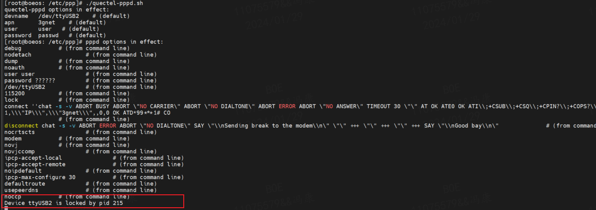
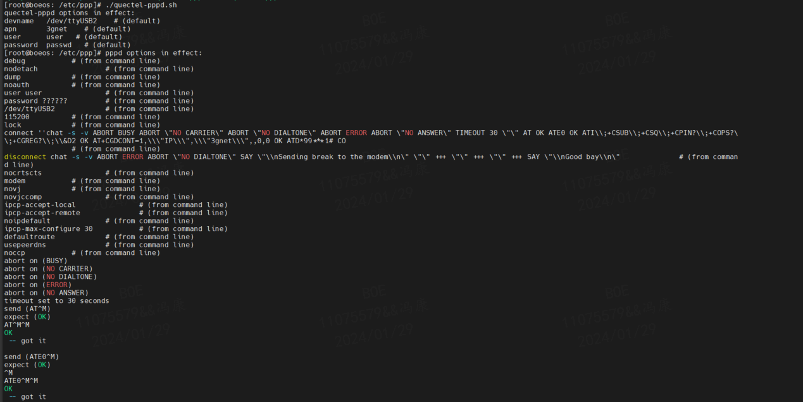
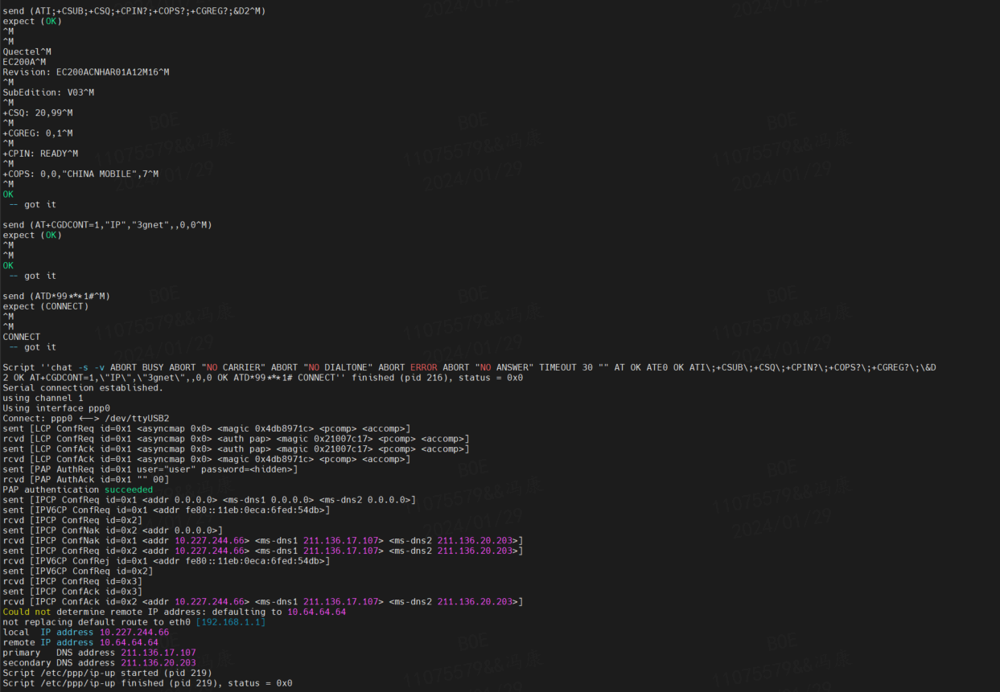
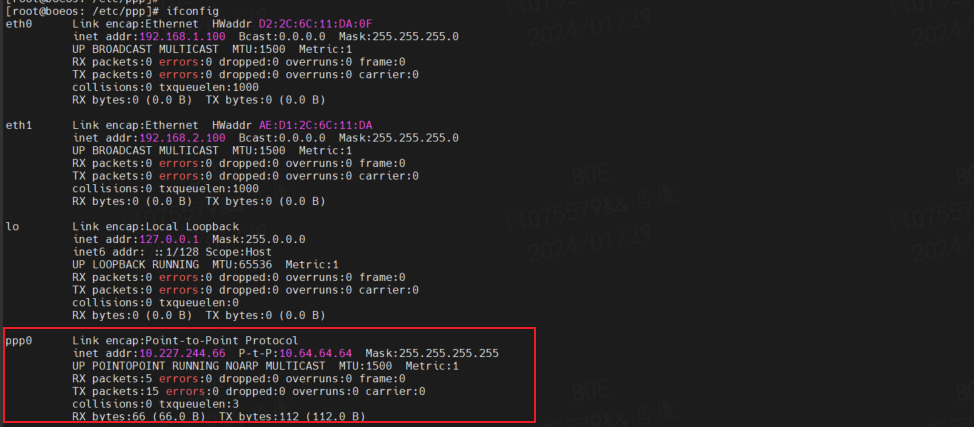
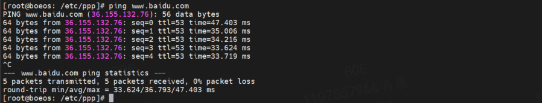

# 移远 4G 模块在 linux 系统下拨号上网

## 1. linux 内核的 USB 转串口驱动移植
详情见 [1.linux系统下的驱动移植.md](/1.linux系统下的驱动移植.md)

## 2. pppd 拨号工具移植
用于 4G 模组拨号上网；

PPP 工具是用于拨号上网的协议栈，PPP 协议是一种链路层协议，它提供了一个在两个不同的网络之间进行数据交换的框架。

### 2.1 使用 buildroot 工具将工具编译到文件系统
- 图形选项设置：
    ```config
    -*-pppd
        [*]   filtering
        [*]   radius
        [*]   overwrite /etc/resolv.conf
    ```
- 配置选择：
    - `BR2_PACKAGE_PPP`
    - |-- `BR2_PACKAGE_PPPD_FILTER`
    - |-- `BR2_PACKAGE_PPPD_RADIUS`
    - |-- `BR2_PACKAGE_PPPD_OVERWRITE_RESOLV_CONF`


## 3. 移远模组的脚本拨号上网
解压官方提供的 PPP 拨号脚本 `Quectel_Linux_PPP_Script_V1.0.0.tgz` 到 `/etc/ppp/` 目录，有2种方法启动ppp拨号：

- 拨号方式1： 
    - 拷贝 `quectel-chat-connect` 、 `quectel-chat-disconnect` 、 `quectel-ppp` 到 `/etc/ppp/peers` 目录下。并在 `quectel-ppp` 里修改你的串口设备名，pppd 拨号使用的 `username`，`password`。
    - 在 `quectel-chat-connect` 里修改你的 `APN` 。`APN/username/password` 是从你的网络提供商那里获取的。
    - 最后使用下面的命令启动 ppp 拨号， 命令最后的 & 可以让 pppd 后台运行： `pppd call quectel-ppp &`

- 拨号方式2：使用quectel-pppd.sh 拨号
    - 命令形式如下: `./quectel-pppd.sh 串口设备名(比如/dev/ttyUSB2) APN username password`
    - `ip-up`：pppd 在获取 ip 和 dns 之后，会自动调用这个脚本文件来设置系统的 DNS ，嵌入式系统一般需要拷贝这个文件到 /etc/ppp 目录下。
    - `quectel-ppp-kill`: 用来挂断拨号的，pppd必须被正常的挂断，否则可能会导致你下次ppp拨号失败。使用下面方式来调用这个脚本:`./quectel-ppp-kill`

- 注意：串口设备名需要选择 “AT命令” 或 “Modem” 功能的串口才能拨号成功。以EC200A为例，“AT命令” 功能的串口设备名应为 `/dev/ttyUSB1`，“Modem” 功能的串口为 `/dev/ttyUSB2`， `/dev/ttyUSB0` 串口为 `DIAG` 日志串口。

### 3.1. 拨号方式的选择
在使用过程中，如果只需要用来拨号上网无其他需求，可以无需修改默认配置的运行商的 APN 以及用户名、密码，这种情况下一般建议使用方式2，使用更为简单，可直接使用 `quectel-pppd.sh` 拨号脚本进行拨号。例如：`./quectel-pppd.sh &`  

使用脚本拨号时一般建议增加 & 符号在后台持续运行，否则当使用 `ctrl+c` 停止拨号时，pppd 进程会自动被挂断，下次再拨号时会失败。如图是错误示范：


### 3.2. 拨号成功示例
EC200A 模块识别成功后，使用 `quectel-pppd.sh` 拨号后成功拨号的打印信息如下：




使用 ifconfig 命令可以看到生成了一个名为 ppp0 的虚拟网卡，并且分配了 IP 地址。



使用 ping 命令连接 www.baidu.com 域名进行网络测试，成功收到 ping 包的回复。

