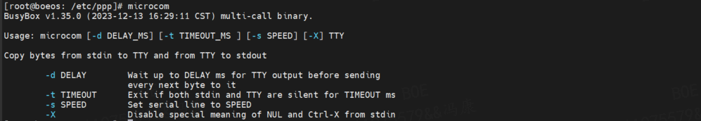
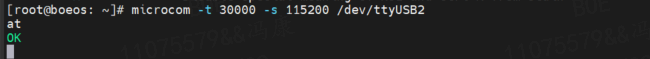

# 移远 4G 模块在 linux系统下使用 AT 指令

## 1. linux 内核的 USB 转串口驱动移植
详情见 [1.linux系统下的驱动移植.md](/1.linux系统下的驱动移植.md)

## 2. 串口工具移植
linux 系统下的串口工具较多，有 microcom 、 minicom 、 picocom 等。

这里选择较为轻便 microcom 为例，该工具集成在 busybox 工具集中。使用 busybox 工具集，可以减少系统对内存的需求，在使用 busybox 或 buildroot 的 busybox 构建系统中使用较为方便。

### 2.1 编译 microcom 工具到文件系统
- 图形选项设置：
    ```config
    --- Applets
        Miscellaneous Utilities  --->
        [*] microcom (5.7 kb)
    ```
- 配置选择：
    - `CONFIG_MICROCOM=y`

## 3. AT 指令的使用
### 3.1 串口使用
参照 microcom 使用说明，使用 microcom 工具打开串口。



可以使用如下指令打开串口：
```bash
microcom -t 30000 -s 115200 /dev/ttyUSB2
```

### 3.2 AT 指令的使用
如上图所示输入 AT 指令，即可得到相应的返回信息。



更多 AT 指令的使用，可以参照模块对应的官方 AT 指令命令手册。