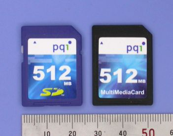
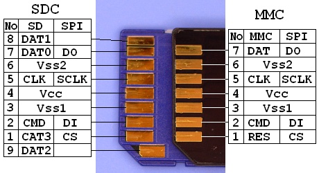
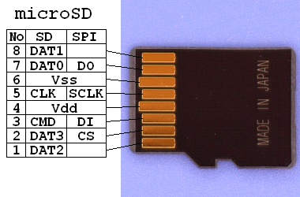
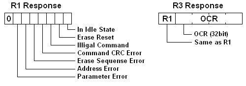
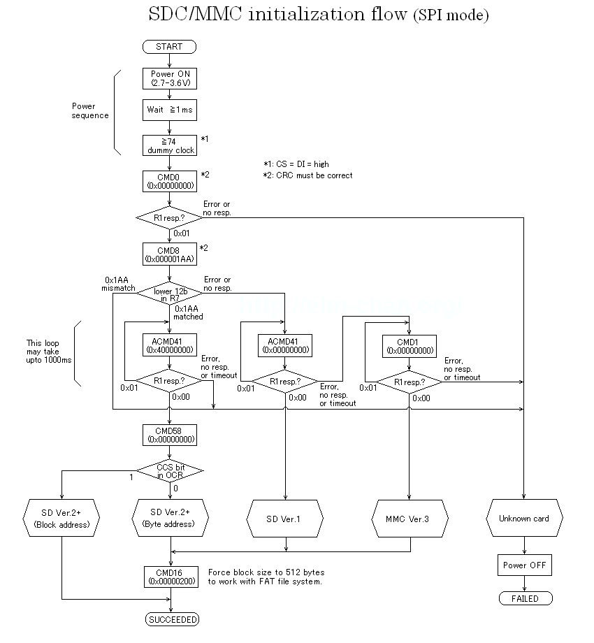
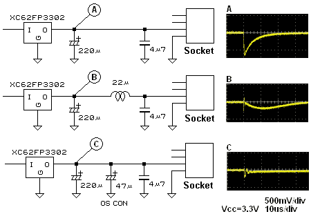
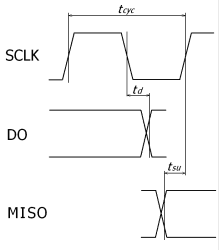

# 【翻译】如何使用MMC/SD卡

原文地址：[http://elm-chan.org/docs/mmc/mmc_e.html](http://elm-chan.org/docs/mmc/mmc_e.html)

中文原文地址：[https://www.0xaa55.com/thread-25692-1-1.html](https://www.0xaa55.com/thread-25692-1-1.html)

**安全数码内存卡**（通称SD卡）对于物联网开发而言算是非常标准的装备了。SD卡对多媒体卡（MMC）向上兼容。
能读SD卡的设备绝大多数情况下都能读 MMC。此外还有不少缩小尺寸的版本，比如 RS-MMC，miniSD 和 microSD ，功能相同。

MMC 和 SD卡都有内置的控制器。存储卡内部已经完成了存储颗粒的控制功能（比如块大小转换、错误校正和耗损平均技术——大家熟知的 FTL 等）。 \
从存储卡里读写的数据都是以 **512字节**为单元的块，所以它可以从上级视角或观察视角被看作是一个块设备，就像标准的硬盘。

## 1. 针脚

上图展示了 SD卡和 MMC的接触表面。MMC有7个接触板。SD卡有9个触点，比MMC多了两个。其中三个触点是电源，所以对于信号传输有效的触点，MMC有4个，SD卡有6个。从主机到卡的数据传输是通过一个同步串口界面进行的。

工作供电的电压的范围由操作条件寄存器（OCR）得知，并且你在初始化卡并且准备操作的时候需要读取它并确保你提供的电压处于范围内。然而，在确定它的供电电压范围前你可以认为它一定会在3.0v到3.3v之间正确工作。因为至少所有的SD卡和MMC都工作在2.7v到3.6v之间。但不要给它直接供5v的电，否则存储卡就地死亡。在写入操作中电流损耗能达到10毫安以上，所以主机系统应该考虑至少要提供100毫安以上的电源到卡上。

下图是miniSD和microSD的触点的图。

*miniSD的触点*

*microSD的触点*

## 2. SPI 模式

*SPI模式最简配置*

这篇文档描述的是使用SPI模式去控制MMC、SD卡。SPI模式是在没有原生的SD卡接口的情况下控制MMC和SD卡的备用操作模式。比起它的原生操作模式，SPI模式的传输协议稍微简单一些。MMC和SD卡可以被接到绝大多数的单片机的SPI接口或GPIO口上。因此SPI模式对于没有原生接口的低成本嵌入式应用而言是最合适的了。有四个不同的SPI模式，0到3，取决于时钟相位（CPHA）和极性（CPOL）。SD卡用的是SPI模式0. 对于MMC，他不是SPI规范的，它的锁存和位移操作都被定义为SCLK的上升沿，但它看起来能在SPI模式0工作。这么说来SPI模式0（CPHA=0，CPOL=0）对于控制MMC和SD卡而言是合适的设置，但模式3（CPHA=1，CPOL=1）依然在绝大多数情况下适用。给DO接一个上拉电阻到电源是不能被省略的，否则一些卡会在初始化的过程中失败。

### 2.1. 命令和响应
在 SPI 模式，数据传输的方向在信号线上是钦定的并且数据是通过面向字节的方式传输的。从主机到卡的命令帧的长度是下图所示的固定长度的报文。当 SD卡或 MMC 把 DO 拉高的时候，这表示它准备好接收命令。当你发送了一个命令帧，存储卡就会返回给你一个应答（R1，R2，R3或R7）。因为数据传输的时钟是被主机控制器驱动的，而且 SPI 是全双工的串口通讯协议，所以在主机发送完命令帧以后，再发送 0xFF 并同时接收数据来分析，直到检测到一个可用的应答。也就是说在读取卡片传来的数据的时候要保持 DI 信号线高（也就是发送 0xFF 来读取数据）。应答会在一次命令应答时间（NCR）内被送回，SD 卡返回0到8字节，MMC返回1到8字节。在发送命令帧前，CS（片选）信号线必须从高拉到低，并且在与卡片交互的时候持续保持低电平（发送命令、接收应答或者数据）。SPI 模式的 CRC 特性是可用可不用的。命令帧里面的CRC字段是不会被卡片检查的。

*SPI波形*

### 2.2. SPI命令集
每个命令被写成缩写，比如 `GO_IDLE_STATE` 或 `CMD<n>`，其中 `<n>` 是命令序号，数值从0到63。下表描述的命令是通常用于初始化和读写卡片用的命令（并非所有的命令）。如果你要了解所有的命令，请参考MMCA和SDA的数据表。

<table cellspacing="0" class="t_table" style="width:75%">
    <tbody>
        <tr>
            <td>命令索引</td>
            <td>参数</td>
            <td>应答</td>
            <td>数据</td>
            <td>缩写</td>
            <td>描述</td>
        </tr>
        <tr>
            <td>CMD0</td>
            <td>无(0)</td>
            <td>R1</td>
            <td>否</td>
            <td>GO_IDLE_STATE</td>
            <td>软件重置</td>
        </tr>
        <tr>
            <td>CMD1</td>
            <td>无(0)</td>
            <td>R1</td>
            <td>否</td>
            <td>SEND_OP_COND</td>
            <td>开启初始化过程</td>
        </tr>
        <tr>
            <td>ACMD41(*1)</td>
            <td>*2</td>
            <td>R1</td>
            <td>否</td>
            <td>APP_SEND_OP_COND</td>
            <td>仅SD卡。开启初始化过程</td>
        </tr>
        <tr>
            <td>CMD8</td>
            <td>*3</td>
            <td>R7</td>
            <td>否</td>
            <td>SEND_IF_COND</td>
            <td>仅SD卡 V2。检查电压范围</td>
        </tr>
        <tr>
            <td>CMD9</td>
            <td>无(0)</td>
            <td>R1</td>
            <td>是</td>
            <td>SEND_CSD</td>
            <td>读取CSD寄存器</td>
        </tr>
        <tr>
            <td>CMD10</td>
            <td>无(0)</td>
            <td>R1</td>
            <td>是</td>
            <td>SEND_CID</td>
            <td>读取CID寄存器</td>
        </tr>
        <tr>
            <td>CMD12</td>
            <td>无(0)</td>
            <td>R1b</td>
            <td>否</td>
            <td>STOP_TRANSMISSION</td>
            <td>停止读取数据</td>
        </tr>
        <tr>
            <td>CMD16</td>
            <td>块长度[31:0]</td>
            <td>R1</td>
            <td>否</td>
            <td>SET_BLOCKLEN</td>
            <td>修改读写块大小</td>
        </tr>
        <tr>
            <td>CMD17</td>
            <td>地址[31:0]</td>
            <td>R1</td>
            <td>是</td>
            <td>READ_SINGLE_BLOCK</td>
            <td>读一个块</td>
        </tr>
        <tr>
            <td>CMD18</td>
            <td>地址[31:0]</td>
            <td>R1</td>
            <td>是</td>
            <td>READ_MULTIPLE_BLOCK</td>
            <td>读多个块</td>
        </tr>
        <tr>
            <td>CMD23</td>
            <td>块的数量[15:0]</td>
            <td>R1</td>
            <td>否</td>
            <td>SET_BLOCK_COUNT</td>
            <td>仅MMC。定义下一个多块读写命令要传输的块的个数</td>
        </tr>
        <tr>
            <td>ACMD23(*1)</td>
            <td>块的数量[22:0]</td>
            <td>R1</td>
            <td>否</td>
            <td>SET_WR_BLOCK_ERASE_COUNT</td>
            <td>仅SD卡。定义下一个多块写入命令要预擦除的块的个数</td>
        </tr>
        <tr>
            <td>CMD24</td>
            <td>地址[31:0]</td>
            <td>R1</td>
            <td>是</td>
            <td>WRITE_BLOCK</td>
            <td>写一个块</td>
        </tr>
        <tr>
            <td>CMD25</td>
            <td>地址[31:0]</td>
            <td>R1</td>
            <td>是</td>
            <td>WRITE_MULTIPLE_BLOCK</td>
            <td>写多个块.</td>
        </tr>
        <tr>
            <td>CMD55(*1)</td>
            <td>无(0)</td>
            <td>R1</td>
            <td>否</td>
            <td>APP_CMD</td>
            <td>ACMD&lt;n&gt;命令的开头命令</td>
        </tr>
        <tr>
            <td>CMD58</td>
            <td>无(0)</td>
            <td>R3</td>
            <td>否</td>
            <td>READ_OCR</td>
            <td>读OCR寄存器</td>
        </tr>
    </tbody>
</table>
<table cellspacing="0" class="t_table" style="width:75%">
    <tbody>
        <tr>
            <td>*1:ACMD&lt;n&gt; 指的是 CMD55-CMD&lt;n&gt; 的命令系列 
                *2: Rsv(0)[31], HCS[30], Rsv(0)[29:0] 
                *3: Rsv(0)[31:12], 供电电压(1)[11:8], 检测模板(0xAA)[7:0]</td>
        </tr>
    </tbody>
</table>

### 2.3. SD 卡应答

*SD卡应答*

有不同的命令应答格式，R1，R2，R3和R7，取决于命令索引。很多命令的应答都是一个字节的应答R1。如上图所示的位域是R1应答的格式，值0x00意为成功。一旦发生任何的错误，特定的状态位会在应答的位域里设置。R3和R7应答（R1+一个结尾的32-bit数据）只被CMD58和CMD8命令返回。

有些命令需要消耗长于NCR的时间并且它应答 `R1b` 。这是一个尾随了忙标识(busy flag)的R1应答（内部过程没完成的时候DO被拉低）。主机控制器需要等待到存储卡的内部过程走到结尾直到D0被拉高（收到一个0xFF）。

## 3. SPI模式的初始化过程
在上电重置后，MMC和SD卡进入它自己的原生操作模式。要让它进入SPI模式，你必须走一个下图那样的程序才行。

*SPI初始化流程*

### 3.1. 上电或插卡
在供电达到2.2伏的时候，等待至少1毫秒。设置SPI时钟频率介于100 kHz到400 kHz之间。设置DI和CS高，并向SCLK施加至少74个时钟脉冲。卡片就会进入它的原生操作模式然后准备接收原生命令。

### 3.2. 软件重置
拉低CS并发送CMD0来重置存储卡。存储卡在收到CMD0信号的时候采样CS信号。如果CS信号为低，卡就会进入SPI模式并应答一个R1应答，并把In Idle State位（闲置状态位）设为1（应答0x01）。由于CMD0命令必须通过它的原生方式发送，CRC域必须是一个有效值。当存储卡进入了SPI模式，CRC特性就不再使用了，存储卡它也不检测CRC值。所以软件重置的CMD0命令，或者带一个值为0的参数的CMD8命令，它们的CRC值可以被硬编码钦定。同时，你也可以通过CMD59来切换CRC特性的开启与关闭。

### 3.3. 初始化

在闲置状态，存储卡只接收CMD0，CMD1，ACMD41，CMD58，和CMD59.所有其它的命令都会被拒绝。此时，你要读OCR寄存器并且检查存储卡工作电压的范围。一旦发现系统供电电压不在存储卡的工作电压范围内，这张卡就应该被弹出。注意所有卡都至少在2.7伏到3.6伏之间能工作，所以如果主机控制器也在这个电压范围内，就可以不用检查OCR的电压范围了。存储卡在收到CMD1的时候开启初始化过程，所以主机必须发送CMD1然后持续检查它的应答，直到初始化结束。当存储卡初始化成功后，R1应答的In Idle State位会被清零（R1的应答从0x01变为0x00）。初始化过程所需的时间能达到上百毫秒（存储卡容量越大，它应该会越长），所以你需要考虑超时的时间。当In Idle State位清零了，通常的读写操作就可以用了。

由于对于SD卡而言推荐用ACMD41而不是CMD1，可以先尝试ACMD41，如果被拒绝了再尝试CMD1。这是一种理想的做法，可以让你同时兼容SD卡和MMC卡（MM卡）。

SCLK的频率应该被改为尽可能大，来把读写性能最大化。可以通过CSD寄存器的TRAN_SPEED字段得知存储卡的最大时钟频率。大多数情况下，MMC的最大时钟频率是20MHz，SD卡的最大时钟频率是25MHz。注意在SPI模式下时钟频率可以被固定在20或25MHz，因为没有漏极开路（open-drain）的条件限制时钟的频率。

在2GB的卡上最初的读写块长度有可能是1024，所以为了能支持FAT文件系统，你需要通过CMD16来把块长度重新设置为512字节。

### 3.4. 初始化大容量卡

在存储卡收到CMD0命令并进入闲置模式后，发送一个参数为0x000001AA的CMD8命令以及正确的CRC值来初始化。如果存储卡拒绝CMD8命令并返回非法指令错误（0x05），这个存储卡应该是版本1的SD卡或版本3的MMC卡。如果它接受，它会返回一个R7应答（R1（0x01）以及一个32位返回值）。返回值低12位如果是0x1AA，意为SD卡的版本是2，并且它能在电压范围2.7伏到3.6伏内工作。如果不是这种情况，这张卡应该被弹出。之后再用带了HCS标识（第30位）的ACMD41命令来开启初始化过程。在初始化完成后，用CMD58读取OCR寄存器并检查CCS标识（第30位）。当它是1，这张卡就是一个大容量卡，也就是SDHC/SDXC。之后描述的存储卡的读写操作是用命令进行块寻址而非字节寻址。在块寻址模式下块的大小被钦定为512字节。

## 4. 数据传输
### 4.1. 数据包和数据应答

*数据包和数据应答*

在数据传输的交互中，在命令应答后会有一个到多个的数据块被收发。数据块被通过以指示（Token）、数据块和CRC构成的数据包来传输。数据包的格式由上图描述，并且有三种数据的token。Stop Tran的指示被用于终止多个块的写入交互，它被用于单个字节的包裹并且不含数据块和CRC。

### 4.2. 单块读取

*单块读取*

参数指定了要开始读的字节或块的位置。由上层指定的LBA扇区地址必须被适当缩放（即保证单位正确，因为LBA的单位是“块”，注意它并不是钦定长度的512字节的块）。当CMD17被接受，一个读操作将被开启，并且读出的数据块会被送回给主机。在检测到一个合法的数据token后，主机控制器接收之后的数据域和CRC。就算你不要CRC，你也必须接收它。读操作过程中如果发生了任何错误，它会返回一个错误token而不是数据包。

### 4.3. 多块读取

*多块读取*

CMD18被用于从指定位置读取多个连续块。读操作会持续进行直到被你阻止。要停止交互，发送CMD12给卡片。发送CMD12的时候接收到的字节是没用的，在收到CMD12的应答前要把它丢掉。对于MMC，如果在发送CMD18前你发送了CMD23来指定传输块的数量的话，你的读操作会被处理为一次读取指定数量的块的读操作，并且会在读完最后一个块后结束。

### 4.4. 单块写入

*单块写入*

单块写入操作写入一个块到卡上。在收到CMD24后，主机发送数据包到卡上。包的格式和读操作的包一样。绝大多数卡并不修改写操作的块大小并且将其钦定为512字节。在CRC功能被启用前，CRC域的值可以瞎jb设。存储卡在收到主机的数据包后立即应答一个“数据应答”。“数据应答”会设置忙标识，并且主机必须等到它不忙为止。

SPI模式的原则是CS信号必须在交互的时候拉低。然而对于这个规则有个例外。当存储卡处于忙状态，主机控制器可以拉高CS线来控制别的SPI从设备。在你重新拉低CS来片选存储卡后，存储卡会重新把DO拉低，来表明它还在忙活。所以你可以在存储卡忙的时候去和别的SPI设备通讯，而不是干等。此外，存储卡内部对数据进行写入的过程是在发送完数据应答后的一个字节之后开始。这意味着你需要在收到数据应答后，还要再发出8个SCLK时钟来开启它的内部的写操作。这8个时钟进行期间CS的状态无所谓，所以你可以通过与别的SPI设备交互来完成这个过程。

### 4.5. 多块写入

*多块写入*

多块写入命令写入多个顺序块到指定位置。在CMD25被接受后，主机控制器发送一个到多个数据包到卡上。数据包的格式和块读取的包的格式相同，除了Data Token不一样以外。写操作也是持续进行的，直到收到一个Stop Tran指示。在你发送每一个数据包以及Stop Tran指示的时候，它都会返回一个忙标识告诉你它很忙。对于MMC，要写入的块的大小可以通过在发送CMD25前发送CMD23来指定，这样当你写完指定长度的包裹后它就自动完成了。对于SD卡，在发送CMD25前你可以发送一个ACMD23来指定预擦除的扇区数量。写操作一直需要用Stop Tran token来终止。它也可以通过在传输一个比预擦除快略大或略小的数据后自动终止，但预擦除并且没有写入的部分，或者没有被预擦除、而是被写入超出了的部分，内容是未定义的。

### 4.6. 读取CSD和CID

和读取单块的过程差不多，但差异在于数据块的长度。CSD和CID都是作为一个16字节的数据块被送给主机的。如果要看CMD、CID和OCR寄存器的内容，请参考MMC和SD卡规范。

-----------------------

## 5. 对总线悬空和热插拔的设计考虑

SPI信号线里可以被悬空的线应该被寄存器正确拉低或拉高。这是CMOS设备的通常的设计规则。因为DI和DO通常为高，它们应该被拉高。根据SD卡和MMC规范，从50k到100k都是推荐被用于上拉电阻用的值。然而规范并没有提到时钟信号，因为它总是被主机控制器驱动。要是有悬空的可能性，你需要把它拉到标准状态，也就是低。

SD卡和MMC能被热插拔。但一些考虑要求主机电路避免错误操作。例如，如果系统供电（Vcc）被直接供给存储卡，Vcc会有个瞬间的压降，因为卡内有电容性质或者内置电容。上图的'A'是示波器的截图，可以看到电压降低了约600mV。这足以触发掉电检测器。图中的'B'用了一个电感器来阻挡电涌，压降被减少到了200mV。一个低ESR电容，比如OS-CON，能像'C'表示的那样消除电压骤降。然而低ESR电容与LDO稳压器能产生振荡。

## 6. 对多从设备（Multi-slave）配置的考虑

在SPI总线中，每个从设备是通过分别的CS信号线来选片的，并且多个设备可以被同时连接到SPI总线上。通用SPI从设备通过CS信号异步驱动/释放其DO信号以共享SPI总线。然而MMC和SD卡驱动/释放其DO信号同步于SCLK信号。这意味着MMC和SD卡有可能与别的SPI从设备冲突。上图是MMC和SD卡驱动/释放信号的时序（DO信号被拉到1/2 vcc来观察总线状态）。因此，为了让MMC或SD卡释放DO信号，主机控制器必须在CS信号置为无效后发送一个字节。

要记住一件重要的事情：MMC和SD卡并非初始就是一个SPI设备。任何试图访问其它SPI设备的总线活动都有可能由于偶然的MMC或SD卡的应答而造成总线冲突。在操作绑定到SPI总线上的其它设备时，你必须先把MMC或SD卡初始化为SPI模式。

## 7. 最大SPI时钟频率

MMC与SD卡能在上至20或25MHz频率的时钟下工作。当然所有原生接口保证能工作在最大时钟频率。然而单片机集成的通用SPI接口有可能由于时序的问题无法在高时钟频率下工作。上图是SPI接口的时序图。在SPI模式0或3，数据在SCLK的下降沿被移出，并在下一个上升沿被锁存。td是SD卡的SCLK到DO的传播延迟，最大14ns。tsu是MISO输入的最短设置时间。因此最大允许的SCLK频率可以被计算为：

`FSCLK(max) = 0.5 / (td + tsu)`

我用过的一些单片机由于时序规范，允许的最大时钟频率被限制在10 MHz左右。

## 8. 文件系统

MMC和SD卡用的文件系统一般是FAT。MMC和SD卡规范定义FAT文件系统是：对于不大于64MB的存储卡使用FAT12文件系统，对于128MB到2GB使用FAT16，对于4GB到32GB的是FAT32，对于64GB到2TB的是exFAT。只允许有一个通过FDISK分区的FAT卷，并且不能像软盘那样没有分区表。当然与MMC和SD卡规范定义不符的文件系统或分区方式也可以被PC用于通用存储媒介。然而这类使用非法格式的卡大概不能被各种DSC、照相机摄像机或电视使用。

## 9. 对写入性能的优化

绝大多数MMC和SD卡使用NAND闪存作为记忆体存储。NAND闪存性价比高并且能快速读写大块数据，但反过来，它的缺点是重复写入同一块区域的数据是低效的。通常Flash闪存需要在写入新数据前擦除旧数据，并且块擦除操作的最小单位比块写入操作的最小单位大。典型的NAND闪存的擦写单位是512字节或16KB，且最新的怪物卡使用更大的块芯片（2K、128K）。这意味着如果你要改写其中的512字节，你需要读取它的一整个块并且修改里面的512字节后，再擦除同样大小的块，然后再写入之前读取并修改好的数据。

### 9.1. 跑分
我用一个便宜的8 bit单片机（ATmega64 @9.2MHz）测试了对于一些MMC或SD卡（上图所示）的读写性能，并且使用一个内存（指随机存储）非常有限的嵌入式系统。由于内存非常有限，读和写每次只能处理2048字节。结果是：在128MB的SD卡上，写：77kB/s，读：328kB/s。在512 MB的SD卡上，写：28kB/s，读：234kB/s。在128MB的MMC上，写：182kB/s，读：312kB/s。

在这之后的跑分测试中，我感觉MMC应该在写性能上比SD卡快一些。

此外对于512MB的SD卡的写性能非常低，它只有128MB的SD卡的三分之一。通常，大容量存储设备的读/写性能与其记录密度成比例地增加，然而对于记忆卡，它有时又是相反的。对于MMC，它看起来比SD卡快好几倍，至少算不上差。在那之后，我测试了不同厂商的SD卡，我发现PQI的SD卡和日立的MMC一样快，但松下和东芝的则非常慢。

### 9.2. 擦除块的大小
为了分析写操作的细节，我使用低级磁盘写入函数进行控制台打印（大概指的是重定向）忙时间（轮询的次数）。同在一行的多个数字表示数据块和一个多块写入操作的Stop Tran token写入交互。

对于分析的结果，128MB的SD卡和512MB的SD卡具有内部处理过程的差异。128MB的SD卡在多块传输结束的时候，覆写已擦除的区块。512MB的SD卡看起来有一个4K数据缓存，并且它每在一个4K边界都覆写擦除的区块。因此你不能直接比较它们处理的耗时。覆写一个擦除区块对于128MB的SD卡消耗3800个轮询时间，但512MB的SD卡需要30000个轮询时间，它将近前者的8倍。通过这个结果来判断，看起来128MB的SD卡使用一个小的块芯片，而一个512MB的SD卡使用一个大的块芯片或者MLC芯片。确实操作的块越大，对于擦写小的局部块的性能越低。在512MB的SD卡上，只有在最开始的512K区域相对更快。看起来它为了加速FAT的访问，对开头这一块的存储区域有特殊处理。

### 9.3. 改进写入的性能
为了避开瓶颈并且增加写入性能，每次写入操作处理的块数量要尽可能多。当然应用程序到媒介之间的每一层都必须支持多块写入特性。对于低级SD卡和MMC的写入函数，它应该在写入数据前把需要写入的扇区的量通知给存储卡。这个方法叫“预定义多块写入”。对于MMC和SD卡，命令是不一样的，MMC用CMD23，SD卡用ACMD23。

存储卡最初是经过分区并把分区格式化为将分配单元对齐到擦除块的边界的位置上。当你使用一个不完全兼容MMC或SD卡（PC就是）的设备并在完全不管边界对齐的时候对存储卡重新分区或重新格式化存储卡，存储卡自身对写入性能的优化会被损坏并且写入性能会丢失。我试图用PC通用的格式化程序把一个512MB的SD卡重新格式化为FAT32文件系统格式，再进行写入性能测算，发现它慢了不止一点半点。因此如果你要重新格式化一张SD卡，你需要通过使用SD卡专用的格式化工具或者SD卡、MMC完全兼容的设备来进行。

--------------

## 10. 许可协议

MMC规范被MMCA（Multimedia Card Association，多媒体卡委员会）制定，然后它已转移到JEDEC。开发和销售MMC产品不需要任何许可证。但是，MMC规范不向公众开放，你需要加入JEDEC来获取技术文档。

SD规范是由SDA（SD卡协会）和SD-3C，LLC开发和提供的产品。销售任何具有SD规范的产品的每个组织或个人都必须获得SDA的许可。例如，要销售任何表明支持SD卡的SD主机产品，无论使用哪种接口，SD模式或SPI模式，都需要HALA（Host and Ancillary Product License Agreement，主机和辅助产品许可协议）来许可。对于中间产品，例如嵌入式模块，模块的销售商或者最终产品之间的任意一个需要有许可证。只有被许可人才能在产品，包装和手册上放置SD徽标。一般会员的年费为2,500美元，HALA每年的许可费为3,000美元。

每个产品都声明支持SD卡需要获得许可。换句话说，该产品如果不支持SD卡，就不需要许可，即使它实际上支持SD卡。为了避免许可证问题，一些不想花钱的设备制造商包括主要公司都说“我支持MMC”，“我支持MMC和兼容机”或“支持TF卡”就行。这算什么话！
