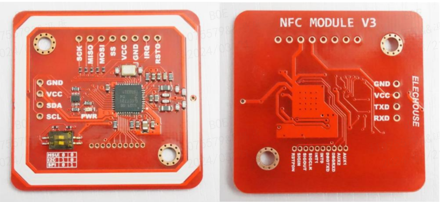

# NFC 协议 PN532 模组介绍和快速使用

### 参考文档：
- `NXP 官方手册`
    - 用户指南：[UM0701-02 - PN532 User Manual](https://www.nxp.com.cn/docs/en/user-guide/141520.pdf)
    - 应用笔记：[AN133910 - PN532 application note](https://www.nxp.com.cn/docs/en/nxp/application-notes/AN133910.pdf)
    - 数据手册：[PN532/C1 - Near Field Communication (NFC) controller](https://www.nxp.com.cn/docs/en/nxp/data-sheets/PN532_C1.pdf)
- `模组 elechouse 官网`
    - https://www.elechouse.com/


### 模组介绍：
PN532 是一款高度集成的收发器模块，用于非接触式通信 13.56 MHz，基于 80C51 微控制器内核。它支持 6 种不同的操作模式：
-  ISO/IEC 14443A/MIFARE 读/写器
-  FeliCa 读/写器
-  ISO/IEC 14443B 读写器
-  ISO/IEC 14443A/MIFARE卡 MIFARE Classic 1K 或 MIFARE Classic 4K 卡仿真模式
- FeliCa 卡仿真
- ISO/IEC 18092、ECMA 340 点对点

PN532 为来自ISO/IEC 14443A/MIFARE兼容卡和转发器。PN532 可处理完整的 ISO/IEC 14443A 成帧和错误检测（奇偶校验和 CRC）。

PN532支持MIFARE Classic 1K或MIFARE Classic 4K卡仿真模式。PN532支持使用MIFARE的非接触式通信 更高的传输速度双向速度高达 424 kbit/s。

PN532 可以解调和解码 FeliCa 编码信号。PN532 可处理 FeliCa 成帧和错误检测。PN532 支持非接触式通信
使用 FeliCa 双向传输速度高达 424 kbit/s。

PN532 支持 ISO/IEC 14443 B 读/写器的第 2 层和第 3 层通信方案，防碰撞除外。这必须在固件中实现
以及上层。

在卡仿真模式下，PN532 能够响应读/写器命令根据 FeliCa 或 ISO/IEC 14443A/MIFARE 卡接口方案。The PN532
从其发射器或 LOADMOD 生成负载调制信号引脚驱动外部有源电路。只有完整的安全卡功能才有可能与使用 NFC-WI/S2C 接口的安全 IC 结合使用。

符合 ECMA 340 和 ISO/IEC 18092 NFCIP-1 无源和有源通信模式，PN532 提供了与另一个符合 NFCIP-1 标准的人通信的可能性PN532 可处理完整的 NFCIP-1 取景和错误检测。

PN532 收发器可以连接到用于读写器的外部天线，或者卡/PICC模式，无需任何额外的有源元件。

PN532 支持以下主机接口：
- SPI接口
- I2C接口
- 高速 UART （HSU）
嵌入式低压差稳压器允许器件直接连接到
一块电池。此外，还包括一个电源开关，用于为安全 IC 供电。

## 1. PN532 模块的硬件连接
### 1.1. 模块外观



### 1.2. 通信接口选择


通过模块的拨码开关选择通讯方式：
- HSU
    - 默认通讯参数为： 115200,8N1，LSB优先。
- I2C
    - I2C 从设备，I2C 地址 0x48 ，时钟最大 400kHz，MSB 优先。
- SPI
    - 使用 SPI 作为主机接口时，当 PVDD 不存在时，需要特定的硬件实现才能使用 LowVbat 模式。
    - SPI 工作在 Mode 0 模式，LSB优先。数据始终在 SCK 的第一个时钟边沿上采样，SCK 为高电平有效。
    - 无论哪种模式，只要 NSS 为低电平，PN532 就会被唤醒（虚拟卡或 LowVbat）。此功能只能通过 PowerDown 命令禁用。此引脚不使用时应绑在高处。


### 1.3. 硬件接线
选择通讯方式后，需要连接到对应引脚：
- HSU：
    - MCU UART_RXD ---> SDA(HSU_TX) Pin_28
    - MCU UART_TXD ---> SCL(HSU_RX) Pin_27
    - GND --->GND
- I2C:
    - MCU SDA ---> SDA Pin_28
    - MCU SCL ---> SCL Pin_27
- SPI:
    - MCU NSS ---> NSS Pin_27
    - MCU MOSI ---> MOSI Pin_28
    - MCU MISO ---> MISO Pin_29
    - MCU SCLK ---> SCK Pin_30
    - GND --->GND

## 2. 通讯规约
控制器与 PN532 在半双工模式下，通过帧进行通讯。在单向或双向使用四种不同类型的帧（主机控制器到 PN532 和PN532到主机控制器）

### 2.1. 普通信息帧格式
用于以下场景：
- 主控制器给 PN532 发送命令；
- PN532 给主控制器发送响应；

帧格式如下：


- **PREAMBLE** : 1 字节 ，前导码 (0x00) ；
- **START CODE** : 2 字节，启动码 (0x00 and 0xFF),
- **LEN** : 1 字节，包长度，指定数据区字节数量 (从 TFI 和 PD0 到 PDn),
- **LCS** : 1 字节，包长度校验码，取与包长度 LEN 满足条件的低字节：[LEN + LCS] = 0x00,
- **TFI** : 1 字节， PN532 的帧标识符, 此字节的值取决于消息传输的方式：
    - **D4h** ，从主机控制器到 PN532 的帧，
    - **D5h** ，从 PN532 到主机控制器的帧。
- **DATA** : LEN-1 字节，包数据信息区，其中第一字节 PD0 为命令码。
- **DCS** : 1 字节，包数据区校验码，取满足条件的低字节：[TFI + PD0 + PD1 + … + PDn + DCS] = 0x00,
- **POSTAMBLE** : 1 字节，后导码 (0x00)。

### 2.2. 拓展信息帧格式
信息帧具有扩展定义，允许在主机控制器和 PN532 之间交换更多数据。

在 PN532 的固件实现中，数据包数据的最大长度限制为 264 字节（包括 TFI 时为 265 字节）。

帧格式如下：


将正常的 LEN 和 LCS 字段固定为 0xFF 值，由于和校验不使用，该值通常被视为错误帧。

实际的长度将编码到后两个字节 LENM （MSByte） 和 LENL （LSByte）：
- LENGTH = LENM x 256 + LENL 编码数据字段中的字节数（TFI 和 PD0 到 PDn）。
    - **LCS** 1 个满足关系的数据包长度校验和 LCS 字节：[LENM + LENL + LCS] = 0x00, 取低位；
    - **DATA** LEN-1 字节，包数据信息区，其中第一字节 PD0 为命令码。

用于发送长度小于 255 字节的帧的主机控制器也可以使用这种类型的帧。

但是，PN532 始终使用合适的帧类型，具体取决于长度（帧 <= 255 字节的正常信息帧和帧 > 255 字节的扩展信息帧）。

### 2.3. 应答帧格式
特定的 ACK 帧用于数据包的同步以及中止机制。

此帧可以从主机控制器到 PN532 或从 PN532 到主机控制器，以指示已成功接收前一帧。

帧格式如下：


### 2.4. 未应答帧格式
特定的 NACK 帧用于数据包的同步。

此帧仅用于从主机控制器到 PN532 的帧，以指示未成功接收上一个响应帧，然后请求将最后一个响应帧从 PN532 重新传输到主机控制器。

帧格式如下：


### 2.5. 错误帧格式
语法错误帧用于通知主机控制器 PN532 在应用程序级别检测到错误。

帧格式如下：


### 2.6. 帧头和帧尾
帧的这两个特定字段在前面的段落中被描述为单字节，其值0x00。事实上，这些字段可以由不确定的字节数组成：
- 帧头：
    - 前导码字段由不确定的字节数组成，其中两个连续的字节不等于 0x00 0xFF（否则在主机控制器链路通信详细信息中指定）。
    - PN532 使用此同步模式 （0x00 0xFF） 来检测帧的开头；之前的所有数据都将被忽略。
    - 
- 帧尾：
    - 后导码字段由不确定的字节数组成，其中两个连续字节不等于 0x00 0xFF（否则在主机控制器链路通信详细信息5 中指定）。
    - PN532 接收并分析帧，直到 DCS 字节。
    - 在此校验和字节之后，通用同步模式检测将再次启动。
    - 因此，DCS字节和下一个同步模式（0x00 0xFF）之间的所有数据都将被忽略。
    - 
- PN532 发送的帧数
    - 关于 PN532 发送到主机控制器的帧，前导码和后导码都仅由一个 0x00 字节组成。但是，PN532 可以不发送这两个字段（前导码和后导码）以增加整体数据吞吐量。
- 示例
    - 从 PN532 的角度来看，以下所有帧都是相同的（GetFirmwareVersion）:
        ```text
        xx xx xx xx xx 00 FF 02 FE D4 02 2A xx xx xx xx 
                       00 FF 02 FE D4 02 2A xx xx xx xx
        xx xx xx xx xx 00 FF 02 FE D4 02 2A
                       00 FF 02 FE D4 02 2A 
        ```

## 3. PN532 命令码支持
命令码说明较多，建议参考目录中 `PN532 User Manual` 章节 `7. Commands supported` 。

下面列出一部分常用的命令码。