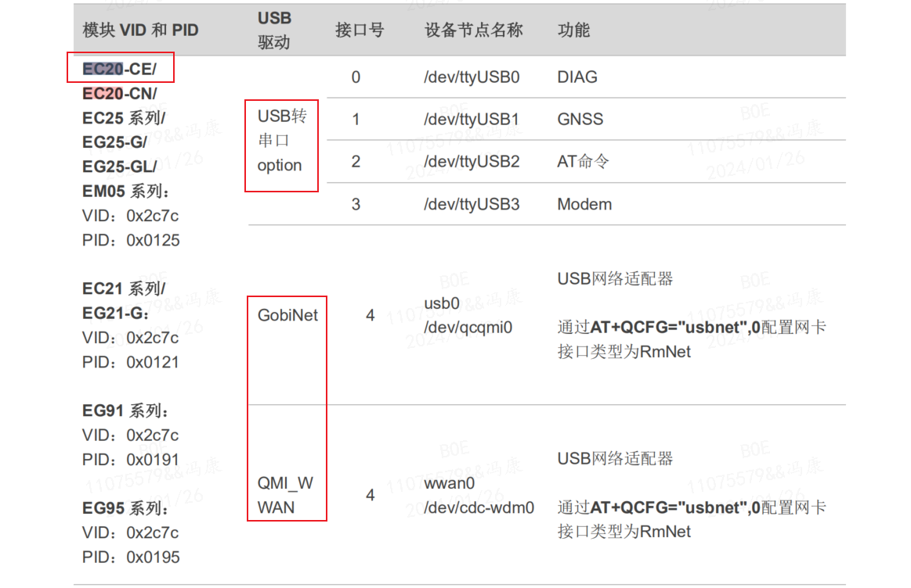
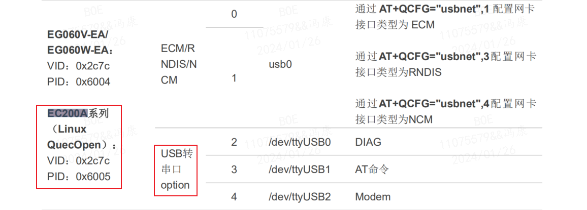

# 移远 4G 模块在 linux 系统下的驱动移植

参考文档；
- `Quectel_UMTS_LTE_5G_Linux_USB_Driver_用户指导_V1.0.pdf`
    - 官网查看下载界面：[Quectel_UMTS_LTE_5G_Linux_USB_Driver_用户指导_V1.0.pdf](https://www.quectel.com.cn/download/quectel_umts_lte_5g_linux_usb_driver_%e7%94%a8%e6%88%b7%e6%8c%87%e5%af%bc_v1-0)
    - 直接下载地址：[https://forumschinese.quectel.com/uploads/short-url/xpMd7lXBklBDV0FgQfqeWC4a3kw.pdf](https://forumschinese.quectel.com/uploads/short-url/xpMd7lXBklBDV0FgQfqeWC4a3kw.pdf)

安装驱动前，需要查看 `Quectel_UMTS_LTE_5G_Linux_USB_Driver_用户指导_V1.0.pdf` 文件，找到需要支持的模块型号，然后安装模块支持的驱动进行安装。

 

这里只使用到 EC20 和 EC200A 模块，两个模块都支持 USB 转串口驱动，所以这里主要介绍 USB 转串口驱动的安装。

## 2. linux 内核的 USB 转串口驱动移植
### 1.1. linux 内核驱动源码的获取
1. 解压移远官方提供的 `Quectel_Linux_USB_Serial_Option_Driver_20230524.tgz` 驱动源码文件
