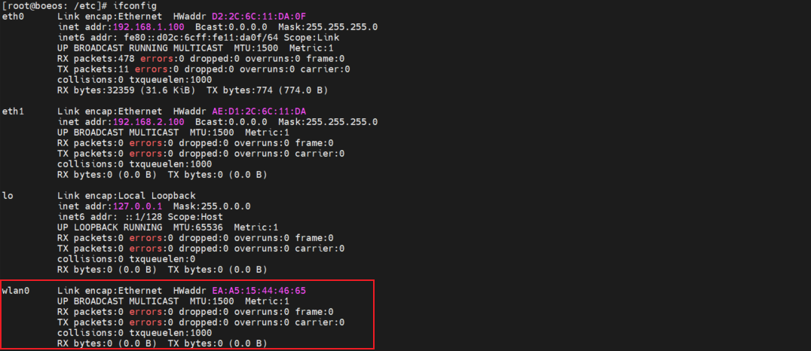
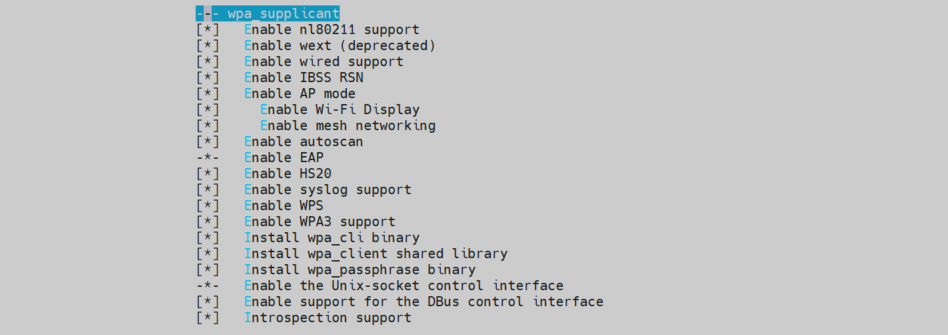

# linux系统 RTL8723 系列 WIFI 驱动移植

## 1. WIFI 驱动安装
### 1.1. `rtl8723` 系列驱动移植
1. 将官方提供的驱动源码添加到内核源码的无线驱动目录 `drivers/net/wireless` ，根据要安装的模块修改 Kconfig 文件和 Makefile 文件，添加模块的编译选项，（具体步骤这里不再叙述，详情见内核和驱动部分），然后执行 `make menuconfig` 命令，选择要安装的模块，保存配置并退出，

2. 将编译好的内核源码烧写到开发板。

### 1.2. `rtl8723du` 驱动模块的安装
1. 如果内核中 `rtl8723du` 驱动是以模块的形式存在的，则需要先安装 `rtl8723` 系列模块，安装命令如下：
```bash
    # 采用 modprobe 自动依赖的方式进行安装模块
    # 使用后系统会在 /lib/module/<$(uname -r)> 目录下的搜索模块，搜索不到会安装失败并报错
    modprobe 8723du

    # 采用 insmod 手动输入路径安装
    insmod /lib/modules/4.1.15-00070-gb52e1ec/kernel/drivers/net/wireless/realtek/rtl8723DU/8723du.ko
```

2. 如果制作的文件系统镜像与内核镜像的名称不同，所以需要手动指定内核模块的路径。安装结果如下：


3. 安装完成后，可以看到生成了 `wlan0` 网卡，表明 `rtl8723du` 驱动已安装成功。



## 2. WIFI 连接的必备工具
linux 系统下的 WIFI 连接需要用到 WIFI 连接工具 `wpa_supplicant`，该工具是比较常用的无线网络连接工具，需要在 buildroot 工具链中选择并编译，添加到文件系统中。

### 2.1. 将 `wpa_supplicant` 添加到文件系统
可以使用 `menuconfig` 工具的搜索功能，搜索 `wpa_supplicant` 工具的相关配置，并编译。

1. `menuconfig` 下进行相关配置
- `menuconfig` 下使用 `/` 搜索功能搜索 `wpa_supplicant` 工具，选中如下：
    
- 选择 `wpa_supplicant` 工具的配置选项，这里为了适配各类 WIFI ，将所有配置全部选中：
    

2. `CONFIG` 配置宏展示如下：
    ```CONFIG
    BR2_PACKAGE_WPA_SUPPLICANT--->
        BR2_PACKAGE_WPA_SUPPLICANT
        BR2_PACKAGE_WPA_SUPPLICANT_NL80211
        BR2_PACKAGE_WPA_SUPPLICANT_WEXT
        BR2_PACKAGE_WPA_SUPPLICANT_WIRED
        BR2_PACKAGE_WPA_SUPPLICANT_IBSS_RSN
        BR2_PACKAGE_WPA_SUPPLICANT_AP_SUPPORT
            BR2_PACKAGE_WPA_SUPPLICANT_WIFI_DISPLAY
            BR2_PACKAGE_WPA_SUPPLICANT_MESH_NETWORKING
        BR2_PACKAGE_WPA_SUPPLICANT_AUTOSCAN
        BR2_PACKAGE_WPA_SUPPLICANT_EAP
        BR2_PACKAGE_WPA_SUPPLICANT_HOTSPOT
        BR2_PACKAGE_WPA_SUPPLICANT_DEBUG_SYSLOG
        BR2_PACKAGE_WPA_SUPPLICANT_WPS
        BR2_PACKAGE_WPA_SUPPLICANT_WPA3
        BR2_PACKAGE_WPA_SUPPLICANT_CLI
        BR2_PACKAGE_WPA_SUPPLICANT_WPA_CLIENT_SO
        BR2_PACKAGE_WPA_SUPPLICANT_PASSPHRASE
        BR2_PACKAGE_WPA_SUPPLICANT_CTRL_IFACE
        BR2_PACKAGE_WPA_SUPPLICANT_DBUS
        BR2_PACKAGE_WPA_SUPPLICANT_DBUS_INTROSPECTION
    ```
