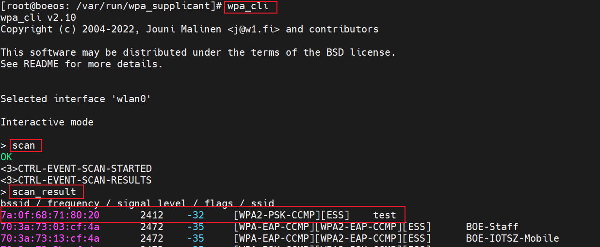
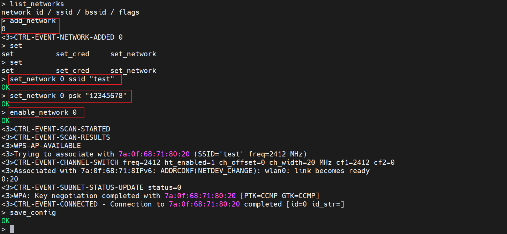
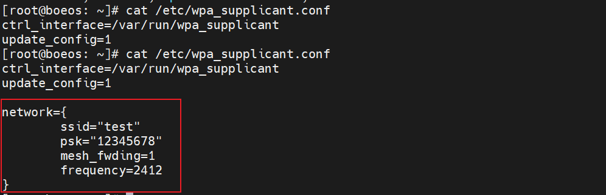
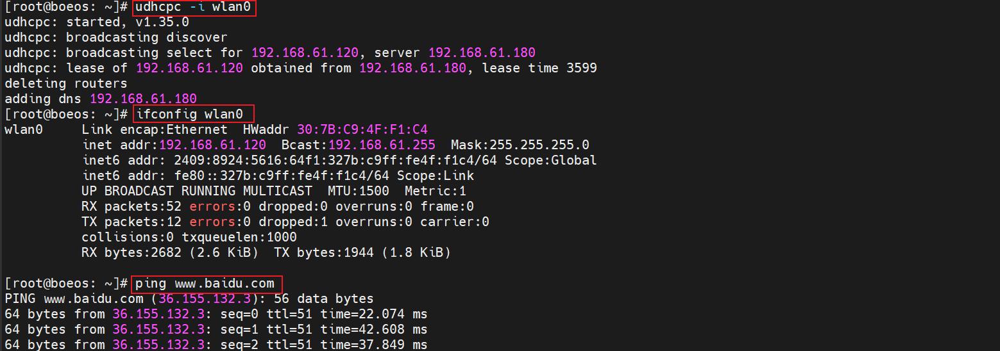
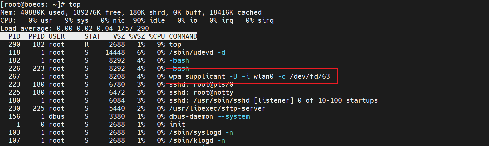
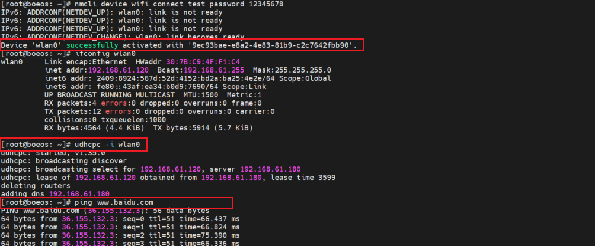
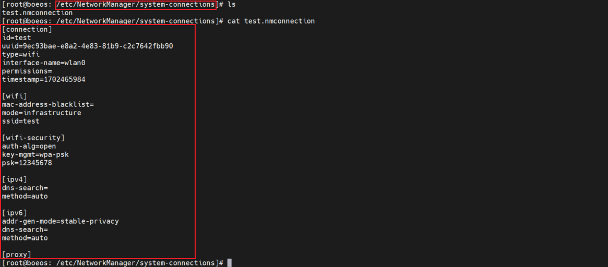

# 使用 wpa_supplicant 工具连接 WIFI

## 1. 无网络守护进程的环境（busybox）下连接 WIFI
在无任何网络守护进程的环境下，可以使用 `wpa_supplicant` 工具对 WIFI 进行连接，该方式需要手动配置网络或设置脚本连接 WIFI 网络。

wpa_supplicant 是跨平台的 WPA 请求者程序（supplicant），支持 WEP、WPA 和 WPA2(IEEE 802.11i).。可以在桌面、笔记本甚至嵌入式系统中使用。

wpa_supplicant 是在客户端使用的 IEEE 802.1X/WPA 组件，支持与 WPA Authenticator 的交互，控制漫游和无线驱动的IEEE 802.11 验证和关联。

软件包提供了主程序 `wpa_supplicant` ，密码工具 `wpa_passphrase` 和文字界面前端 `wpa_cli` .

软件包连接 WIFI 的方式有以下几种：

### 1.1. 使用 `wpa_cli` 连接
1. 使用 `wpa_cli` 前，需要先为 wpa_supplicant 指定一个控制接口，且它需要获得更新配置的权限。先创建一个最小配置：
    ```bash
    # /etc/wpa_supplicant.conf 的最小配置文件内容如下
    ctrl_interface=/var/run/wpa_supplicant
    update_config=1
    ```

2. 接下来启动 wpa_supplicant ：
    ```bash
    wpa_supplicant -B -i wlan0 -c /etc/wpa_supplicant.conf
    ```

3. 完成后，执行 `wpa_cli` 命令，进入 `wpa_cli` 命令行模式，输入 `scan` 命令搜索当前环境的 WIFI ，再输入  `scan_result` 命令将扫描结果显示出来，可以看到已经搜索到名为 test 的测试网络 WIFI ：
    

4. 在 `wpa_cli` 命令行模式下完成以下操作：
    ```bash
    > list_networks #列出当前可用的配置
    > add_network   #新增网络配置
    > set_network 0 ssid "test" # 设置网络N的ssid名称
    > set_network 0 psk "12345678" # 设置网络N的密码，无密码需要设置 set_network 0 key_mgmNONE
    > enable_network 0 # 连接
    ```

5. 结果如下图:
    

6. 在 `wpa_cli` 命令行模式下输入 `save_config` ，将配置保存到指定的 `/etc/wpa_supplicant.conf` 文件中，  可以看到配置文件已经改变，网络配置已经写入成功：
    

7. 在 `wpa_cli` 命令行模式下输入 `quit` 指令退出 `wpa_cli` 命令行模式，使用 `udhcpc` 命令获取 IP 地址，  测试后可以成功上网：
    

### 1.2. 使用 `wpa_passphrase` 连接
1. 用命令行工具 wpa_passphrase 生成 wpa_supplicant 所需的最小配置，可以快速连接到已知 SSID 的无线网络。  例如：
    ```bash
    # $ wpa_passphrase MYSSID passphrase
    network={
        ssid="MYSSID"
        #psk="passphrase"
        psk=59e0d07fa4c7741797a4e394f38a5c321e3bed51d54ad5fcbd3f84bc7415d73d
    }
    ```

    上例表明，wpa_supplicant 可以与 wpa_passphrase 协同工作，只需简单地这样做即可：
    ```bash
    # wpa_supplicant -B -i interface -c <(wpa_passphrase MYSSID passphrase)
    ```

2. 测试结果发现进程在后台运行，使用 udhcpc 命令获取 IP 地址，测试后可以成功上网：
    


## 2. 在集成 `NetworkManager` 进程的环境下连接 WIFI
`NetworkManager` 配置无线网络采用的是 `nmcli` 命令对无线连接进行设置并写入到配置文件，再调用 `wpa_supplicant` 工具对无线网络进行连接，调用过程在系统后台，无需细节配置。`nmcli` 命令是 `NetworkManager` 集成的命令，功能很强大，具体的可以使用命令+help的方式查看具体功能。

1. 使用 `nmcli` 命令对无线网络进行搜索：
    ```bash
        # 使用 wifi 命令对 device 对象中的进行
        # nmcli 命令格式为 nmcli {OBJECT {COMMAND <param> } }
        # 这里由于所处环境 WIFI 较多，使用 grep 管道进行筛选
        nmcli device wifi list | grep test
    ```
    
    结果如下，也可以看到 WIFI 的相关参数：
    
    

2. 使用 `nmcli` 命令对无线网卡进行连接，配置完成后会生成配置文件，重启设备也会自动连接到该WIFI：
    ```bash
        # 使用 wifi 命令对 device 对象中的进行
        # nmcli 命令格式为 nmcli {OBJECT {COMMAND <param> } }
        # 这里由于所处环境 WIFI 较多，使用 grep 管道进行筛选
        nmcli device wifi connect test password 12345678
    ```

    结果如下，也可以看到 WIFI 成功连接，完成连接后需要使用 udhcpc 命令自动获取 ip 地址和 dns 就可以连接到外网：
    

3. 配置完成后，重启设备，会自动连接到 WIFI，在 `/etc/NetworkManager/system-connections` 目录下会看到上述命令设置的 WIFI 配置文件 `test.nmconnection` ：
    

## 3. 在集成 `systemd-network` 进程的环境下连接
 `NetworkManager` 工具一般用在桌面环境，尝试将文件修改为 `systemd` 启动方式，并使用对应的 `systemd-network` 进程服务进行 WIFI 连接

本质上，无线网络的配置都是通过 使用 `wpa_supplicant` 连接无线网络来实现的，网络配置管理工具 `netplan` 网络配置 、 `NetworkManager` 在管理无线网络底层都是使用 `wpa_supplicant` ，区别只是配置方式，底层都是调用 `wpa_supplicant` 。

`Systemd Networkd` 服务也是一种配置管理工具，同样可以结合 `wpa_supplicant` 管理无线网络。

由于当前 `systemd` 已经成为主要的系统管理框架和组件集，所以使用 `systemd-networkd` 结合 `wpa_supplicant` 实现无线网络管理，就是一种非常简洁并且不需要第三方管理工具的实现方法。

1. 确定 WiFi 设备的名称：可以使用 ip link 命令或 ifconfig 命令来查看所有网络设备的列表。

2. 创建一个 .network 文件，其中包含 WiFi 网络的配置信息。可以在 `/etc/systemd/network` 目录中创建一个 .network 文件。例如，创建一个名为 `wlan0.network` 的文件，并在其中添加以下内容：

    ```bash
    [Match]
    Name=wlan0

    [Network]
    DHCP=yes
    ```

    其中:
    - [Match] 部分指定了此网络配置文件应用于哪个网络接口。在本例中，它应用于名为 wlan0 的接口。
    - [Network] 部分指定了网络配置信息。在本例中，它使用 DHCP 自动获取 IP 地址和其他网络设置。

3. 重新启动 systemd-networkd 服务：使用 `systemctl restart systemd-networkd` 命令来重新启动 systemd-networkd 服务。

4. 连接 WiFi：使用 `systemctl start wpa_supplicant.service` 命令启动 WPA 客户端，然后使用 wpa_cli 命令连接到 WiFi 网络。例如，使用以下命令连接到名为 MyWiFi 的 WiFi 网络：

    ```bash
    wpa_cli -i wlan0
    > scan
    > scan_results
    > add_network
    > set_network 0 ssid "MyWiFi"
    > set_network 0 psk "mypassword"
    > enable_network 0
    > save_config
    > quit
    ```

    其中，
    - -i 选项指定要使用的无线网络接口（在本例中为wlan0）。
    - add_network 命令添加一个新的网络配置文件，并将其指定为0。
    - set_network命令设置网络的SSID和密码。 
    - enable_network 命令启用新的网络配置文件。
    - save_config命令将新的网络配置文件保存到 `/etc/wpa_supplicant/wpa_supplicant.conf` 文件中。

5. 重新启动WPA客户端：使用 `systemctl restart wpa_supplicant.service` 命令重新启动 WPA 客户端。