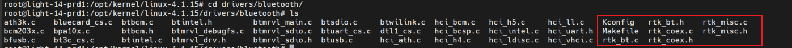
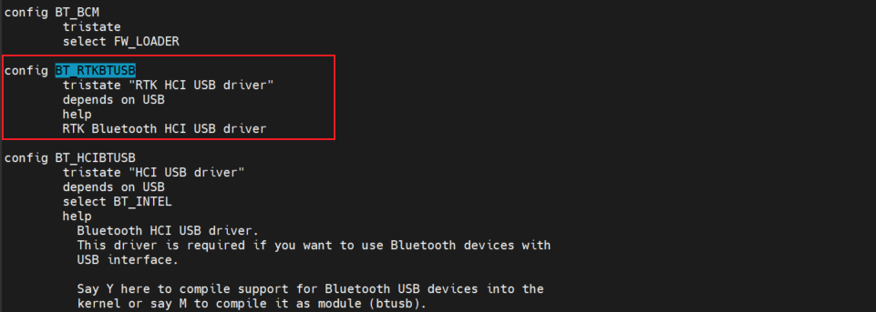
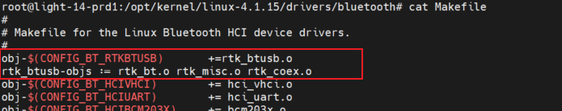
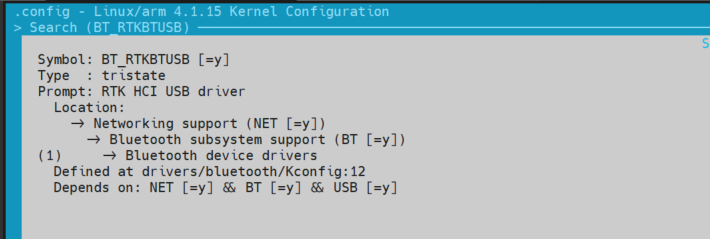
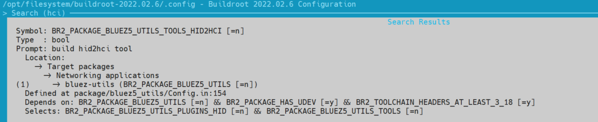

# linux系统 RTL8723 系列 Bluetooth 驱动移植

## 1. Bluetooth 驱动移植
以下以 `rtl8723du` 芯片为例，介绍如何在 linux 系统下移植 `Bluetooth` 驱动。

### 1.1. `rtl8723` 蓝牙驱动添加到内核源码
1. 将官方提供的蓝牙驱动源码添加到内核源码驱动目录 `drivers/bluetooth` ，根据要安装的模块修改 Kconfig 文件和 Makefile 文件，添加模块的编译选项，（具体步骤这里不再叙述，详情见内核和驱动部分），然后执行 `make menuconfig` 命令，选择要安装的模块，保存配置并退出。

2. 修改目录 `drivers/bluetooth` 下的 Kconfig 文件。
    - 添加名为 `BT_RTKBTUSB` 的选项，设置为三态配置选项。
    

3. 修改目录 `drivers/bluetooth` 下的 Makefile 文件。
    - 添加 `obj-$(CONFIG_BT_RTKBTUSB) += rtk_btusb.o` 选项；
    - 指定该选项的链接目标 `obj-$(CONFIG_BT_RTKBTUSB) += rtk_bt.o rtk_misc.o rtk_coex.o`，
    

### 1.2. `rtl8723` 蓝牙驱动编译到内核
1. 进入内核 `menuconfig` 工具配置界面，命令为：`make ARCH=arm CROSS_COMPILE=arm-linux-gnueabihf- menuconfig` 。使用 `/` 搜索工具搜索 `BT_RTKBTUSB` 选项：
    

2. 选中该选项，将选项设置为选中状态 [*] ，保存配置并退出：
    
    
3. 编译内核镜像，编译完成后，烧写到开发板。

## 2. 安装 Bluetooth 连接的必备工具
linux 系统下的蓝牙配置需要用到工具套件 `blueZ`，该工具是比较常用的蓝牙设置和连接工具，需要在 buildroot 工具链中选择并编译，添加到文件系统中。

### 2.1. 将 `blueZ` 工具添加到 buildroot 文件系统
可以使用 `menuconfig` 工具的搜索功能，搜索 `bluez-utils` 工具套件的相关配置，并编译。

该工具主要包括的命令有： `hciattach` 、 `hciconfig` 、 `hcidump` 、 `hcitool` 、 `hcid` 等。

1. `menuconfig` 下进行相关配置
    - `menuconfig` 下使用 `/` 搜索功能搜索 `bluez` 工具，选中如下：
    

    - 选择 `bluez` 工具的配置选项，这里为了适配各类蓝牙设备和功能，暂时将所有配置全部选中：
    

2. 重新编译文件系统并烧写到开发板。

3. `CONFIG` 配置宏展示如下：

### 2.2. 直接下载 blueZ 工具源码编译
- blueZ 官网地址 ：[www.bluez.org](www.bluez.org)