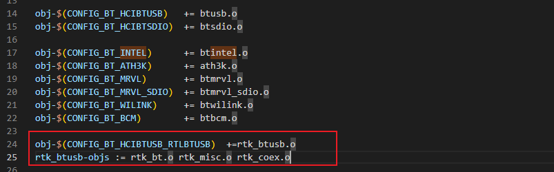
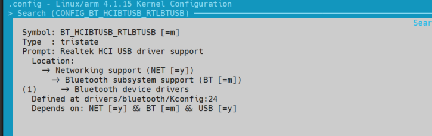
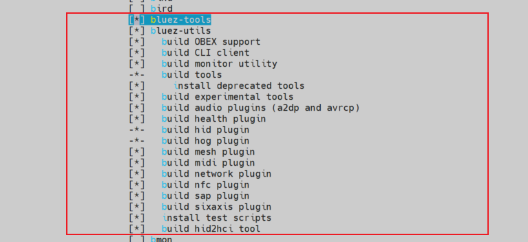

# linux系统 RTL8723 系列 Bluetooth 驱动移植

## 1. Bluetooth 驱动移植
以下以 `rtl8723du` 芯片为例，介绍如何在 linux 系统下移植 `Bluetooth` 驱动。

### 1.1. `rtl8723` 蓝牙驱动添加到内核源码
1. 将官方提供的蓝牙驱动源码添加到内核源码驱动目录 `drivers/bluetooth` ，根据要安装的模块修改 Kconfig 文件和 Makefile 文件，添加模块的编译选项，（具体步骤这里不再叙述，详情见内核和驱动部分），然后执行 `make menuconfig` 命令，选择要安装的模块，保存配置并退出。


2. 修改目录 `drivers/bluetooth` 下的 Kconfig 文件。
    - 添加名为 `BT_RTKBTUSB` 的选项，设置为三态配置选项。
    

3. 修改目录 `drivers/bluetooth` 下的 Makefile 文件。
    - 添加 `obj-$(CONFIG_HCIBTUSB_RTKBTUSB) += rtk_btusb.o` 选项；
    - 指定该选项的链接目标 `rtk_btusb-objs += rtk_bt.o rtk_misc.o rtk_coex.o`，
    - **注意：这里添加时尽量添加到 btusb 和 btintel 之后，因为 rtk_btusb 模块会调用 btusb 和 btintel 模块的函数。**
    

### 1.2. `rtl8723` 蓝牙驱动编译到内核
1. 进入内核 `menuconfig` 工具配置界面，命令为：`make ARCH=arm CROSS_COMPILE=arm-linux-gnueabihf- menuconfig` 。

2. 将驱动编译成模块形式在使用时更为灵活方便，可以随时卸载和安装，内核源码菜单的选项位置如下，这里将 `Bluetooth subsystem support` 、 `HCI USB driver` 、 `Realtek HCI USB driver support` 都设置为 `[M]` 选项。

    ```menuconfig
    [*] Networking support  --->
        <M>   Bluetooth subsystem support  --->
            Bluetooth device drivers  --->
                <M> HCI USB driver
                <M> Realtek HCI USB driver support
    ```

    如果系统中选型位置找不到，也使用 `/` 搜索工具搜索 `CONFIG_BT_HCIBTUSB_RTLBTUSB` 选项：

    

3. 使用 `make ARCH=arm CROSS_COMPILE=arm-linux-gnueabihf- zImage -j12` 编译内核镜像，导出 `arch/arm/boot/zImage` 内核镜像文件。

4. 新建一个 bash 脚本完成内核模块的编译、安装和打包，也可以依次输入命令完成操作，脚本如下：
    ```bash
    #!/bin/bash

    rm -rf ./.tmp
    make modules -j${CPUS}
    make modules_install INSTALL_MOD_PATH=./.tmp/rootfs/
    cd .tmp/rootfs/
    tar -jcvf modules.tar.bz2 *
    ```

    - 赋予脚本可执行权限，运行脚本，可以看到蓝牙驱动相关的重要模块被打包到 `modules.tar.bz2` ：

        
        

    - 四个模块的依赖和安装顺序为：`bluetooth.ko -> btusb.ko -> btintel.ko -> rtl_btusb.ko` 。
    
5. 将 `zImage` 文件和 `modules.tar.bz2` 文件导出，使用 `mfgtools` 烧写工具烧写到开发板，注意留意打印信息确认文件的正确写入。

6. 驱动模块安装目录中，有几个重要文件需要了解：
    - `modules.dep` 文件，该文件记录了模块之间的依赖关系。
    - `modules.order` 文件，该文件记录了模块的安装顺序，如果安装顺序不对，可能导致模块加载失败。如果已经出现安装顺序错误的情况，可以调整源码中相关 `Makefile` 的编译顺序。
    - `modules.builtin` 文件，该文件记录了模块的编译信息。

## 2. 用 buildroot 工具安装 Bluetooth 使用的必备工具
linux 系统下的蓝牙配置需要用到工具套件 `blueZ`，该工具是比较常用的蓝牙设置和连接工具，需要在 buildroot 工具链中选择并编译，添加到文件系统中。

依赖包和工具包括：
- `bluez-utils` 工具套件；
- `openobex` 工具套件；
- `rfkill` 命令；

### 2.1. 添加 `blueZ` 蓝牙配置工具
可以使用 `menuconfig` 工具的搜索功能，搜索 `bluez-utils` 工具套件的相关配置，并编译。

该工具主要包括的命令有： `hciattach` 、 `hciconfig` 、 `hcidump` 、 `hcitool` 、 `hcid` 等。

1. `menuconfig` 下进行相关配置
    - `menuconfig` 下使用 `/` 搜索功能搜索 `bluez` 工具，选中如下：
    

    - 选择 `bluez` 工具的配置选项，这里为了适配各类蓝牙设备和功能，暂时将所有配置全部选中：
    

2. `CONFIG` 配置宏展示如下：
    ```defconfig
    BR2_PACKAGE_BLUEZ_TOOLS=y
    BR2_PACKAGE_BLUEZ5_UTILS=y
    BR2_PACKAGE_BLUEZ5_UTILS_OBEX=y
    BR2_PACKAGE_BLUEZ5_UTILS_CLIENT=y
    BR2_PACKAGE_BLUEZ5_UTILS_MONITOR=y
    BR2_PACKAGE_BLUEZ5_UTILS_TOOLS=y
    BR2_PACKAGE_BLUEZ5_UTILS_DEPRECATED=y
    BR2_PACKAGE_BLUEZ5_UTILS_EXPERIMENTAL=y
    BR2_PACKAGE_BLUEZ5_UTILS_PLUGINS_AUDIO=y
    BR2_PACKAGE_BLUEZ5_UTILS_PLUGINS_HEALTH=y
    BR2_PACKAGE_BLUEZ5_UTILS_PLUGINS_HID=y
    BR2_PACKAGE_BLUEZ5_UTILS_PLUGINS_MESH=y
    BR2_PACKAGE_BLUEZ5_UTILS_PLUGINS_MIDI=y
    ```

### 2.2. 添加 `openobex` 蓝牙文件传输工具
如果需要使用蓝牙进行文件传输，需要用到文件传输协议 `obex` 协议.

该协议的命令行使用可以借助 `openobex` 工具实现，这里需要将 `openobex` 工具移植到 buildroot 文件系统中。

1. `menuconfig` 下进行相关配置
    - `menuconfig` 下使用 `/` 搜索功能搜索 `openobex` 工具.
    - 选择 `openobex` 工具的配置选项：
    

2. 重新编译文件系统并烧写到开发板。

3. `CONFIG` 配置宏展示如下：
    ```defconfig
    BR2_PACKAGE_OPENOBEX=y
    ```

### 2.3. 添加 `rfkill` 无线启停命令
射频（rf）是Radio Frequency的缩写，rfkill可以管理wifi、wlan、bluetooth、uwb、wimax、wwan、gps、fm、nfc无线信号。

这种开关在某种程度上能够控制硬件的状态，使用的例子有：飞行模式、硬件节能。

1. 内核中添加 `rfkill` 支持：
    

2. 文件系统支持 `rfkill` 命令。

    - `menuconfig` 下进行相关配置:
        - `menuconfig` 下使用 `/` 搜索功能搜索 `rfkill` 命令.
        - 选择 `rfkill` 工具的配置选项：
    

    - `busybox-menuconfig` 下进行相关配置:
        - `busybox-menuconfig` 下使用 `/` 搜索功能搜索 `rfkill` 命令.
        - 选择 `rfkill` 工具的配置选项 (`CONFIG_RFKILL`)：
    

    - `CONFIG` 配置宏展示如下：
        ```bash
        # defconfig 下：
        BR2_PACKAGE_UTIL_LINUX_RFKILL=y
        # busybox 的 config 下：
        CONFIG_RFKILL
        ```

    - 重新编译文件系统并烧写到开发板。


## 3. 直接编译安装 Bluetooth 使用的必备工具
- blueZ 官网地址 ：[www.bluez.org](www.bluez.org)