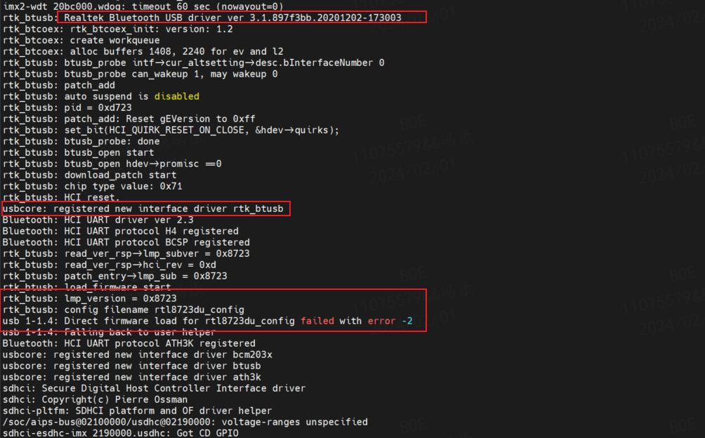
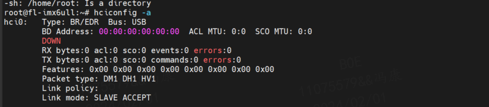
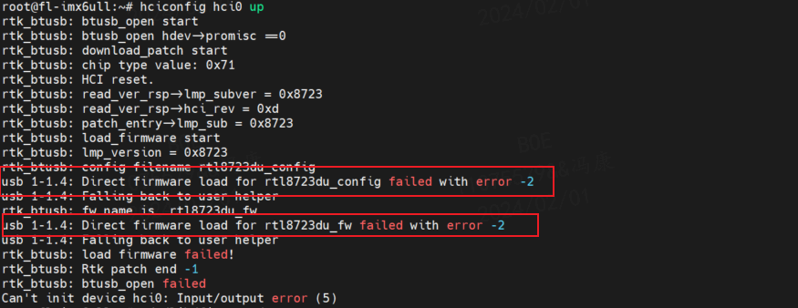
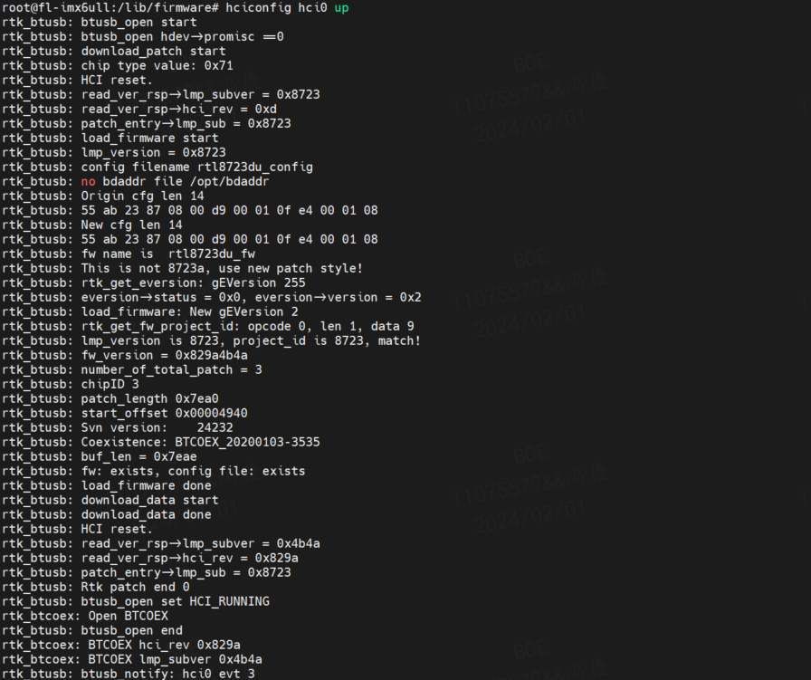
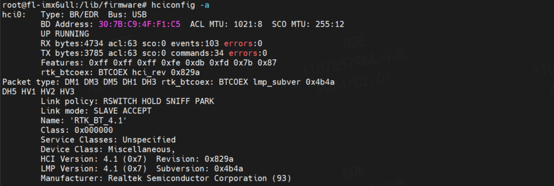
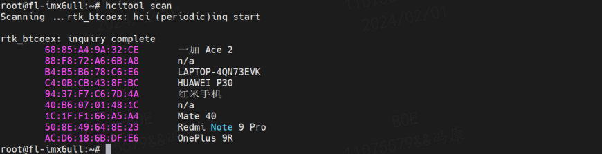
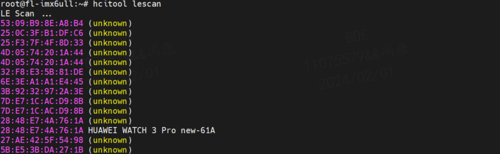
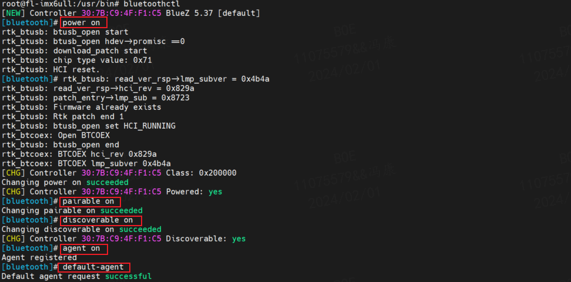
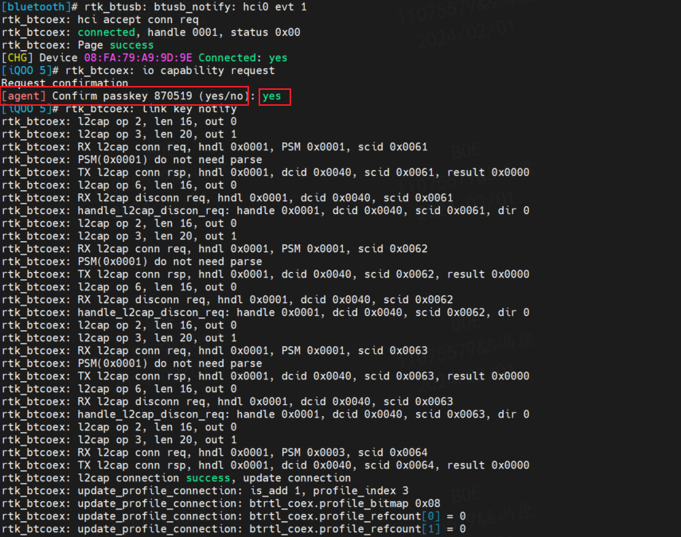

# 使用 blueZ 工具套件连接 Bluetooth

BlueZ 是官方 Linux Bluetooth 栈，由主机控制接口（Host Control Interface ，HCI）层、Bluetooth 协议核心、逻辑链路控制和适配协议（Logical Link Control and Adaptation Protocol，L2CAP）、SCO 音频层、其他 Bluetooth 服务、用户空间后台进程以及配置工具组成。

## 1. RTL8723 的固件安装
### 1.1. 固件下载
解压 `20210324_LINUX_BT_DRIVER_RTL8723D_COEX_v3b3b.tar.gz` 文件，其中 `rtkbt-firmware` 文件夹中包含的就是必需的固件文件 `rtl8723du_config` 和 `rtl8723du_fw` 。

### 1.2. 固件安装
1. 驱动安装完成启动后，会发现开机打印信息中驱动被安装并识别，但是缺少固件：
    

2. 系统启动后，使用 `hciconfig -a` 命令查看蓝牙设备，但是会发现没有生成 mac 地址：
    

    使用 `hciconfig hci0 up` 命令也无法启用该蓝牙设备，错误信息显示无法成功加载固件：
    

3. 通过渠道获取到 rtl8723du 的固件文件 `rtl8723du_config` 和 `rtl8723du_fw` ，通过 tftp 或 ssh 等网络传输工具将固件文件传输到开发板中，放在 `/lib/firmware/` 目录下。

4. 再次使用 `hciconfig hci0 up` 命令加载蓝牙设备，会发现蓝牙设备启动成功：
    

5. 使用 `hciconfig -a` 命令查看蓝牙设备，发现已经生成 mac 地址：
    

### 1.3. 固件测试
1. hcitool: HCI 工具。使用 `hcitool` 命令可以查看蓝牙设备信息，如 mac 地址、连接状态等。
    - `sudo hcitool scan` /*scan other bluetooth device*/.
    

    - `sudo hcitool lescan` /*scan other le bluetooth device*/.
    
    - 其它 hcitool cmd 可用 hcitool --help 获得或查看 tools/hcitool.c 文件。

2. l2ping: l2cap 测试指令。
    - `l2ping <address>` 。这里我们使用 `l2ping 00:11:22:33:44:55` 测试手机的蓝牙 mac 地址，发现可以成功 ping 通。
    


## 2. RTL8723 蓝牙启动流程
### 2.1. 开启 bluetoothd 守护进程
bluetoothd 是 BlueZ 的一个守护进程，实现了 A2DP, AVRCP, GATT, SDP 等 profiles，并提供 D-Bus services 给外部程序使用。

在启动 bluetoothd 之前需要完成以下几步配置：
1. 确认 bluetooth.conf 已放置在 `/etc/dbus-1/system.d` 目录下，启动 bluez 进程：`bluetoothd 
-n -d &` （防止命令行下运行时终止进程，加 & 符号让服务在后台运行）；对于 Bluez 5.xx, 可以添加-C 参数，提供 deprecated command line interfaces，如 sdptool 
browse local。

    如果 bluetoothd 启动失败，出现以下 log：
    ```bash
    D-Bus setup failed: Connection ":1.12" is not allowed to own the service "org.bluez" due to security policies in the configuration file
    ```

    则可能是 D-Bus 权限问题，可以在 `/etc/dbus-1/system.d/bluetooth.conf` 中添加:
    ```html
    <policy user="root">
        <allow own="org.bluez"/>
        <allow send_destination="org.bluez"/>
        <allow send_interface="org.bluez.Agent1"/>
        <allow send_interface="org.bluez.MediaEndpoint1"/>
        <allow send_interface="org.bluez.MediaPlayer1"/>
        <allow send_interface="org.bluez.ThermometerWatcher1"/>
        <allow send_interface="org.bluez.AlertAgent1"/>
        <allow send_interface="org.bluez.Profile1"/>
        <allow send_interface="org.bluez.HeartRateWatcher1"/>
        <allow send_interface="org.bluez.CyclingSpeedWatcher1"/>
        <allow send_interface="org.bluez.GattCharacteristic1"/>
        <allow send_interface="org.bluez.GattDescriptor1"/>
        <allow send_interface="org.freedesktop.DBus.ObjectManager"/>
        <allow send_interface="org.freedesktop.DBus.Properties"/>
        <!-- for bluez 4 -->
        <allow send_interface="org.bluez.Agent"/>
        <allow send_interface="org.bluez.HandsfreeAgent"/>
        <allow send_interface="org.bluez.MediaEndpoint"/>
        <allow send_interface="org.bluez.MediaPlayer"/>
        <allow send_interface="org.bluez.Watcher"/>
        <allow send_interface="org.bluez.ThermometerWatcher"/>
        <allow send_type="method_call"/>
    </policy>
    ```
    如果不是以 root 运行 bluetoothd，则需要添加相应 user 的 policy，和 root policy 类似，复制上面的内容，然后把第一行修改成<policy user=”xxx”>

    不过请在 root 权限下运行 bluetoothd。

2. 如果使用 UART 接口的卡片，需要将#BT_DIS pin 拉 high 并通过 rtk_hciattach 完成初始化和配置：`rtk_hciattach -n -s 115200 ttyUSB0 rtk_h5`;

3. 在 terminal 中输入 `rfkill list` 查看 Bluetooth 状态。如果蓝牙状态为 Blocked: yes, 请使用 `rfkill unblock bluetooth` 修改蓝牙状态为 Blocked: no。 

4. 将蓝牙带起来：运行 bluetoothctl, 在其提供的命令行中输入 power on 或者使用hciconfig 工具，命令为 hciconfig hci0 up。建议使用 bluetoothctl 使能蓝牙。

### 2.2. 查看、修改蓝牙信息
`hciconfig -a` 可以显示 Controller 的一些基本信息，也可以通过 `bluetoothctl` 的 `show` 命令查看 Controller 信息。

在 BlueZ 的 main.conf (/etc/bluetooth/main.conf) 中可以设置 Name、Class 等信息。

如果要修改 Controller 在手机等远端设备上的显示图标,可以修改 class。例如要显示成耳机，可修改成 0x210404。(Only the major and minor device class bits are considered)。同时需要修改 `plugins/hostname.c` ，注释掉函数 update_name() 和 update_class() 中的代码。

### 2.3. 蓝牙配置
BlueZ 提供了一个命令行工具 bluetoothctl ，实现了 GAP 操作。

#### 2.3.1. bluetoothctl 的使用
此程序位于 `<bluez-5.xx>/client/` 目录下。请在 root 权限下运行 bluetoothctl，进入内部命令行模式。

bluetoothctl 常用语法如下：
```bash
[bluetooth]# show //查看控制器的 Power 是否为 yes，如果 Power 为 no，则运行 power on
[bluetooth]# power on //启动蓝牙设备
[bluetooth]# agent NoInputNoOutput //可以设置其他 IO caps, 如 KeyboardDisplay
[bluetooth]# agent on //启动代理
[bluetooth]# default-agent //设置当前代理为默认
[bluetooth]# scan on //扫描到对应的设备后，使用 scan off 关闭 scan。
[bluetooth]# pair 00:22:48:DC:89:0F //配对远端设备。
[bluetooth]# connect 00:22:48:DC:89:0F //连接远端设备
```

#### 2.3.2. 用 bluetoothctl 配置蓝牙
按如下命令完成蓝牙的配置：
```bash
root@fl-imx6ull:~# bluetoothctl //打开 bluez 蓝牙工具
Agent registered
[CHG] Controller 0C:CF:89:7C:79:E3 Pairable: yes
[bluetooth]# power on //启动蓝牙设备
Changing power on succeeded
[CHG] Controller 0C:CF:89:7C:79:E3 Powered: yes
[bluetooth]# pairable on //设置为配对模式
Changing pairable on succeeded
[bluetooth]# discoverable on //设置为可发现模式
Changing discoverable on succeeded
[CHG] Controller 0C:CF:89:7C:79:E3 Discoverable: yes
[bluetooth]# agent on //启动代理
Agent is already registered
[bluetooth]# default-agent //设置当前代理为默认
Default agent request successful
```

实际展示结果如下：




## 3. RTL8723 蓝牙的配对
### 3.1. 被动配对
在启动蓝牙守护进程并完成对蓝牙的配置后，可以通过手机蓝牙查看到蓝牙设备。

点击蓝牙进行配对，需要手动输入确认蓝牙的配对请求（回复 yes ）:
```bash
[bluetooth]# rtk_btusb: btusb_notify: hci0 evt 1
rtk_btcoex: hci accept conn req
rtk_btcoex: connected, handle 0001, status 0x00
rtk_btcoex: Page success
[CHG] Device 08:FA:79:A9:9D:9E Connected: yes
[iQOO 5]# rtk_btcoex: l2cap op 2, len 16, out 0
```

后续还需要一次认证确认（回复 yes ），认证完成后，命令行转化为配对后的设备名称：

```bash
[agent] Authorize service 0000111e-0000-1000-8000-00805f9b34fb (yes/no):yes
[iQOO 5]# 
[iQOO 5]#
```

- 实际展示结果如下：
    
    

### 3.2. 主动配对
蓝牙配置完成后，使用 bluetoothctl 命令行工具，也可以实现主动配对。

```bash
[bluetooth]# scan on    //搜索可被发现蓝牙
Discovery started
[bluetooth]# rtk_btcoex: hci (periodic)inq start
[CHG] Controller 30:7B:C9:4F:F1:C5 Discovering: yes
[NEW] Device 50:8C:3A:69:E7:AD 50-8C-3A-69-E7-AD
...
[NEW] Device 08:FA:79:A9:9D:9E iQOO 5
...
[NEW] Device 54:64:F4:6F:52:14 54-64-F4-6F-52-14
[bluetooth]# scan off   //停止搜索
rtk_btcoex: hci (periodic)inq cancel/exit
Discovery stopped
[CHG] Controller 0C:CF:89:7C:79:E3 Discovering: no
...
[NEW] Device 50:8C:3A:69:E7:AD RSSI is nil
[CHG] Device 69:E7:27:69:F8:A7 RSSI is nil
...
```

通过 pair 命令对名为 iQOO 5 的蓝牙设备发起配对请求，发起后需要在手机蓝牙界面配对确认，命令行如下：
```bash
[bluetooth]# pair 08:FA:79:A9:9D:9E     //主动配对蓝牙
[agent] Authorize service 0000111e-0000-1000-8000-00805f9b34fb (yes/no):yes
```


## 4. RTL8723 蓝牙配对设备的移除
### 4.1. 移除配对设备
以 [3.1. 被动配对](#31-被动配对) 章节中的蓝牙设备为例，移除配对设备可以通过以下命令实现：

```bash
[iQOO 5]# devices   //列出已配对设备
Device 08:FA:79:A9:9D:9E iQOO 5
[iQOO 5]# remove 08:FA:79:A9:9D:9E  //移除已配对设备
[iQOO 5]# 
...
rtk_btcoex: HCI Disconnect, handle 0002, reason 0x13
Device has been removed
rtk_btcoex: disconn cmpl evt: status 0x00, handle 0002, reason 0x16
rtk_btcoex: process disconn complete event.
[CHG] Device 08:Frtk_btusb: btusb_notify: hci0 evt 2
A:79:A9:9D:9E Connected: no
[DEL] Device 08:FA:79:A9:9D:9E iQOO 5
[bluetooth]#
```

## 5. RTL8723 蓝牙设备的连接
### 5.1. 被动连接
被动设备的连接由手机端发起，一般手机在配对列表中点击蓝牙设备可以发起连接，该操作与被动配对类似，可以参考 [3.1. 被动配对](#31-被动配对) 章节。

### 5.2. 主动连接
**蓝牙配对完成后**，可以继续使用 bluetoothctl 命令行工具，也可以实现主动连接。主要命令如下：
```bash
[bluetooth]# connect 08:FA:79:A9:9D:9E  //主动连接设备
Attempting to connect to 08:FA:79:A9:9D:9E
[CHG] Device 08:FA:79:A9:9D:9E Connected: yes
Connection successful
```

