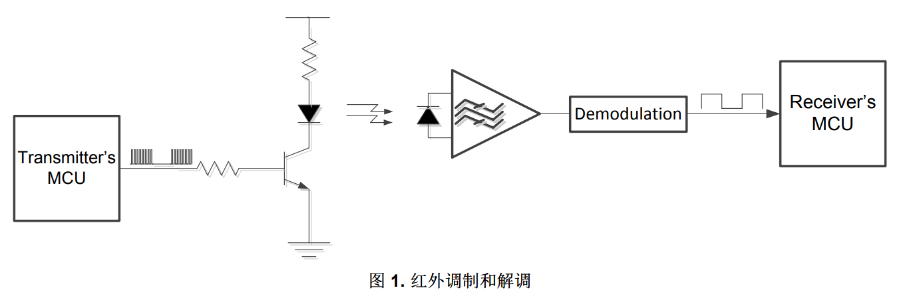
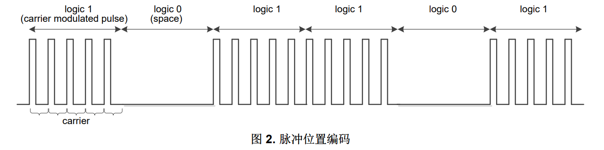
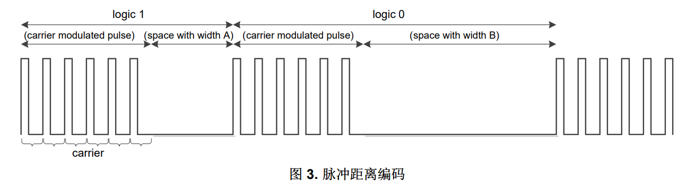
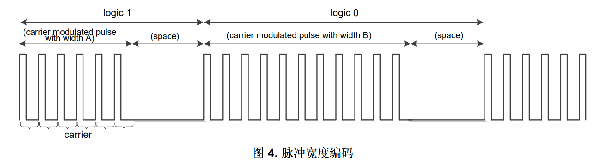
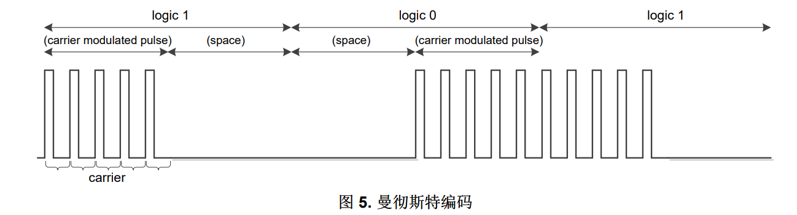
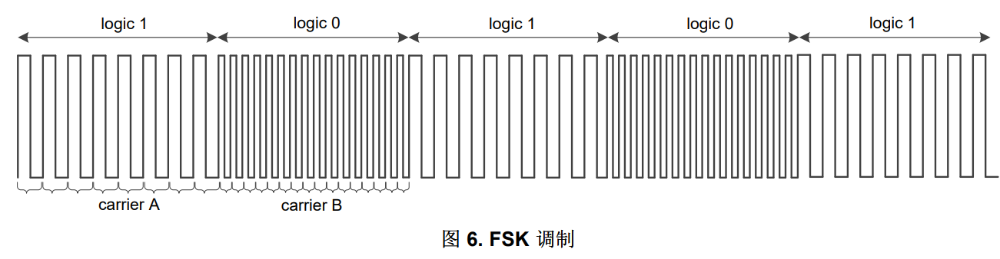

# 红外调制和解调

参考文献：
- TI：
    - [ZHCA623 - 采用 MSP430FR4xx 的红外远程控制实现](https://www.ti.com.cn/cn/lit/an/zhca623/zhca623.pdf?ts=1720005526897)

## 1. 红外简介

红外远程控制使用红外 (IR) 光传送信息。 红外光由 IR 发光二极管 (LED) 在来自发送器的 MCU 的调制信号
控制下发出。 调制可以帮助接收器区分所需信号与所有其他红外噪声源。 调制过程通过使用承载有效信息
的包络信号调制载波信号（通常为更高频率的方波）来实现。

接收器通过光电二极管将 IR 光转换为电流。 通常使用互阻抗放大器将电流转换为电压，并在经过增益放大
器和滤波器的处理之后进行解调。 解调过程中会将载波信号分离出去。 已解调信号可直接连接到接收器的
MCU 进行解码（请参见图 1）。

## 2. 红外远程控制调制和编码原理
所有现代红外远程控制设计均采用数字调制。 两种基本的数字调制技术为振幅键控 (ASK) 和频移键控
(FSK)。 ASK 通过更改载波幅值来表示逻辑 1 和 0，而 FSK 使用两种不同的载波频率来表示这两种逻辑电
平。

### 2.1. ASK 调制
ASK 是最原始而又最为简单的技术之一，受到许多消费类电子产品公司的青睐。 ASK 调制性能出色（稳定
且功耗低）、设计简洁且成本低，因此已成为最常用的调制模式。

在发送器中，有效数据会被调制到频率处于 30kHz 至 60kHz 范围内的一组载波脉冲中。 不发送信号时，插
入一段空白部分。

接收器频率被调整为发送器的载波频率，以便接收器的带通滤波器能够阻隔所有其他噪声。 许多产品都配有
完全集成的接收器模块，用于将已解调信号与接收器的微控制器连接。 典型的载波频率有 30、33、36、38、40 或 56kHz。

以下章节将介绍 ASK 调制系统中的几种主要编码方法。

- 脉冲位置编码
    - 脉冲位置编码是基本的 ASK 调制。 每个位宽度都是恒定的。 载波调制脉冲代表逻辑 1，空白部分代表逻辑 0（请参见图 2）。
    - 
- 脉冲距离编码
    - 在脉冲距离编码中，每个位由载波调制脉冲和空白部分组成。 通过不同的空白部分宽度来分别表示逻辑 1 和逻辑 0。 载波调制脉冲的宽度是恒定的（请参见图 3）。
    - 
- 脉冲宽度编码
    - 在脉冲宽度编码中，每个位由载波调制脉冲和空白部分组成。 通过不同的载波调制脉冲宽度来分别表示逻辑 1 和逻辑 0，空白部分是恒定的（请参见图 4）。
    - 
- 曼彻斯特编码
    - 曼彻斯特编码也称作双相位编码。 每个位由载波调制脉冲和空白部分组成。 调制脉冲和空白部分之间的转换极性定义逻辑电平。 例如，“从调制脉冲到空白部分”表示逻辑 1，而“从空白部分到调制脉冲”表示逻辑 0（请参见图 5）。
    - 

### 2.2. FSK 调制
FSK 使用两种不同的载波频率来分别表示逻辑 1 和逻辑 0，而且各脉冲之间无空白部分（请参见图 6）。

FSK 调制相对要逊色一些，因为其同时采用两种频率，这会增加解调复杂度和成本，因此未被广泛使用。

