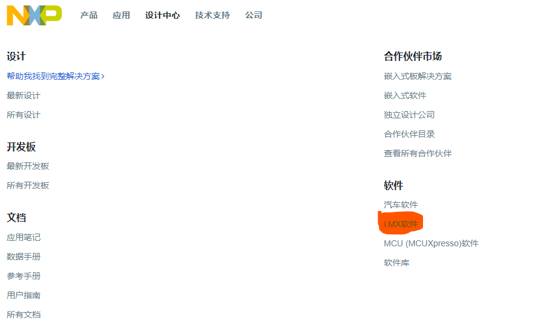
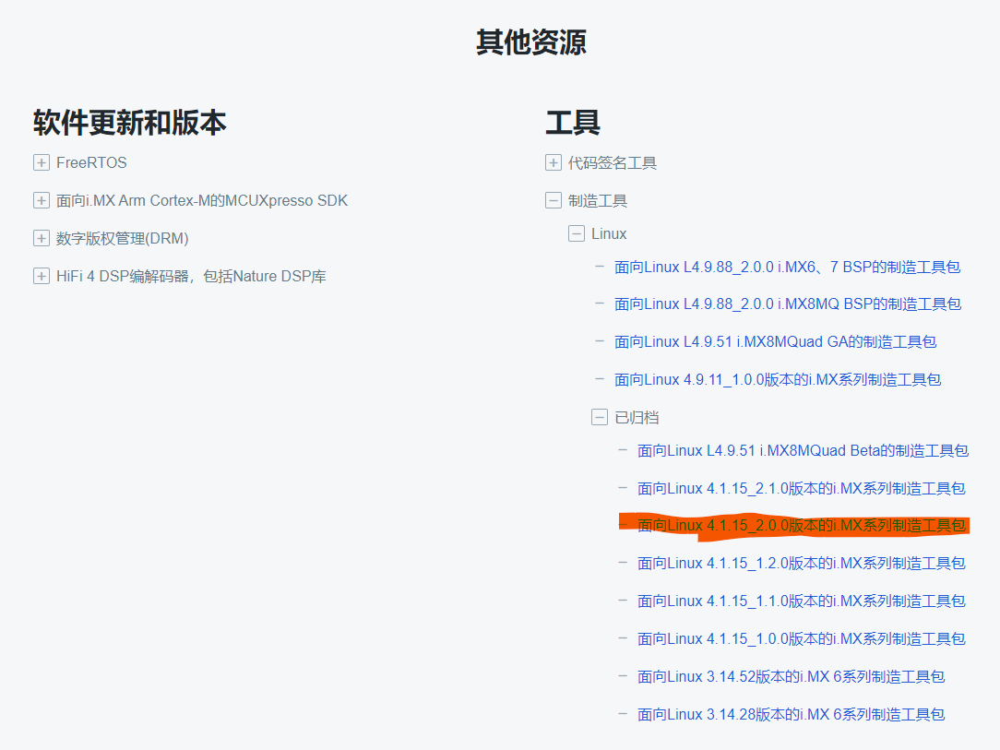
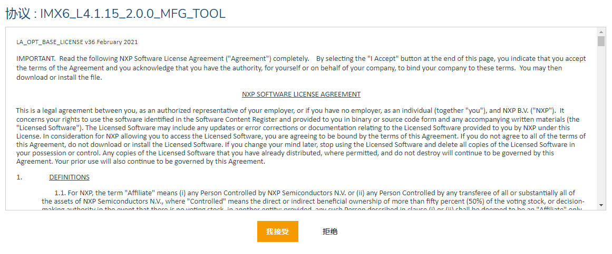

# MFG 量产工具官方版本下载

## 工具简介

`Manufacturing (MFG) tool V2` 量产工具是 NXP 官方提供的使用 `USB OTG` 方式烧写的量产工具。

## 官网下载

1. 进入 NXP 官网，选择：`“设计中心” -> “i.MX 软件”`。

    

2. 拉到最下面的其他资源，选择：`“工具” -> “制造工具” -> “Linux” -> “已归档” -> “面向Linux 4.1.15_2.0.0版本的i.MX系列制造工具包”`。

    

3. 进到下载界面后点击 “我接受” 即开始下载。

    
