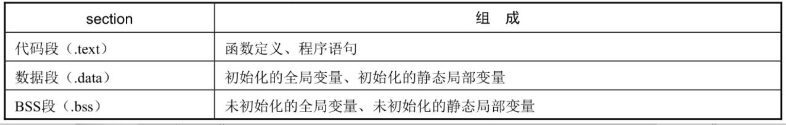

# 属性声明：section
## 1. 属性声明：section
我们可以使用__attribute__来声明一个section属性，section属性的主要作用是：在程序编译时，将一个函数或变量放到指定的段，即放到指定的section中。

一个可执行文件主要由代码段、数据段、BSS段构成。代码段主要存放编译生成的可执行指令代码，数据段和BSS段用来存放全局变量、未初始化的全局变量。代码段、数据段和BSS段构成了一个可执行文件的主要部分。

除了这三个段，可执行文件中还包含其他一些段。用编译器的专业术语讲，还包含其他一些section，如只读数据段、符号表等。我们可以使用下面的readelf命令，去查看一个可执行文件中各个section的信息。
```bash
root@light-14-prd1:~/langurage_C# readelf -S a.out 
There are 29 section headers, starting at offset 0x1970:

Section Headers:
  [Nr] Name              Type             Address           Offset
       Size              EntSize          Flags  Link  Info  Align
  [ 0]                   NULL             0000000000000000  00000000
       0000000000000000  0000000000000000           0     0     0
  [ 1] .interp           PROGBITS         0000000000000238  00000238
       000000000000001c  0000000000000000   A       0     0     1
  [ 2] .note.ABI-tag     NOTE             0000000000000254  00000254
       0000000000000020  0000000000000000   A       0     0     4
  [ 3] .note.gnu.build-i NOTE             0000000000000274  00000274
       0000000000000024  0000000000000000   A       0     0     4
  [ 4] .gnu.hash         GNU_HASH         0000000000000298  00000298
       000000000000001c  0000000000000000   A       5     0     8
  [ 5] .dynsym           DYNSYM           00000000000002b8  000002b8
       00000000000000a8  0000000000000018   A       6     1     8
  [ 6] .dynstr           STRTAB           0000000000000360  00000360
       0000000000000084  0000000000000000   A       0     0     1
  [ 7] .gnu.version      VERSYM           00000000000003e4  000003e4
       000000000000000e  0000000000000002   A       5     0     2
  [ 8] .gnu.version_r    VERNEED          00000000000003f8  000003f8
       0000000000000020  0000000000000000   A       6     1     8
  [ 9] .rela.dyn         RELA             0000000000000418  00000418
       00000000000000c0  0000000000000018   A       5     0     8
  [10] .rela.plt         RELA             00000000000004d8  000004d8
       0000000000000018  0000000000000018  AI       5    22     8
  [11] .init             PROGBITS         00000000000004f0  000004f0
       0000000000000017  0000000000000000  AX       0     0     4
  [12] .plt              PROGBITS         0000000000000510  00000510
       0000000000000020  0000000000000010  AX       0     0     16
  [13] .plt.got          PROGBITS         0000000000000530  00000530
       0000000000000008  0000000000000008  AX       0     0     8
  [14] .text             PROGBITS         0000000000000540  00000540
       00000000000001e2  0000000000000000  AX       0     0     16
  [15] .fini             PROGBITS         0000000000000724  00000724
       0000000000000009  0000000000000000  AX       0     0     4
  [16] .rodata           PROGBITS         0000000000000730  00000730
       000000000000001a  0000000000000000   A       0     0     4
  [17] .eh_frame_hdr     PROGBITS         000000000000074c  0000074c
       000000000000003c  0000000000000000   A       0     0     4
  [18] .eh_frame         PROGBITS         0000000000000788  00000788
       0000000000000108  0000000000000000   A       0     0     8
  [19] .init_array       INIT_ARRAY       0000000000200db8  00000db8
       0000000000000008  0000000000000008  WA       0     0     8
  [20] .fini_array       FINI_ARRAY       0000000000200dc0  00000dc0
       0000000000000008  0000000000000008  WA       0     0     8
  [21] .dynamic          DYNAMIC          0000000000200dc8  00000dc8
       00000000000001f0  0000000000000010  WA       6     0     8
  [22] .got              PROGBITS         0000000000200fb8  00000fb8
       0000000000000048  0000000000000008  WA       0     0     8
  [23] .data             PROGBITS         0000000000201000  00001000
       0000000000000018  0000000000000000  WA       0     0     8
  [24] .bss              NOBITS           0000000000201018  00001018
       0000000000000008  0000000000000000  WA       0     0     1
  [25] .comment          PROGBITS         0000000000000000  00001018
       0000000000000029  0000000000000001  MS       0     0     1
  [26] .symtab           SYMTAB           0000000000000000  00001048
       0000000000000618  0000000000000018          27    43     8
  [27] .strtab           STRTAB           0000000000000000  00001660
       000000000000020f  0000000000000000           0     0     1
  [28] .shstrtab         STRTAB           0000000000000000  0000186f
       00000000000000fe  0000000000000000           0     0     1
Key to Flags:
  W (write), A (alloc), X (execute), M (merge), S (strings), I (info),
  L (link order), O (extra OS processing required), G (group), T (TLS),
  C (compressed), x (unknown), o (OS specific), E (exclude),
  l (large), p (processor specific)
root@light-14-prd1:~/langurage_C#
```

在Linux环境下，使用GCC编译生成一个可执行文件a.out，使用readelf命令，就可以查看这个可执行文件中各个section的基本信息，如大小、起始地址等。在这些section中，.text section就是我们常说的代码段，.data section是数据段，.bss section是BSS段。

我们知道，一段源程序代码在编译生成可执行文件的过程中，函数和变量是放在不同段中的。一般默认的规则如表6-1所示。



下面分别定义一个函数、一个全局变量和一个未初始化的全局变量。
```c
int global_val = 8;
int uninit_val;

void print_star(void)
{
    printf("*****************\n");
}

int main(int argc, char *argv[])
{
    print_star();
    return 0;
}
```
我们使用GCC编译这个程序，并查看生成的可执行文件a.out的符号表信息。
```bash
Symbol table '.symtab' contains 66 entries:
   Num:    Value          Size Type    Bind   Vis      Ndx Name
    44: 0000000000201018     4 OBJECT  GLOBAL DEFAULT   24 uninit_val
    ......
    50: 0000000000201010     4 OBJECT  GLOBAL DEFAULT   23 global_val
    ......
    59: 000000000000063a    19 FUNC    GLOBAL DEFAULT   14 print_star
```
对应的section header表信息如下。
```bash
Section Headers:
  [Nr] Name              Type             Address           Offset
       Size              EntSize          Flags  Link  Info  Align
  [14] .text             PROGBITS         0000000000000530  00000530
       00000000000001b2  0000000000000000  AX       0     0     16
  ......
  [23] .data             PROGBITS         0000000000201000  00001000
       0000000000000014  0000000000000000  WA       0     0     8
  [24] .bss              NOBITS           0000000000201014  00001014
       000000000000000c  0000000000000000  WA       0     0     4
```

通过符号表和section header表信息，我们可以看到，函数print_star被放在可执行文件中的.text section，即代码段；初始化的全局变量 global_val 被放在了a.out的.data section，即数据段；而未初始化的全局变量uninit_val则被放在了.bss section，即BSS段。

编译器在编译程序时，以源文件为单位，将一个个源文件编译生成一个个目标文件。在编译过程中，编译器都会按照这个默认规则，将函数、变量分别放在不同的section中，最后将各个section组成一个目标文件。编译过程结束后，链接器会将各个目标文件组装合并、重定位，生成一个可执行文件。

在GNU C中，我们可以通过__attribute__的section属性，显式指定一个函数或变量，在编译时放到指定的section里面。通过上面的程序我们知道，未初始化的全局变量默认是放在.bss section中的，即默认放在BSS段中。现在我们就可以通过section属性声明，把这个未初始化的全局变量放到数据段.data中。

```c
int uninit_val __attribute__((section(".data")));
```

再次使用 readelf 命令查看符号表信息，发现其 Ndx 已经变成了 23 ，即放到了数据段.data中。

```bash
44: 0000000000201014     4 OBJECT  GLOBAL DEFAULT   23 uninit_val
```

## 2. U-boot镜像自复制分析
有了section这个属性声明，我们就可以试着分析：U-boot在启动过程中，是如何将自身代码加载的RAM中的。

U-boot一般存储在NOR Flash或NAND Flash上。无论从NOR Flash还是从NAND Flash启动，U-boot其本身在启动过程中，都会从Flash存储介质上加载自身代码到内存，然后进行重定位，跳到内存RAM中去执行。

在 uboot 源码的 arch/arm/lib/section.c 文件中，有这样一段代码:
```c
char __image_copy_start[0] __section(".__image_copy_start");
char __image_copy_end[0] __section(".__image_copy_end");
```

这两行分别定义一个零长度数组，并指示编译器要分别放在.__image_copy_start和.__image_copy_end这两个section中。

链接器在链接各个目标文件时，会按照链接脚本里各个section的排列顺序，将各个section组装成一个可执行文件。U-boot的链接脚本U-boot.lds在U-boot源码的根目录下面。

```lds
OUTPUT_FORMAT("elf32-littlearm", "elf32-littlearm", "elf32-littlearm")
OUTPUT_ARCH(arm)
ENTRY(_start)
SECTIONS
{
 . = 0x00000000;
 . = ALIGN(4);
 .text :
 {
  *(.__image_copy_start)
  *(.vectors)
  arch/arm/cpu/armv7/start.o (.text*)
 }
 .__efi_runtime_start : {
  *(.__efi_runtime_start)
 }
 ...
 ...
 . = ALIGN(4);
 .image_copy_end :
 {
  *(.__image_copy_end)
 }
 .rel_dyn_start :
 {
  *(.__rel_dyn_start)
 }
 .rel.dyn : {
  *(.rel*)
 }
 .rel_dyn_end :
 {
  *(.__rel_dyn_end)
 }
 .end :
 {
  *(.__end)
 }
 _image_binary_end = .;
 . = ALIGN(4096);
 .mmutable : {
  *(.mmutable)
 }
 .bss_start __rel_dyn_start (OVERLAY) : {
  KEEP(*(.__bss_start));
  __bss_base = .;
 }
 .bss __bss_base (OVERLAY) : {
  *(.bss*)
   . = ALIGN(4);
   __bss_limit = .;
 }
 .bss_end __bss_limit (OVERLAY) : {
  KEEP(*(.__bss_end));
 }
 .dynsym _image_binary_end : { *(.dynsym) }
 ...
 ...
}

```

通过链接脚本我们可以看到， __image_copy_start 和 __image_copy_end 这两个section，在链接的时候分别放在了代码段 .text 的前面、数据段 .data 的后面，作为 U-boot 复制自身代码的起始地址和结束地址。

上面定义的两个零长度数组 __image_copy_start[0] 和 __image_copy_end[0] ，其实就分别代表了 U-boot 镜像要复制自身镜像的起始地址和结束地址。无论U-boot自身镜像存储在NOR Flash，还是存储在NAND Flash上，只要知道了这两个地址，我们就可以直接调用相关代码复制。

在 arch/arm/lib/relocate.S 中，ENTRY（relocate_code）汇编代码主要完成代码复制的功能。
```S
ENTRY(relocate_code)
relocate_base:
	adr	r3, relocate_base
	ldr	r1, _image_copy_start_ofs
	add	r1, r3			/* r1 <- Run &__image_copy_start */
	subs	r4, r0, r1		/* r4 <- Run to copy offset      */
	beq	relocate_done		/* skip relocation               */
	ldr	r1, _image_copy_start_ofs
	add	r1, r3			/* r1 <- Run &__image_copy_start */
	ldr	r2, _image_copy_end_ofs
	add	r2, r3			/* r2 <- Run &__image_copy_end   */
copy_loop:
	ldmia	r1!, {r10-r11}		/* copy from source address [r1] */
	stmia	r0!, {r10-r11}		/* copy to   target address [r0] */
	cmp	r1, r2			/* until source end address [r2] */
	blo	copy_loop
```

在这段汇编代码中，寄存器R1、R2分别表示要复制镜像的起始地址和结束地址，R0表示要复制到RAM中的地址，R4存放的是源地址和目的地址之间的偏移，在后面重定位过程中会用到这个偏移值。在汇编代码中：

```S
ldr	r1, _image_copy_start_ofs
```

通过ARM的LDR伪指令，直接获取要复制镜像的首地址，并保存在R1寄存器中。数组名本身其实就代表一个地址，通过这种方式，U-boot在嵌入式启动的初始阶段，就完成了自身代码的复制工作：从Flash复制自身镜像到内存中，然后进行重定位，最后跳到内存中执行。