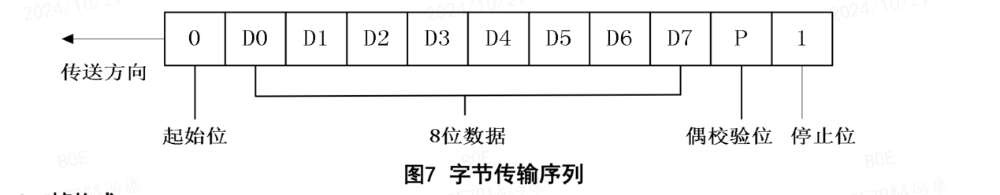
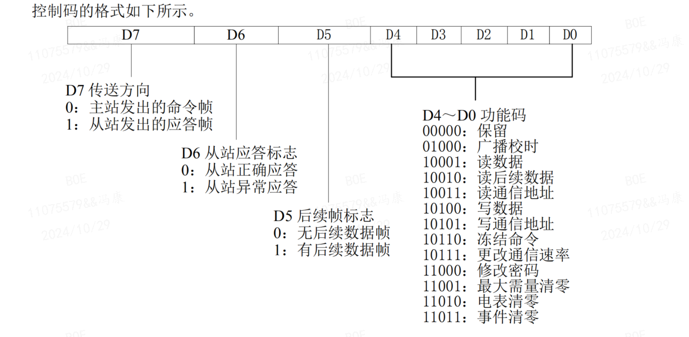
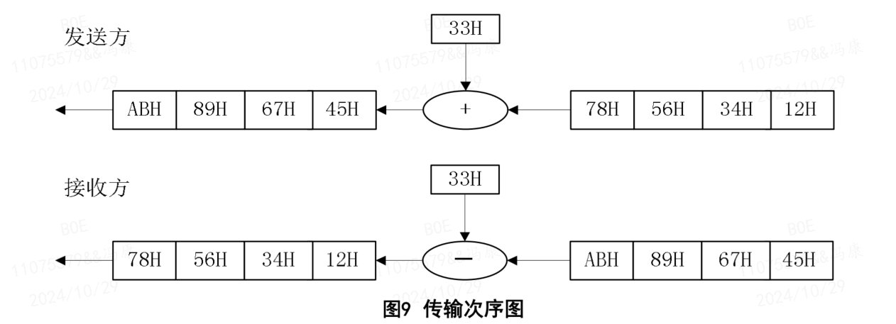

# DLT645 协议

DLT645协议，包括DLT645-1997和DLT645-2007，是一种问答式（主从式）通信规约。在这种通信模式下，通常存在一个主站和一个或多个从站。主站负责发起通信请求，从站则根据主站的请求提供相应的响应。

问答式规约的通信过程通常包括以下几个步骤：

主站发起请求：主站发送一个请求报文给特定的从站，请求报文中包含了需要从站执行的操作，如读取电能量、读取实时参数等。
- 从站接收请求：从站接收到主站的请求后，根据请求的内容进行处理。
- 从站准备响应：从站根据请求的内容准备相应的数据，并构造一个响应报文。
- 从站发送响应：从站将构造好的响应报文发送回主站。
- 主站接收响应：主站接收到从站的响应后，根据响应内容进行相应的处理。

## 1. 通讯报文结构
本协议为主-从结构的半双工通信方式。手持单元或其它数据终端为主站，多功能电能表为从站。每个多功能电能表均有各自的地址编码。通信链路的建立与解除均由主站发出的信息帧来控制。每帧由帧起始符、从站地址域、控制码、数据域长度、数据域、帧信息纵向校验码及帧结束符 7 个域组成。每部分由若干字节组成。

### 1.1. 字节格式
每字节含 8 位二进制码，传输时加上一个起始位(0)、一个偶校验位和一个停止位(1)， 共 11 位。
其传输序列如图 7。D0 是字节的最低有效位，D7 是字节的最高有效位。先传低位，后传高位。



### 1.2. 帧格式
每帧由帧起始符、从站地址域、控制码、数据域长度、数据域、帧信息纵向校验码及帧结束符 7 个域组成。

```bash
帧起始符 68H    : 1字节。
地址域  A0~A5   : 6字节，BCD码。
帧起始符 68H    : 1字节。
控制码 C        : 1字节。
数据域长度 L    : 1字节，为数据域的字节数。
数据域 DATA     : 不定长，处理时减33H处理。
校验码 CS       : 1字节。
结束符 16H      : 1字节。
```
### 1.3. 地址域 A0~A5
地址域由 6 个字节构成，每字节 2 位 **BCD 码**，地址长度可达 12 位十进制数。每块表具有唯一的通信地址，且与物理层信道无关。当使用的地址码长度不足 6 字节时，高位用“0”补足 6 字节。

通信地址 999999999999H 为广播地址，只针对特殊命令有效，如广播校时、广播冻结等。广播命令不要求从站应答。

地址域支持缩位寻址，即从若干低位起，剩余高位补 AAH 作为通配符进行读表操作，从站应答帧的地址域返回实际通信地址。

地址域传输时低字节在前，高字节在后。

### 1.4. 控制码 C
常用控制码C有：
- 0x11 ：读电表数据；
- 0x91 ：电表返回的读数据响应；
- 0xd1 : 电表返回的读数据异常；


### 1.5. 数据域 DATA
除特殊说明的数据项以 ASCII 码表示外，其它数据项均采用压缩 BCD 码表示。

数据域包括数据标识、密码、操作者代码、数据、帧序号等，其结构随控制码的功能而改变。

传输时发送方按字节进行加 33H 处理，接收方按字节进行**减 33H 处理**。

### 1.6. 校验码
从第一个帧起始符开始到校验码之前的所有各字节的模 256 的和，即各字节二进制算术和，不计超过 256 的溢出值。

### 1.7. 传输
在主站发送帧信息之前，先发送 4 个字节 FEH，以唤醒接收方。

所有数据项均先传送低位字节，后传送高位字节。数据传输的举例：电能量值为 123456.78kWh，其传输次序如图 9。




## 2. 应用示例
### 2.1. 读取电表数据
读当前正向有功电量：
- 主站请求帧：FE FE FE FE 68 68 93 38 18 80 00 68 11 04 33 33 34 33 7D 16
    - 地址域：68 93 38 18 80 00 （表号：008018389368）
    - 控制码：11
    - 数据域长度：04
    - 数据域：33 33 34 33 （减33H，字节反转 00010000 ，正向有功总电能）
    - 校验码：7D
- 从站应答帧：FE FE FE FE 68 68 93 38 18 80 00 68 91 08 33 33 34 33 64 34 34 33 00 16
    - 地址域：68 93 38 18 80 00
    - 控制码：91
    - 数据域长度：08
    - 数据域：33 33 34 33 64 34 34 33 （减33H，字节反转，数值 00010131 ，根据正向有功总电能数据格式，数值为 101.31 kWh）
    - 校验码：00
