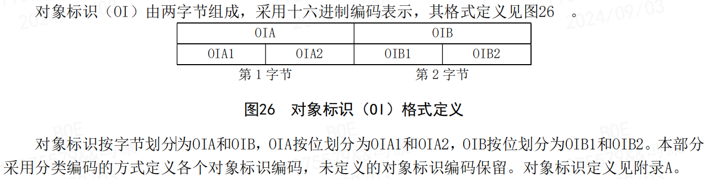
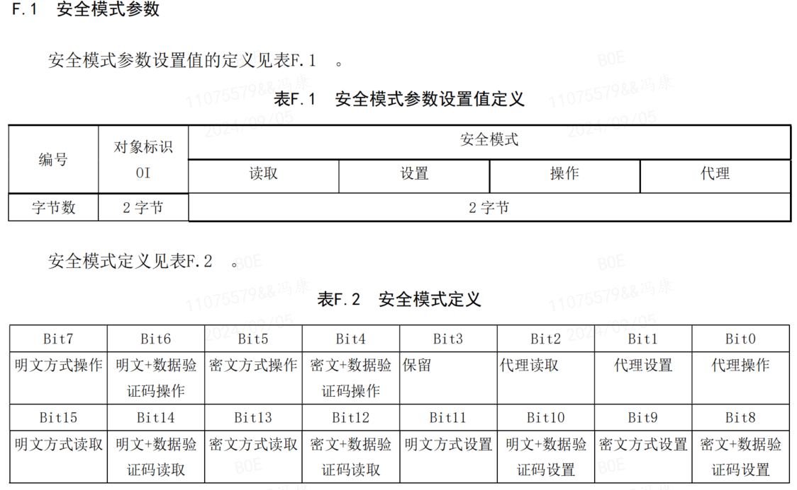

# DLT698.45 协议

DLT698.45 协议是在原电力行业标准 DL/T 698的基础上进行扩展和改进的。它遵循了面向对象的方法，使得协议更加灵活和可扩展，适应了电力行业信息化和智能化的需求。

## 1. 协议介绍
### 1.1. 协议特性
- 面向对象：协议中的数据单元被设计为对象，每个对象都有唯一的标识符（OI），这有助于数据的封装和处理。
- 可扩展性：通过定义新的对象标识符和属性，可以轻松扩展协议以支持新的功能。
- 互操作性：协议支持不同厂商的设备之间的互操作，促进了系统的集成和兼容性。
- 安全性：协议支持基于密码的认证和加密通信，确保数据传输的安全性。

### 1.2. 协议交互流程
1. 客户机和服务器的应用进程使用协议应用层的服务，所以应用层是唯一包含服务组件的协议层，应用层数据单元（APDU）通过数据链路层协议传输帧的链路用户数据域传输。
2. 客户机和服务器在开始通信前，通信信道必须先完成预连接。预连接建立后，默认具有一个最低权限的应用连接，客户机和服务器之间可直接进行数据交换。当客户机需要得到较高权限的服务器服务时，客户机必须发起建立较高权限的应用连接。


### 1.3. 通讯参数
1. 默认红外通信参数：
    - 波特率：1200
    - 数据位：8
    - 校验位：E，偶校验
    - 停止位：1

## 2. 帧结构
采用异步式传输帧结构，定义如下：
- 帧头 ：
    - 起始字符（68H）
    - **长度域 L :** `[具体定义见协议标准 5.1.2]`
    - **控制域 C :** `[具体定义见协议标准 5.1.3]`
        - 传输方向位及启动标志位；
        - 分帧标志位；
        - 扰码标志位；
        - 功能码
    - **地址域 A :** `[具体定义见协议标准 5.1.3]`
        - 服务器地址 SA ，类型分为如下几种：
            - 单地址，其地址长度为可变长度，字节数由地址长度域表示，最长 16 字节；
            - 通配地址，其地址长度为可变长度，字节数由地址长度域表示；
            - 组地址，同单地址；
            - 广播地址，广播地址 = AAH，广播地址对系统所有服务器都有效，所有服务器无需回答；
        - 客户机地址 CA，用1字节无符号整数表示，取值范围0…255，值为0表示不关注客户机地址；
    - **帧头校验 HCS** ：帧头校验HCS为2字节，是对帧头部分除起始字符和HCS本身之外的所有字节的校验校验算法见附录 D。
- APDU 或 APDU 分帧片段：
    - **链路用户数据**：包含一个完整的应用层协议数据单元（APDU）字节序列或APDU的分帧片段。
- 帧尾：
    - **帧校验 FCS**：帧校验FCS为2字节，是对整帧除起始字符、结束字符和FCS本身之外的所有字节的校验，校验算法见附 录 D。
    - 结束字符（16H）
## 2.1. 传输规则
1. 帧的基本单元为8位字节。链路层传输顺序为低位在前，高位在后；低字节在前，高字节在后。
2. 采用串行通信方式实现本地数据传输时，传输规则包括： 
    - 线路空闲状态为二进制 1。 
    - 在发送数据时，在有效数据帧前加 4 个 FEH 作为前导码。 
    - 帧的字符之间无线路空闲间隔；两帧之间的线路空闲间隔最少需 33 位。 
    - 如帧头校验 HCS 和帧校验 FCS 检出了差错，两帧之间的线路空闲间隔最少需 33 位。


## 3. 客户端应用层 APDU 编码查看
应用层服务对象是构成客户机和服务器应用层的主要组件，它使用数据链路层提供的服务，服务规范包含客户机和服务器应用进程在各自应用层的逻辑接口，并向应用进程提供服务。

客户机和服务器的应用服务对象都包括预连接、应用连接和数据交换三个必备组件。

预连接服务适用于交换网络传输信道，如以太网、GPRS等，当其完成物理连接，建立透明通道后，需要在此通道上建立预连接并进行管理。

对于本地通信信道，如RS485、红外等，当物理连接建立时，默认预连接的通道即存在，不需要额外的建立以及预连接管理。


报文示例为一条读取报文，其中 `[05 01 00 10 23 01 00 00]` 就是应用层 APDU 部分：
```c
68 17 00 43 05 AA AA AA AA AA AA 09 6B B7 [05 01 00 10 23 01 00 00] CE 2F 16
```

下面以客户端 APDU 的读取请求为例，介绍其格式，和协议标准查看方式：

### 3.1. 客户端 APDU 格式
客户机应用层数据单元（Client-APDU）定义如下：
```c++
Client-APDU∷=SEQUENCE
{
    应用层服务 CHOICE 
    {
        建立应用连接请求 [2] CONNECT-Request， 
        断开应用连接请求 [3] RELEASE-Request， 
        读取请求 [5] GET-Request， 
        设置请求 [6] SET-Request， 
        操作请求 [7] ACTION-Request， 
        上报应答 [8] REPORT-Response， 
        代理请求 [9] PROXY-Request， 
        异常响应 [110] ERROR-Response 
    }， 
    时间标签 TimeTag OPTIONAL(可选)
}
```
这里对象为 `SEQUENCE` 属性，要求所有的元素都必须按照定义的顺序出现，并且每个元素都必须存在；内部属性应用层服务为 `CHOICE` ，表示选择其中一种；时间标签为 `OPTIONAL` ，即非必需的。

### 3.2. 客户端读取请求 GET-Request
1. 通过搜索关键词 `GET-Request` ，查看 GET-Request 服务的数据格式定义：
    ```c++
    GET-Request∷=CHOICE 
    { 
        读取一个对象属性请求 [1] GetRequestNormal， 
        读取若干个对象属性请求 [2] GetRequestNormalList， 
        读取一个记录型对象属性请求 [3] GetRequestRecord， 
        读取若干个记录型对象属性请求 [4] GetRequestRecordList， 
        读取分帧响应的下一个数据块请求 [5] GetRequestNext， 
        读取一个对象属性的 MD5 值 [6] GetRequestMD5 
    }
    ```

2. 搜索关键字 `GetRequestNormal` 查看 `GetRequestNormal` 数据类型定义如下：
    ```c++
    GetRequestNormal∷=SEQUENCE 
    { 
        服务序号-优先级 PIID， 
        一个对象属性描述符 OAD 
    }
    ```

3. 搜索关键字 `PIID` 数据类型定义如下：
    ```c++
    PIID∷=unsigned
    ```
    - PIID 是用于客户机 APDU（Client-APDU）的各服务数据类型中，基本定义如下，具体应用约定应根据实际系统要求而定。
        - bit7（服务优先级）——0：一般，1：高级，在.response APDU 中，其值与对应.request APDU 中的相等。 
        - bit6（保留）。 
        - bit0~bit5（服务序号）——二进制编码表示 0…63，在.response APDU中，其值与对应.request APDU 中的相等。

4. 搜索关键字 `OAD` 数据类型定义如下：
    ```c++
    OAD∷=SEQUENCE 
    { 
        对象标识 OI， 
        属性标识及其特征 unsigned， 
        属性内元素索引 unsigned（1…255） 
    }
    ```
    - 对象属性标识及其特征——用 bit0…bit7 表示八位位组的最低位到最高位，其中：
        1) bit0…bit4 编码表示对象属性编号，取值 0…31，其中 0 表示整个对象属性，即对象的所有属性； 
        2) bit5…bit7 编码表示属性特征，属性特征是对象同一个属性在不同快照环境下取值模式，取值 0…7，特征含义在具体类属性中描述。
    - 属性内元素索引——00H 表示整个属性全部内容。如果属性是一个结构或数组，01H 指向对象属性的第一个元素；如果属性是一个记录型的存储区，非零值 n 表示最近第 n 次的记录。

5. 搜索关键字 `OI` 数据类型定义如下：
    

6. 对照附录 A，查看对象标识OI（类似于数据地址）。

6. 以上述示例报文的 `[05 01 00 10 23 01 00 00]` 为例，其 APDU 的格式如下：
    - **05**： ，Get-Request， 读取请求；
        - **01**： ，GetRequestNormal（1）；
            - **00**：服务序号-优先级 PIID，表示无优先级。
            - **10 23 01 00**：一个对象属性描述符 OAD。
                - **1023**：对象标识OI。对照附录A，得出定义为 `C 相反向有功最大需量`，为最大需量类。
                - **01**：属性标识及其特征，表示第一个属性。
                    - 属性标识及其特征的具体定义可以根据对象标识OI所属的类进行查找，如上述的对象标识对应的是最大需量类，搜索`最大需量类`。
                    - 找到 `7.3.2 最大需量类` 的定义，得出属性为：
                        1) 逻辑名（static），数据类型 octet-string ;
                        2) 总及费率最大需量数组（dyn.），数据类型 array ;
                        3) 换算及单位（static），数据类型 Scaler_Unit;
                - **00**：属性内元素索引，表示整个属性全部内容。
        - **00**：时间标识。 

## 4. 接口类与对象标识分类
对象是属性和方法的集合。对象的信息包含在属性中，属性值表示对象的特征。对象提供了操作的方法。具有共享公共特征的对象归纳为接口类（IC），接口类由类标识码（class_id）进行标识。接口类的公共特征（包括属性和方法）适用于该类的所有实例。接口类的实例称为接口类对象，简称对象。一个对象只能属于一个接口类。一个对象对应于一个唯一的标识，即对象标识（OI）。

具体定义见协议标准 ：`7 接口类与对象标识`

对象标识分为以下几种，每种对象标识包含的属性可能不同，即回复的报文不同：
1. 电能量类对象；
2. 最大需量类对象；
3. 变量类对象；
4. 事件类对象；
5. 参变量类对象；
6. 冻结类对象；
7. 采集监控类对象；
8. 集合类对象；
9. 文件传输类对象；
10. ESAM接口类对象；
11. 输入输出设备类对象；
12. 显示类对象；

## 5. APDU 加密和安全传输数据单元
在信息传输过程中， DLT698 协议具有不同的安全模式，上述数据请求都是明文传输，在请求数据有一定的限制，明文传输很多数据无法访问。

### 5.1. 安全模式参数
DLT698 协议定义了`明文、明文+数据验证码、密文、密文+数据验证码`四种安全模式，不同的安全模式下访问数据的权限有所区别。

1. 安全模式参数如下：

    

2. 根据 `F.2 默认安全模式参数` 列出的安全模式参数，明文方式传输的数据十分有限（电压、电流、频率等实时数据都无法看到），除列出的数据外如果在安全模式参数中没有明确要求，均采用明文+MAC方式读取；

### 5.2. 明文+MAC方式读取 APDU 编写
1. 格式列表为：
    ```c++
    
    ```
2. 查看 `6.3.4.4 安全传输数据单元` 安全传输数据单元（SECURITY-APDU）定义。
    ```c++
    SECURITY-APDU∷=CHOICE 
    { 
        安全请求 [16] SECURITY-Request， /* 常用 */
        安全响应 [144] SECURITY-Response 
    }
    ```

3. SECURITY-Request 数据类型定义如下，协议定义在 `6.3.13.1 SECURITY-Request 数据类型` ：
    ```c++
    SECURITY-Request∷=SEQUENCE 
    { 
        应用数据单元 CHOICE 
        { 
            明文应用数据单元 [0] octet-string， /* 常用 */
            密文应用数据单元 [1] octet-string 
        }， 
        数据验证信息 CHOICE 
        { 
            数据验证码 [0] SID_MAC， 
            随机数 [1] RN， 
            随机数+数据MAC [2] RN_MAC， 
            安全标识 [3] SID 
        } 
    }

        RN_MAC∷=SEQUENCE 
        { 
            随机数 RN， 
            数据 MAC MAC 
        }
    ```

4. SID_MAC 为 ESAM 所属安全标识以及消息鉴别码，数据类型定义及说明：
    ```c++
    SID_MAC∷=SEQUENCE 
    { 
        安全标识 SID， 
        数据 MAC MAC 
    }
    ```

5. SID 为 ESAM 所属安全标识，SID数据类型定义及说明：
    ```c++
    SID∷=SEQUENCE 
    { 
        标识 double-long-unsigned， 
        附加数据 octet-string 
    }
    ```

6. MAC 消息鉴别码 (Message Authentication Code) ，用于鉴别消息的完整性的固定长度的认证标识，数据类型定义及说明：
    ```c++
    MAC∷=octet-string
    ```

### 5.3. 明文+MAC方式读取帧示例
```c++
读取电能表的通信地址： 
发送帧：10 00 08 05 01 01 40 01 02 00 00 00 85 01 02 03 06 12 34 56 78 90 12 04 12 34 56 
78 
10 —— [16] SECURITY-Request 
00 —— 明文应用数据单元 
08 —— 明文的长度 
05 —— [5] GET-Request 
01 —— [1] GetRequestNormal 
01 —— PIID 
40 01 02 00 —— OAD：通信地址40010200 
00 —— 没有时间标签 
00 —— 数据验证信息 [0] SID_MAC 
85 01 02 03 —— SID 标识 （32bit 正整数）
06 12 34 56 78 90 12 —— 附加数据 
04 —— MAC 的长度 
12 34 56 78 —— MAC 

响应帧：90 00 12 85 01 01 40 01 02 00 01 09 06 20 16 01 29 00 01 00 01 00 04 12 34 56 78 
90 —— [144] SECURITY-Response 
00 —— 明文 
12 —— 明文的长度 
85 —— [133] GET-Response 
01 —— [1] GetResponseNormal 
01 —— PIID-ACD 
40 01 02 00 —— OAD 
01 —— Data 
09 —— octet-string 
06 —— SIZE(6) 
20 16 01 29 00 01 —— 通信地址：201601290001 
00 —— 没有跟随上报信息 
00 —— 没有时间标签 
01 —— 含数据验证信息 
00 —— 数据验证信息 [0] MAC 
04 —— MAC 的长度 
12 34 56 78 —— MAC
```

## 6. 完整报文示例解析
报文示例：
```c
/* <!-- 正向有功电能--逻辑名 --> */
TX: 68 17 00 43 05 46 42 13 32 00 01 00 EE 29 05 01 00 00 10 01 00 00 B1 F2 16
RX: 68 1D 00 C3 05 46 42 13 32 00 01 00 B1 FA 
85 01 00 /* <!-- GET-Response -- GetResponseNormal -- 优先级00，一般优先级--> */
00 10 01 00 /* <!-- 对象属性描述符 OAD，标识符0010，属性标识和特征01，属性内元素索引00 --> */
01 /* <!-- data数据 --> */
09 02 /* <!-- 数据类型 octet-string，size（2） --> */
00 10 /* <!-- 0010数据位 --> */
00 /* <!-- FollowReport OPTIONAL=0 表示没有上报信息 --> */
00 /* <!-- 没有时间标签 --> */
9D 17 16

/* <!-- 正向有功电能--总及费率对应总、尖峰平谷 --> */
tx：68 17 00 43 05 46 42 13 32 00 01 00 EE 29 05 01 00 00 10 02 00 00 D5 1D 16
rx：FE FE FE FE 
68 34 00 C3 
05 46 42 13 32 00 01 00 00 F1 
85 01 00 
00 10 02 00 
01 /* <!-- data数据 --> */
01 05 /* <!-- 数组类型，5个 --> */
06 00 05 D6 D3 /* <!-- 06是double-long-unsigned，数据382675，单位kwh，除100 --> */
06 00 01 AC A6 /* <!-- 06是double-long-unsigned，数据109734 --> */
06 00 02 1C F5 /* <!-- 06是double-long-unsigned，数据138485 --> */
06 00 00 17 78 /* <!-- 06是double-long-unsigned，数据6008 --> */
06 00 01 F5 BF /* <!-- 06是double-long-unsigned，数据128447 --> */
00 00 
16 65 16 

/* <!-- 频率 --> */
FE FE FE FE 68 17 00 43 05 46 42 13 32 00 01 00 EE 29 05 01 00 20 0F 02 00 00 1C 0C 16 
FE FE FE FE 68 1A 00 C3 
05 46 42 13 32 00 01 00 
57 5A 
85 01 00 
20 0F 02 00 
00 0F /* 表示发生错误， */
00 00 
86 97 16 
```

## 客户端报文生成明文 Demo
明文生成仅能用于读取部分数据。
```c
//gcc 7.4.0

#include <stdio.h>
#include <string.h>

typedef signed char int8_t; // %x
typedef unsigned char uint8_t;

typedef signed short int16_t; // %u
typedef unsigned short uint16_t;

typedef signed int int32_t; // %hu
typedef unsigned int uint32_t;

#define HI_UINT16(a) (((a) >> 8) & 0xFF)
#define LO_UINT16(a) ((a) & 0xFF)
#define RET_SUCCESS 0
#define RET_FAILED -1

static uint16_t fcstab[256] = {
    0x0000, 0x1189, 0x2312, 0x329b, 0x4624, 0x57ad, 0x6536, 0x74bf,
    0x8c48, 0x9dc1, 0xaf5a, 0xbed3, 0xca6c, 0xdbe5, 0xe97e, 0xf8f7,
    0x1081, 0x0108, 0x3393, 0x221a, 0x56a5, 0x472c, 0x75b7, 0x643e,
    0x9cc9, 0x8d40, 0xbfdb, 0xae52, 0xdaed, 0xcb64, 0xf9ff, 0xe876,
    0x2102, 0x308b, 0x0210, 0x1399, 0x6726, 0x76af, 0x4434, 0x55bd,
    0xad4a, 0xbcc3, 0x8e58, 0x9fd1, 0xeb6e, 0xfae7, 0xc87c, 0xd9f5,
    0x3183, 0x200a, 0x1291, 0x0318, 0x77a7, 0x662e, 0x54b5, 0x453c,
    0xbdcb, 0xac42, 0x9ed9, 0x8f50, 0xfbef, 0xea66, 0xd8fd, 0xc974,
    0x4204, 0x538d, 0x6116, 0x709f, 0x0420, 0x15a9, 0x2732, 0x36bb,
    0xce4c, 0xdfc5, 0xed5e, 0xfcd7, 0x8868, 0x99e1, 0xab7a, 0xbaf3,
    0x5285, 0x430c, 0x7197, 0x601e, 0x14a1, 0x0528, 0x37b3, 0x263a,
    0xdecd, 0xcf44, 0xfddf, 0xec56, 0x98e9, 0x8960, 0xbbfb, 0xaa72,
    0x6306, 0x728f, 0x4014, 0x519d, 0x2522, 0x34ab, 0x0630, 0x17b9,
    0xef4e, 0xfec7, 0xcc5c, 0xddd5, 0xa96a, 0xb8e3, 0x8a78, 0x9bf1,
    0x7387, 0x620e, 0x5095, 0x411c, 0x35a3, 0x242a, 0x16b1, 0x0738,
    0xffcf, 0xee46, 0xdcdd, 0xcd54, 0xb9eb, 0xa862, 0x9af9, 0x8b70,
    0x8408, 0x9581, 0xa71a, 0xb693, 0xc22c, 0xd3a5, 0xe13e, 0xf0b7,
    0x0840, 0x19c9, 0x2b52, 0x3adb, 0x4e64, 0x5fed, 0x6d76, 0x7cff,
    0x9489, 0x8500, 0xb79b, 0xa612, 0xd2ad, 0xc324, 0xf1bf, 0xe036,
    0x18c1, 0x0948, 0x3bd3, 0x2a5a, 0x5ee5, 0x4f6c, 0x7df7, 0x6c7e,
    0xa50a, 0xb483, 0x8618, 0x9791, 0xe32e, 0xf2a7, 0xc03c, 0xd1b5,
    0x2942, 0x38cb, 0x0a50, 0x1bd9, 0x6f66, 0x7eef, 0x4c74, 0x5dfd,
    0xb58b, 0xa402, 0x9699, 0x8710, 0xf3af, 0xe226, 0xd0bd, 0xc134,
    0x39c3, 0x284a, 0x1ad1, 0x0b58, 0x7fe7, 0x6e6e, 0x5cf5, 0x4d7c,
    0xc60c, 0xd785, 0xe51e, 0xf497, 0x8028, 0x91a1, 0xa33a, 0xb2b3,
    0x4a44, 0x5bcd, 0x6956, 0x78df, 0x0c60, 0x1de9, 0x2f72, 0x3efb,
    0xd68d, 0xc704, 0xf59f, 0xe416, 0x90a9, 0x8120, 0xb3bb, 0xa232,
    0x5ac5, 0x4b4c, 0x79d7, 0x685e, 0x1ce1, 0x0d68, 0x3ff3, 0x2e7a,
    0xe70e, 0xf687, 0xc41c, 0xd595, 0xa12a, 0xb0a3, 0x8238, 0x93b1,
    0x6b46, 0x7acf, 0x4854, 0x59dd, 0x2d62, 0x3ceb, 0x0e70, 0x1ff9,
    0xf78f, 0xe606, 0xd49d, 0xc514, 0xb1ab, 0xa022, 0x92b9, 0x8330,
    0x7bc7, 0x6a4e, 0x58d5, 0x495c, 0x3de3, 0x2c6a, 0x1ef1, 0x0f78};

static uint16_t dlt698_pppfcs16(uint8_t *buf, uint16_t len)
{
    uint16_t fcs = 0xFFFF;

    while (len--)
    {
        fcs = (fcs >> 8) ^ fcstab[(fcs ^ *buf++) & 0xff];
    }
    return (~fcs);
}

/* 示例：【FE FE FE FE】68 17 00 43 05 AA AA AA AA AA AA 09 6B B7 05 01 00 10 23 01 00 00 CE 2F 16 */
int DLT698_2017_package(uint8_t *addr, int addr_len, uint8_t *out, int *out_len)
{
    int i = 0;
    int len = 0;
    uint16_t crc = 0x0000;

    /* 串口 */
    for(i=0; i<4; i++) out[len++] = 0xfe;
    // 起始字符 0x68
    out[len++] = 0x68;

    // 长度域 L(占位)
    out[len++] = 0x00;
    out[len++] = 0x00;

    // 控制域 C 0x43 [该帧是由客户机发起一个请求，功能码为应用连接管理及数据交换服务]
    out[len++] = 0x43;

    /* 地址域：服务器地址 SA */
    out[len++] = (uint8_t)(addr_len - 1);

    // 服务器地址
    for (i = 0; i < addr_len; i++)
    {
        out[len++] = addr[5 - i];
    }

    // 客户机地址 (定义为 0x10)
    out[len++] = 0x09;
    // out[len++] = 0x00;

    // 帧头校验 HCS (占位)
    out[len++] = 0x00;
    out[len++] = 0x00;
    
    /* 用户数据：应用层协议数据单元 (APDU)宇节序列或APDU的分帧片段 */
    static uint8_t temp[] = {0x05, 0x01, 0x00, 0x10, 0x23, 0x01, 0x00};
    memcpy(&out[len], temp, sizeof(temp));
    len += sizeof(temp);
    
    out[len++] = 0x00; 

    // 帧校验 FCS (占位)
    out[len++] = 0x00;
    out[len++] = 0x00;

    // 结束字符 0x16
    out[len++] = 0x16;
    
    *out_len = len;

    // 长度域 (替换)
    out[1+4] = LO_UINT16((uint16_t)(len - 6));
    out[2+4] = HI_UINT16((uint16_t)(len - 6));

    // 帧头校验 (替换)
    int frame_head_size = 2 + 1 + addr_len + 1 + 1 +4;
    crc = dlt698_pppfcs16(&out[5], 11);
    out[frame_head_size + 1] = LO_UINT16(crc);
    out[frame_head_size + 2] = HI_UINT16(crc);

    // 帧校验 (替换)
    crc = dlt698_pppfcs16(&out[5], len - 8);
    out[len - 3] = LO_UINT16(crc);
    out[len - 2] = HI_UINT16(crc);

    // LOG_TRACE_HEX(out, len, "[ELECMETER_2017]CMD");

    return RET_SUCCESS;
}

int main(void)
{
    uint8_t addr_in[]={12,34,56,78,90,11};
    uint8_t buf[128];
    memset(buf, 0, 128);
    int i,len=-1;
    DLT698_2017_package(addr_in, sizeof(addr_in), buf, &len);
    
    for(i=0; i<len; i++) printf("%02X ", buf[i]);
    return 0;
}
```