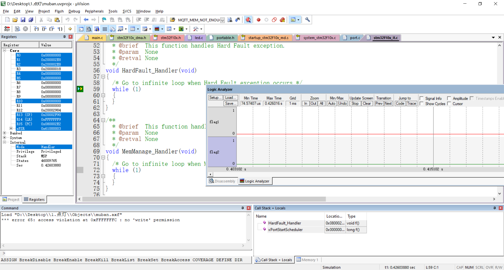
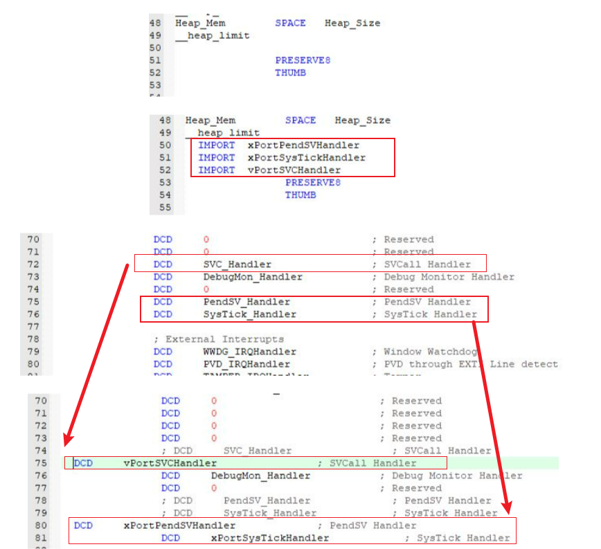
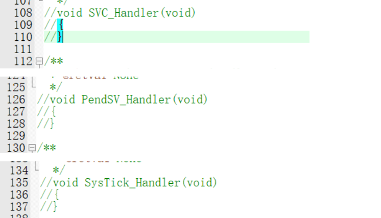

# FreeRTOS移植常见问题汇总

FreeRTOS 移植可能会遇到以下常见问题：
1. [程序进入硬件错误 HardFault_Handler](#01-程序进入硬件错误-hardfault_handler) ;


## 01. 程序进入硬件错误 HardFault_Handler 
### 1.1. 问题描述
移植到 STM32F103C8T6 ，且 FreeRTOSconfig.h 文件已经完成相应修改。

编译没有错误提示，硬件 Debug 时，程序不进入 FreeRTOS 创建的任务 ，卡在 `HardFault_Handler()` ，且 R14 寄存器值为 `0xfffffff9` ，如图所示:


### 1.2. 解决办法
可以考虑下是否是 `startup_stm32f10x_md.s` 中修改**内部中断向量**，指向 `portable/port.c` 文件中定义的中断向量名，如果没有修改，修改成如图所示线程就可以正常启动并切换。



### 1.3. 其他解决办法
除此之外，还有一种方法解决问题（可以在 startup_stm32f10x_md.s 文件只读无法修改或其他不能修改的情况下使用）：
1. 在 `FreeRTOSConfig.h` 中添加宏定义：
    ```c
    #define xPortPendSVHandler  PendSV_Handler
    #define vPortSVCHandler     SVC_Handler
    #define xPortSysTickHandler SysTick_Handler
    ```
2. 把 `stm32f10x_it.c` 文件中的三个函数进行注释即可解决问题

    
