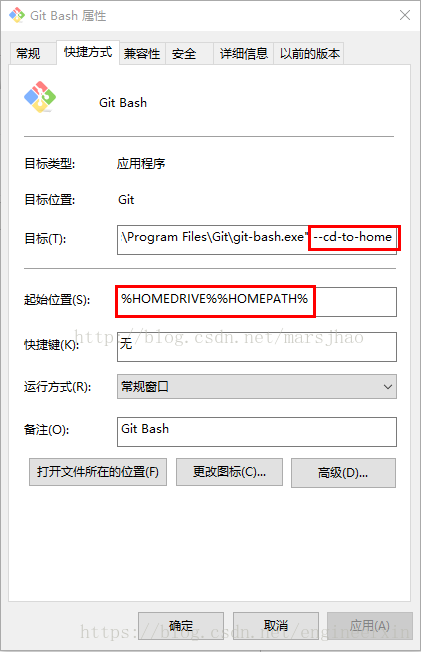
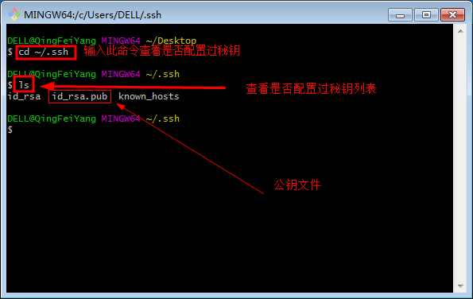
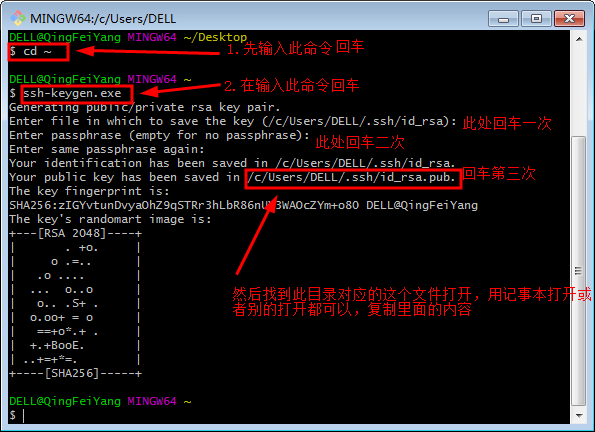
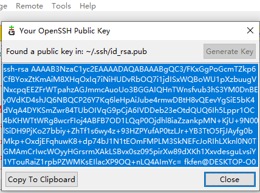

# git仓库管理的简单使用


## 1. git 的下载和使用

### 1.1. git 的下载

1. 下载 git 软件

    [git下载链接](https://git-scm.com/download/win)

2. 根据提示完成安装。

3. 修改环境变量
- 在快捷方式上修改
    1. 在“Git Bash”快捷方式上点击鼠标右键，然后选择“属性”，会弹出如下截图的提示框：  
        
    2. 修改”目标（T）”与“起始位置（s）”的内容，去掉”目标（T）”中的 --cd-to-home，将“起始位置（s）”的内容改为你要创建git仓库的位置。

- 修改环境变量
    1. 打开电脑用户环境变量
    2. 添加变量名为“Home”的环境变量，变量值为想要修改的文件夹路径。

## 2. 电脑端设置

### 2.1. 安装git后，首次使用Git需要的配置

1. 在 `git bash` 中设置个人信息，此信息用于提交时，提交提交者的基本信息。
    ```c
    $ git config --global user.name "your name"
    $ git config --global user.email "email@example.com"
    ```

2. 生成并添加ssh密钥。使用SSH密钥后，将SSH密钥添加到才能对仓库进行PUSH命令进行写操作。

- 使用 `git bash` 生成ssh密钥：
    1. 查看SSH密钥  
        
    2. 如果没有看到id_ras.pub文件即没有配置，然后请看下面如何配置。  
        - 使用 `ssh-keygen.exe` 生成新的 `ssh-key` ；
        - 依次输入：文件名、口令、确认口令，根据提示完成 `ssh-key` 的生成。  
        
    3. 按上图所示完成步骤后，找到上面目录对应的这个 `id_rsa.pub` 公钥这个文件打开，用记事本打开或者cat命令都可以，复制里面的内容。
    4. 远程仓库的SSH使用。  
    在创建好的远程代码仓库中的设置中，把 `ssh-key` 添加到 `Deploy keys` 中。电脑就可以使用 git 完成对远程仓库的连接和操作了。

- 使用 `git gui` 生成ssh密钥：

    1. 在目标文件夹使用 git gui，查看 “ Help -> Show SHH Key ” ，如果没有就根据提示生成 key；
        
    2. 复制该 key 到远程仓库即可。

### 2.2. 仓库 repository 的设置

1. 创建一个新的 `repository` ；

2. 在该 `repository` 的 `setting` 中，将电脑端git 生成的 `ssh-key` 添加到 `Deploy keys` 中，这样才能都对该仓库进行修改和提交操作。

## 3. 常用的git bash操作

1. 仓库初始化
    ```shell
    # 在文件夹右键使用 `git bash` 命令行，输入指令完成本地仓库的初始化，输入指令后会生成一个 `.git` 文件
    $ git init
    ```

2. 远程github仓库操作
    ```shell
    # 显示所有的仓库地址和仓库别名
    $ git remote -v

    # 新增远程仓库
    $ git remote add <alias> <url>
    
    # 删除远程仓库
    $ git remote rm <alias> <url>

    # 把远程仓库的origin改为name
    $ git remote rename <origin> <name>

    # 清理 github 远程仓库的引用，如果远端仓库已删除，该命令可以清理掉已删除的仓库分支
    $ git remote prune <远端仓库别名>
    ```

3. 同步仓库
    ```shell
    # alias为仓库别名，baranch_name为分支名
    $ git pull add <alias> <baranch_name>

    # 同步所有分支
    $ git pull
    ```

4. 将变更提交到本地仓库
    ```shell
    # 将filename文件提交到本地仓库
    $ git add 'filename'

    # 将所有更改都提交到本地仓库
    $ git add .

    # 将所有更改都提交到本地仓库
    $ git add -A
    ```

5. 将变更提交到本地仓库
    ```shell
    # 提交并给 git add 中提交的文件添加注释
    $ git commit -m '注释或备注信息等'
    ```

6. 将本地仓库推送到远程仓库
    ```shell
    # 推送后远端仓库会和本地仓库合并，远程仓库修改时需要ssh-key的权限
    $ git push

    # 推送后仓库别名的远端仓库会和本地仓库合并，需要ssh-key的权限
    $ git push <远程仓库别名>

    # 如果本地分支名与远程分支名相同，则可以省略冒号： ,需要ssh-key的权限
    $ git push <远程仓库名> <本地分支名>:<远程分支名>

    # 将本地分支与远程分支关联，以便后续的 `git push` 操作更方便
    $ git push -u <remote> <branch-name>
    ```

7. 查看本地仓库状态
    ```shell
    # 可以查看到当前暂存区的修改的文件同步状态
    $ git status
    ```

8. 对比本地仓库
    ```shell
    # 可以查看到目标仓库与远程仓库的文件区别，如果只有一个远程仓库可以省略后面的别名
    $ git diff <alias>
    # 比较两个文件的区别
    $ git diff <filename1> <filename2>
    ```

9. 查看git提交的日志
    ```shell
    # 可以查看到本地仓库的操作日志，上次存储、提交等的时间的注释等
    $ git log
    ```

10. 克隆（下载）一个本地库
    ```shell
    # url为远程仓库地址
    $ git clone <url>
    ```
11. 分支操作
    ```shell
    # 列出所有远程分支
    $ git branch -r

    # 查看当前所有分支（包括本地和远程分支）
    $ git branch -a

    # 查看本地分支
    $ git branch

    # 创建一个新分支但不切换到该分支
    $ git branch <branch-name>

    # 创建并切换到新分支
    $ git checkout -b <branch-name>

    # 切换到已有分支
    $ git checkout <branch-name>

    # 将一个分支的更改合并到当前分支
    $ git merge <source-branch>

    # 解决合并冲突
    $ git add <conflicted-files>
    $ git commit

    # 删除分支
    $ git branch -d <branch-name>

    # 强制删除未合并的本地分支
    $ git branch -D <branch-name>

    # 删除远程分支
    $ git push <remote> --delete <branch-name>

    # 重命名当前分支
    $ git branch -m <new-branch-name>
    $ git branch -m <old-branch-name> <new-branch-name>
    ```

## 4. 常见异常问题
### 4.1. GitHub 远程仓库设置后 SSH 无法连接，端口 22 超时
1. 错误示例：
    ```shell
    fkfen@fengkang MINGW64 ~/Desktop/repository (master)
    $ git push github
    ssh: connect to host github.com port 22: Connection timed out
    fatal: Could not read from remote repository.

    Please make sure you have the correct access rights
    and the repository exists.
    ```

2. 检查防火墙是否是防火墙或网络原因导致的问题；
3. 使用 `ssh -vT git@github.com` 命令测试连接，查看打印信息是否成功解析域名的 IP 地址；
4. 如果不是以上两个问题，可以使用 git bash 命令行进入 `~/.ssh` 文件夹，找到 `config` 文件用文本方式打开，添加以下内容:
    ```
    Host github.com
    User <fkfengkangfk@outlook.com>(这里填写自己的 email 地址)
    Hostname ssh.github.com
    PreferredAuthentications publickey
    ```
5. 添加完成后，重新访问即可成功连接。