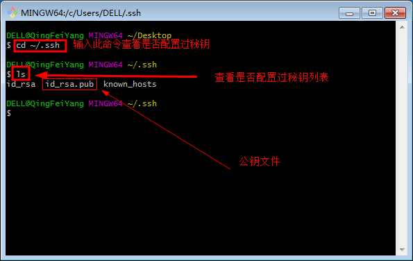
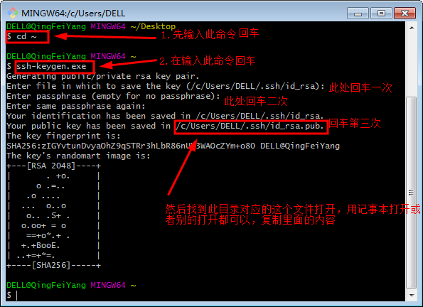
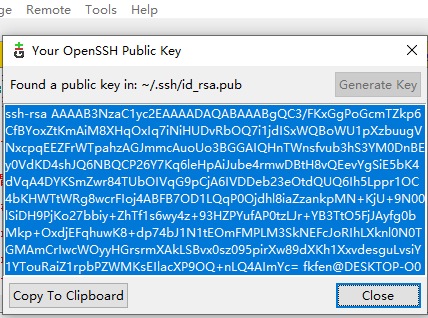
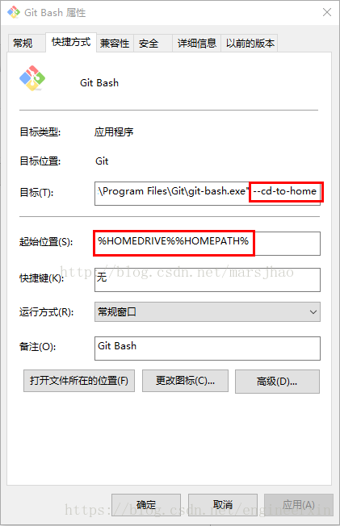

# git仓库管理的简单使用


## 电脑端设置

### 安装git后，首次使用Git需要的配置

1. 在 `git bash` 中设置个人信息，此信息用于提交时，提交提交者的基本信息。
    ```c
    $ git config --global user.name "your name"
    $ git config --global user.email "email@example.com"
    ```

2. 生成并添加ssh密钥。使用SSH密钥后，将SSH密钥添加到才能对仓库进行PUSH命令进行写操作。

- 使用 `git bash` 生成ssh密钥：

    1. 查看SSH密钥  
        
    2. 如果没有看到id_ras.pub文件即没有配置，然后请看下面如何配置。  
        - 使用 `ssh-keygen.exe` 生成新的 `ssh-key` ；
        - 依次输入：文件名、口令、确认口令，根据提示完成 `ssh-key` 的生成。  
        
    3. 按上图所示完成步骤后，找到上面目录对应的这个 `id_rsa.pub` 公钥这个文件打开，用记事本打开或者cat命令都可以，复制里面的内容。
    4. 远程仓库的SSH使用。  
    在创建好的远程代码仓库中的设置中，把 `ssh-key` 添加到 `Deploy keys` 中。电脑就可以使用 git 完成对远程仓库的连接和操作了。

- 使用 `git gui` 生成ssh密钥：

    1. 在目标文件夹使用 git gui，查看 “ Help -> Show SHH Key ” ，如果没有就根据提示生成 key；
        
    2. 复制该 key 到远程仓库即可。

### 常用的git bash操作

1. 仓库初始化

    在文件夹右键使用 `git bash` 命令行，输入指令完成本地仓库的初始化，输入指令后会生成一个 `.git` 文件
    ```c
    $ git init
    ```

2. 关联远程github仓库

    ```c
    $ git remote add <alias> <url> /* alias为仓库别名，url为仓库链接 */
    ```
3. 同步仓库

    ```c
    $ git pull add <alias> <baranch_name>   /* alias为仓库别名，baranch_name为分支名 */
    $ git pull                              /* 同步所有分支 */
    ```

4. 将变更提交到本地仓库

    ```c
    $ git add 'filename'    /* 将filename文件提交到本地仓库 */
    $ git add .             /* 将所有更改都提交到本地仓库 */
    $ git add -A            /* 将所有更改都提交到本地仓库 */
    ```

5. 将变更提交到本地仓库

    ```c
    $ git commit -m '注释或备注信息等' /* 提交注释 */
    ```

6. 将本地仓库推送到远程仓库

    ```c
    $ git push /* 提交后远端仓库会和本地仓库合并，需要ssh-key的权限 */
    $ git push <远程仓库名> <本地分支名>:<远程分支名> /* 如果本地分支名与远程分支名相同，则可以省略冒号： ,需要ssh-key的权限*/
    ```

7. 查看本地仓库状态

    ```c
    $ git status /* 可以查看到当前暂存区的修改的文件同步状态 */
    ```

8. 对比本地仓库与remote仓库区别

    ```c
    $ git diff /* 可以查看到仓库与远程仓库的文件区别 */
    ```

9. 查看git提交的日志

    ```c
    $ git log /* 可以查看到本地仓库的操作日志，上次存储、提交等的时间的注释等 */
    ```

10. 克隆（下载）一个本地库

    ```c
    $ git clone <url> /* url为远程仓库地址 */
    ```

11. 查看现有远程仓库

    ```c
    $ git remote -v /*  */
    ```

12. 修改远程仓库别名

    ```c
    $ git remote rename <origin> <name> /* 把远程仓库的origin改为name */
    ```

## github 仓库设置

### 仓库 repository 的设置

1. 创建一个新的 `repository` ；

2. 在该 `repository` 的 `setting` 中，将电脑端git 生成的 `ssh-key` 添加到 `Deploy keys` 中，这样才能都对该仓库进行修改和提交操作。


## git 的下载和使用

### git 的下载

1. 下载 git 软件

    [git下载链接](https://git-scm.com/download/win)

2. 根据提示完成安装。

3. 修改环境变量
- 在快捷方式上修改
    1. 在“Git Bash”快捷方式上点击鼠标右键，然后选择“属性”，会弹出如下截图的提示框：  
        
    2. 修改”目标（T）”与“起始位置（s）”的内容，去掉”目标（T）”中的 --cd-to-home，将“起始位置（s）”的内容改为你要创建git仓库的位置。

- 修改环境变量
    1. 打开电脑用户环境变量
    2. 添加变量名为“Home”的环境变量，变量值为想要修改的文件夹路径。