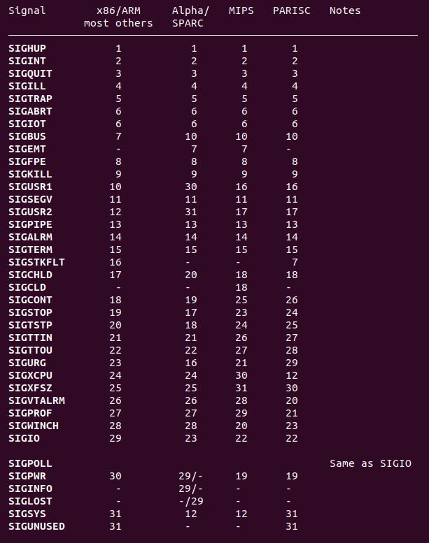

# 信号通信

信号其实就是一个软件中断。

信号间通信是通过内核来实现的，用户空间不具备发送信号的能力，是由进程A发送信号给内核，再由内核发送给信号B，实现信号通信。

例如 Linux 终端中当正在运行一个进程时，用键盘输入 `Ctrl+C` 就相当于一个产生了一个硬中断，CPU从用户态切换到内核态去处理硬中断，产生一个 `SIGINT` 信号写入到进程的PCB表中，当从内核态返回到用户态时，会识别到进程PCB表中的 `SIGINT` 信号，进而终止进程不再返回到该进程的用户空间代码。

## 信号四要素
1. 编号；
2. 名称；
3. 事件；
4. 默认处理方式。

## 如何查看信号的所有种类

可以用一条指令查看 Linux 中的信号通信分类：

    kill -l

执行结果：


## 所有信号类型的具体定义

可以用 man 指令查看 Linux 中的信号通信分类：

>man 7 signal

Linux同时支持POSIX可靠信号（以下简称“标准信号”）和POSIX实时信号。

下面列出 Linux 支持的信号. 某些信号依赖于体系结构(architecture).

    首先, POSIX.1-1990 描述了下列信号.

       信号         值      动作   说明
       ─────────────────────────────────────────────────────────────────────
       SIGHUP        1       Term     （Hangup）在控制终端上是挂起信号, 或者控制进程结束
       SIGINT        2       Term     （Interrupt）从键盘输入的中断
       SIGQUIT       3       Core      从键盘输入的退出
       SIGILL        4       Core     （Illegal）无效硬件指令
       SIGABRT       6       Core     （Abort）非正常终止, 可能来自 abort(3)
       SIGFPE        8       Core     （Floating-point exception）浮点运算例外
       SIGKILL       9       Term      杀死进程信号
       SIGSEGV      11       Core      无效的内存引用
       SIGPIPE      13       Term     （Broken pipe）管道中止: 写入无人读取的管道
       SIGALRM      14       Term     来自 alarm(2) 的超时信号
       SIGTERM      15       Term     （Termination）终止信号
       SIGUSR1   30,10,16    Term     用户定义的信号 1
       SIGUSR2   31,12,17    Term     用户定义的信号 2
       SIGCHLD   20,17,18    Ign     （Child）子进程结束或停止
       SIGCONT   19,18,25    Cont    （Continue）继续停止的进程
       SIGSTOP   17,19,23    Stop     停止进程
       SIGTSTP   18,20,24    Stop     （Terminal Stop）终端上发出的停止信号
       SIGTTIN   21,21,26    Stop     后台进程试图从控制终端(tty)输入
       SIGTTOU   22,22,27    Stop     后台进程试图在控制终端(tty)输出
    **信号 SIGKILL and SIGSTOP 不能被捕获 (caught), 阻塞(blocked), 或者忽略(ignored).**


    下面的信号是在 POSIX.1-2001 标准中新增的信号，POSIX.1-1990中不存在.

       信号           值      动作   说明
       ───────────────────────────────────────────────────────────────────
       SIGBUS      10,7,10     Core  （BUS）总线错误 (不正确的内存访问)
       SIGPOLL                 Term  （Pollable event）可轮询事件 (Sys V). 等同于SIGIO
       SIGPROF     27,27,29    Term  系统资源定时器(Profiling timer)超时
       SIGSYS      12,-,12     Core  用错误参数调用系统例程 (SVID)
       SIGTRAP        5        Core  跟踪/断点自陷（trap）
       SIGURG      16,23,21    Ign   套接口上出现 urgent 情况 (4.2 BSD)
       SIGVTALRM   26,26,28    Term （Virtual）虚拟超时时钟 (4.2 BSD)
       SIGXCPU     24,24,30    Core  超过了CPU时间限制 (4.2 BSD)
       SIGXFSZ     25,25,31    Core  超过了文件大小限制 (4.2 BSD)

       (这里的 SIGSYS, SIGXCPU, SIGXFSZ, 以及 某些 系统上 的 SIGBUS, Linux 的 缺省动作 (到2.3.27版) 是 Term（中止进程但不核心转储）, 而 SUSv2 （Linux 2.4之后）声明是 Core(结束且核心转储).)

       下面是其他几个信号.

       信号           值      动作   说明
       ──────────────────────────────────────────────────────────────
       SIGIOT         6        Core    IOT 自陷. 等同于 SIGABRT
       SIGEMT       7,-,7      Term   （Emulator trap）仿真器自陷
       SIGSTKFLT    -,16,-     Term    (Stack fault)协处理器堆栈错误
       SIGIO       23,29,22    Term    I/O 有效信号 (4.2 BSD)
       SIGCLD       -,-,18             等同于 SIGCHLD
       SIGPWR      29,30,19    Term    电源无效 (System V)
       SIGINFO      29,-,-             等同于 SIGPWR
       SIGLOST      -,-,-      Term    文件锁丢失
       SIGWINCH    28,28,20    Ign     窗口大小调整信号 (4.3 BSD, Sun)
       SIGUNUSED    -,31,-     Core    未使用的信号 (将成为 SIGSYS)

       这里的 - 指 信号 不存在; 可能给出三个值, 第一个值一般用于 alpha 和 sparc, 中间的值用于 i386, ppc 和 sh, 最后一个 是 mips 的.   
       信号29 在 alpha机上 是 SIGINFO / SIGPWR , 而在 sparc机上 是 SIGLOST。  
       POSIX.1-2001中没有指定SIGEMT，但它出现在大多数其他UNIX系统上，在这些系统中，它的默认操作通常是使用核心转储终止进程。  
       SIGPWR（在POSIX.1-2001中没有指定）在出现它的其他UNIX系统上通常默认被忽略。  
       在其他几个UNIX系统上，默认情况下会忽略SIGIO（在POSIX.1-2001中未指定）。  
       SIGUNUSED在大多数体系结构上与SIGSYS同义。自glibc 2.26以来，SIGUNUSED不再在任何架构上定义。

       "动作(Action)"栏 的字母有下列含义:

       Term     缺省动作是结束进程.

       Ign      缺省动作是忽略这个信号.

       Core     缺省动作是结束进程, 并且核心(Core)转储.

       Stop     缺省动作是停止进程.

       Cont     缺省动作是如果当前进程处于停止状态，继续运行进程，

       (译注: 这里 "结束" 指 进程 终止 并 释放资源, "停止" 指 进程 停止 运行, 但是 资源 没有 释放, 有可能 继续 运行.)

    SIGIO 和 SIGLOST 有 相同的 值. 后者 在 内核 源码 中 被注释 掉了, 但是 某些 软件 构造的 进程 仍然 认为 信号29 是 SIGLOST.

## 不同架构支持的信号区别



## 信号的使用

在 Linux 中通过内核将信号发送到对应进程，就需要知道：

- 需要发送的具体信号类型
- 进程的 ID 号是多少

>例如，在 Linux 使用过程中会用到命令： `kill -9 pid`   其中的：  
>- `9` 指的信号类型为 `SIGKILL` ，即杀死进程信号；  
>- `pid` 所指的是需要杀死的进程的进程号；
>
>整条语句的作用就是利用 `kill` 指令向进程ID 为 `pid` 的进程发送 `SIGKILL` 信号。

## 信号的发生
在Linux编程中，信号有两种产生方式：

1. 同步信号：
   - 硬件异常：例如除以0、无效指令和非法地址访问等。
   - 软件中断：比如调用系统库函数时出现的错误等。
   - 这些同步信号通常被称为“陷阱”，可用来暂停当前进程并抛出异常。无论程序处于用户态还是内核态，Linux都能够通过同步信号机制处理这些异常，保证了系统的稳定性和可靠性。常见的同步信号有SIGSEGV（段违规）和SIGFPE（浮点异常）。

2. 异步信号
   - 软件信号：通过kill、raise、alarm等系统调用函数手动发送信号。
   - 终端信号：由用户在终端上按下特定的键（如Ctrl+C）来产生的信号。

### kill() 函数

```c
#include <sys/types.h>
#include <signal.h>

int kill(pid_t pid, int sig);
/* 
返回值：
    成功为0，失败为-1，可以使用errno打印错误。
 */
```
- **kill（）系统调用可用于向任何进程组或进程发送任何信号；**
- 如果 pid 为正，则将信号 sig 发送到具有 pid 指定的ID的进程。
- 如果 pid 等于 0，那么 sig 将被发送到调用进程的进程组中的每个进程。
- 如果 pid 等于 -1，那么 sig 将被发送到调用进程有权发送信号的每个进程，进程 1（init）除外，但请参见下文。
- 如果 pid 小于-1，那么 sig 将发送到进程组中ID为 -pid 的每个进程。
- 如果 sig 为 0，则不发送信号，但仍执行存在性和许可检查；这可以用于检查是否存在调用者被允许发送信号的进程ID或进程组ID。
- 对于有权发送信号的进程，它必须具有特权（在Linux下：在目标进程的用户命名空间中具有CAP_KILL功能），或者发送的真实或有效用户ID。
- 进程必须等于目标进程的真实的set-user-ID或已保存set-user-ID。在SIGCONT的情况下，当发送和接收进程属于同一会话时也可以。
- root用户可以发送信号给普通用户，普通用户不能发送root超级用户发送信号。

### raise() 函数

```c
#include <signal.h>

int raise(int sig);
/* 
描述：
    发送一个信号给调用的进程(自己)或线程。
返回值：
    成功为0，失败为非0，可以使用errno打印错误。
 */
```
- 等价于：kill(getpid(), sig);
- 在多线程编程中等价于：pthread_kill(pthread_self(), sig);
- raise(9)杀进程时，相当于调用内核的 `_exit()` ,而不是库函数的 `exit()` 。

### alarm() 函数

```c
#include <unistd.h>

unsigned int alarm(unsigned int seconds);
/* 
描述：
    设置一个发送信号的时钟。
    在几秒后发送一个SIGALRM信号给调用进程。
返回值：
    返回之前设置的 alarm() 函数触发的剩余秒数，如果之前没有使用过则返回0。
 */
```
- 如果 `seconds` 的值为0，任何被挂起的alarm都会被取消;
- 使用 `alarm()` 函数后，之前设置的 `alarm()` 将会被取消;
- `alarm()`和 `setitimer()`共享相同的定时器；对其中一个的调用会干扰对另一个的使用。
- `alarm()`创建的警报在`execve()`中保留，并且不会由fork（2）创建的子进程继承。
- `sleep()`可以使用`SIGALRM`来实现；不要混合调用`alarm()`和`sleep()`。
- 使用 `alarm()` 函数开启闹钟时，在 `seconds` 时间内，进程不能结束，否则会导致 `alarm()` 函数失效，此时 `alarm()` 函数就无意义了。

-------------------------------------

## 信号的接收
在Linux下，有以下几种基本的信号接收方式：

1. 显式设置信号处理器函数：使用 `signal()` 函数显式为一个进程指定信号处理器函数。比较常用的是使用 `sigaction()` 函数来设置信号处理程序。

2. 保持默认行为：可以选择不设置信号处理器函数，让进程继续执行其默认操作。一般情况下，当进程接收到 `SIGKILL` 或 `SIGSTOP` 信号时，它必须停止运行，因为这些信号不能被捕获或忽略。

3. 使用自定义信号队列：可以使用 `sigqueue()` 或 `kill()` 系统调用，在进程间发送自定义数据和信号。当一个进程通过 `kill()` 调用向另一个进程发送一个信号时，信号将被添加到接收进程的信号队列中。从该队列中读取信号的顺序无法预测，并且当队列满时，信号可能会被忽略。

4. 使用异步 I/O 信号通知：也可以使用 `aio_signal()` 等异步 I/O 系统调用来实现信号通信。

5. 使用管道通知：可以使用管道实现两个进程之间的通信。当一个进程需要通知另一个进程时，它可以向该管道写入数据，接收进程会收到通过管道的文件描述符上的读事件通知，并相应地响应。

系统调用的信号接收函数有：`pause()`、`sleep()`、`while()`；

### pause() 函数

```c
#include <unistd.h>

int pause(void);
/* 
描述：
    等待一个信号。pause会导致调用进程（或线程）进入休眠（Sleeping），直到发出终止进程或调用信号捕获函数的信号。
返回值：
    只有在捕获到信号之后才会返回，并且设置 errno 为 EINTR。
 */
```

### sleep(3) 函数

```c
#include <unistd.h>

unsigned int sleep(unsigned int seconds);
/* 
描述：
    sleep会导致调用进程（或线程）进入休眠（Sleeping），直到当前时间已经经过设定的睡眠时间，或者收到非 ignored 的信号。
返回值：
    如果经过设定时间后才返回，返回0，如果中途收到信号返回剩余的睡眠时间。
 */
```
- 在 Linux 中, `sleep()` 是通过 `nanosleep(2)` 实现的应用.  
- 在有些系统中, `sleep()` 可能使用 `alarm(2)` 和 `SIGALRM` (POSIX.1 permits this) 实现的; 不建议混用 `alarm(2)` 和 `sleep()` .
- 在信号处理程序中使用 `longjmp(3)` 函数，或者在睡眠时修改SIGALRM的处理方式，会导致未定义的结果。

----------------------

## 信号的处理

1. 系统处理方式 
- 忽略信号：对于某些信号，应用程序可以选择将其忽略。这些信号一般用于内核通知等，如`SIGALRM`（定时器超时信号）和`SIGTERM`（终止进程信号）。

- 捕获并处理信号：应用程序可以注册一个信号处理函数，以便在收到特定信号时执行自定义操作。例如，当收到SIGINT（中断进程信号）时，程序可以打印相应的消息或清理资源后退出。

- 执行默认操作：对于每个信号，操作系统都定义了一个默认的响应方式。例如，当进程收到`SIGSEGV`（段错误信号）时，操作系统会自动终止该进程。

2. 用户处理方式 
- 应用程序可以通过调用 `signal()` 或 `sigaction()` 函数来指定自己的信号处理方式。其中，`signal()` 是较为简单的函数，而 `sigaction()` 则提供更多控制选项。如果应用程序未为某个信号指定自定义处理方式，则由操作系统执行默认操作。

### signal() 函数

```c
#include <signal.h>

typedef void (*sighandler_t)(int);
sighandler_t signal(int signum, sighandler_t handler);
/* 
描述：
    sleep会导致调用进程（或线程）进入休眠（Sleeping），直到当前时间已经经过设定的睡眠时间，或者收到非 ignored 的信号。
形参：
    int signum ：要处理的信号类型；
    sighandler_t handler ：signum 信号的处理函数。
返回值：
    成功时返回信号处理函数的先前值（即返回信号处理函数的函数指针），发生错误时返回 SIG_ERR 。错误会设置 errno 指示原因。
 */
```
- `signal()` 的行为在不同的UNIX版本中有所不同，在不同的Linux版本中也有不同的历史。避免使用它：改为使用`sigaction()`.
- `signal()`将形参 `int signum` 类型的信号处理设置为 `handler` ，它是`SIG_IGN`、`SIG_DFL`或程序员定义的函数（“信号处理程序”）的地址。
- 当 `signum` 信号被进程接收后，会发生一下情况：
  - 如果将处理程序设置为 `SIG_IGN` ，信号将会被忽略；
  - 如果将处理程序设置为 `SIG_DFL` ，则发生与该信号相关联的默认动作；
  - 如果将处理程序设置为一个函数，则首先要么将处理程序重置为SIG_DFL，要么阻止该信号（见下面的可移植性说明），然后使用参数`signum`调用处理程序。如果调用处理程序导致信号被阻塞，则在从处理程序返回时解除阻塞状态。
- 信号`SIGKILL`和`SIGSTOP`不能被捕获或忽略。
- 在信号处理程序中使用 `longjmp(3)` 函数，或者在睡眠时修改SIGALRM的处理方式，会导致未定义的结果。

### sigaction() 函数

```c
#include<signal.h>
 
int sigaction(int signum, const struct sigaction* act, struct sigaction* oldact);
/*
功能：
    修改或检查signum信号的处理方式。
参数：
    signum：要操作的信号；
    act：信号的新处理方式；传入参数；
    oldact：信号原先的处理方式；传出参数；
    
    若act非空，则将信号原处理方式变为act；若oldact非空，则将先前的处理方式存入oldact。
返回值：
    成功：0
    失败：-1
*/
 
struct sigaction {
    void(*sa_handler)(int);                      // 旧的信号处理函数指针
    void(*sa_sigaction)(int, siginfo_t*, void*); // 新的信号处理函数指针
    sigset_t sa_mask;         // 阻塞信号集
    int sa_flags;             // 信号处理方式
    void(*sa_restorer)(void); // 已弃用
}
/*
(1) sa_handler、sa_sigaction：信号处理函数指针，与signal函数中的函数指针用法一样，
                              根据情况给两者之一赋值。
    a) SIG_IGN：忽略该信号
    b) SIG_DFL：执行默认处理方式
    c) 回调函数名：自定义处理方式
(2) sa_mask：阻塞信号集。信号处理函数执行过程中，临时屏蔽指定信号。
(3) sa_flags：指定信号处理行为，通常设置为0（使用旧的信号处理函数）. 也可是以下值的"按位或"组合
        SA_NOCLDSTOP：使父进程在其子进程暂停或继续运行时不会收到SIGCHLD；
        SA_NOCLDWAIT：使父进程在其子进程退出时不会收到SIGCHLD信号，此时子进程也不会成为僵尸进程；
        SA_NODEFER：使对信号的屏蔽无效，即在信号处理函数执行期间仍能收到该信号；
        SA_RESETHAND：信号处理之后重新设置为默认的处理方式；
        SA_SIGINFO：使用sa_sigaction成员而不是sa_handler作为信号处理函数；
        SA_RESTART：使被信号打断的系统调用自动重新发起（已废弃）；
*/
 
void(*sa_sigaction)(int, siginfo_t*, void*);
/*
功能：
    新的信号处理函数指针，
参数：
    signum：信号编号；
    info：记录信号发送进程信息的结构体；
    context：赋给指向ucontext_t类型的一个对象指针，
             以引用在传递信号是被中断的接收进程或线程的上下文。
*/
```

### sigqueue() 函数
```c
#include<signal.h>
 
int sigqueue(pid_t pid, int sig, const union sigval value);
/*
功能：
    给指定进程发送信号。
参数：
    pid：进程号；
    sig：信号；
    value：通过信号传递的参数。
        union sigval {
            union sigval {
                int sival_int;
                void* sival_ptr;
            }
        }
返回值：
    成功：0
    失败：-1
*/
```


## 信号的使用注意事项 ##
- 信号使用时，使用父子进程通信一定要注意使用 `wait(NULL)` 或 `waitpid()` 回收资源，否则如果子进程未结束时杀死父进程会导致子进程变成僵尸进程（Z），使子进程占用的资源无法回收。