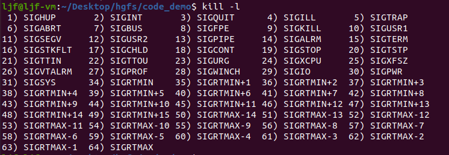

# 信号通信

信号其实就是一个软件中断。

信号间通信是通过内核来实现的，用户空间不具备发送信号的能力，是由进程A发送信号给内核，再由内核发送给信号B，实现信号通信。

例如 Linux 终端中当正在运行一个进程时，用键盘输入 `Ctrl+C` 就相当于一个产生了一个硬中断，CPU从用户态切换到内核态去处理硬中断，产生一个 `SIGINT` 信号写入到进程的PCB表中，当从内核态返回到用户态时，会识别到进程PCB表中的 `SIGINT` 信号，进而终止进程不再返回到该进程的用户空间代码。

## 如何查看信号的所有种类

可以用一条指令查看 Linux 中的信号通信分类：

    kill -l

执行结果：

## 所有信号类型的具体定义

可以用 man 指令查看 Linux 中的信号通信分类：

>man 7 signal

Linux同时支持POSIX可靠信号（以下简称“标准信号”）和POSIX实时信号。

下面列出 Linux 支持的信号. 某些信号依赖于体系结构(architecture).

    首先, POSIX.1-1990 描述了下列信号.

       信号         值      动作   说明
       ─────────────────────────────────────────────────────────────────────
       SIGHUP        1       Term     （Hangup）在控制终端上是挂起信号, 或者控制进程结束
       SIGINT        2       Term     （Interrupt）从键盘输入的中断
       SIGQUIT       3       Core      从键盘输入的退出
       SIGILL        4       Core     （Illegal）无效硬件指令
       SIGABRT       6       Core     （Abort）非正常终止, 可能来自 abort(3)
       SIGFPE        8       Core     （Floating-point exception）浮点运算例外
       SIGKILL       9       Term      杀死进程信号
       SIGSEGV      11       Core      无效的内存引用
       SIGPIPE      13       Term     （Broken pipe）管道中止: 写入无人读取的管道
       SIGALRM      14       Term     来自 alarm(2) 的超时信号
       SIGTERM      15       Term     （Termination）终止信号
       SIGUSR1   30,10,16    Term     用户定义的信号 1
       SIGUSR2   31,12,17    Term     用户定义的信号 2
       SIGCHLD   20,17,18    Ign     （Child）子进程结束或停止
       SIGCONT   19,18,25    Cont    （Continue）继续停止的进程
       SIGSTOP   17,19,23    Stop     停止进程
       SIGTSTP   18,20,24    Stop     （Terminal Stop）终端上发出的停止信号
       SIGTTIN   21,21,26    Stop     后台进程试图从控制终端(tty)输入
       SIGTTOU   22,22,27    Stop     后台进程试图在控制终端(tty)输出
    **信号 SIGKILL and SIGSTOP 不能被捕获 (caught), 阻塞(blocked), 或者忽略(ignored).**

    下面的信号是在 POSIX.1-2001 标准中新增的信号，POSIX.1-1990中不存在.

       信号           值      动作   说明
       ───────────────────────────────────────────────────────────────────
       SIGBUS      10,7,10     Core  （BUS）总线错误 (不正确的内存访问)
       SIGPOLL                 Term  （Pollable event）可轮询事件 (Sys V). 等同于SIGIO
       SIGPROF     27,27,29    Term  系统资源定时器(Profiling timer)超时
       SIGSYS      12,-,12     Core  用错误参数调用系统例程 (SVID)
       SIGTRAP        5        Core  跟踪/断点自陷（trap）
       SIGURG      16,23,21    Ign   套接口上出现 urgent 情况 (4.2 BSD)
       SIGVTALRM   26,26,28    Term （Virtual）虚拟超时时钟 (4.2 BSD)
       SIGXCPU     24,24,30    Core  超过了CPU时间限制 (4.2 BSD)
       SIGXFSZ     25,25,31    Core  超过了文件大小限制 (4.2 BSD)

       (这里的 SIGSYS, SIGXCPU, SIGXFSZ, 以及 某些 系统上 的 SIGBUS, Linux 的 缺省动作 (到2.3.27版) 是 Term（中止进程但不核心转储）, 而 SUSv2 （Linux 2.4之后）声明是 Core(结束且核心转储).)

       下面是其他几个信号.

       信号           值      动作   说明
       ──────────────────────────────────────────────────────────────
       SIGIOT         6        Core    IOT 自陷. 等同于 SIGABRT
       SIGEMT       7,-,7      Term   （Emulator trap）仿真器自陷
       SIGSTKFLT    -,16,-     Term    (Stack fault)协处理器堆栈错误
       SIGIO       23,29,22    Term    I/O 有效信号 (4.2 BSD)
       SIGCLD       -,-,18             等同于 SIGCHLD
       SIGPWR      29,30,19    Term    电源无效 (System V)
       SIGINFO      29,-,-             等同于 SIGPWR
       SIGLOST      -,-,-      Term    文件锁丢失
       SIGWINCH    28,28,20    Ign     窗口大小调整信号 (4.3 BSD, Sun)
       SIGUNUSED    -,31,-     Core    未使用的信号 (将成为 SIGSYS)

       这里的 - 指 信号 不存在; 可能给出三个值, 第一个值一般用于 alpha 和 sparc, 中间的值用于 i386, ppc 和 sh, 最后一个 是 mips 的.   
       信号29 在 alpha机上 是 SIGINFO / SIGPWR , 而在 sparc机上 是 SIGLOST。  
       POSIX.1-2001中没有指定SIGEMT，但它出现在大多数其他UNIX系统上，在这些系统中，它的默认操作通常是使用核心转储终止进程。  
       SIGPWR（在POSIX.1-2001中没有指定）在出现它的其他UNIX系统上通常默认被忽略。  
       在其他几个UNIX系统上，默认情况下会忽略SIGIO（在POSIX.1-2001中未指定）。  
       SIGUNUSED在大多数体系结构上与SIGSYS同义。自glibc 2.26以来，SIGUNUSED不再在任何架构上定义。

       "动作(Action)"栏 的字母有下列含义:

       Term      缺省动作是结束进程.

       Ign      缺省动作是忽略这个信号.

       Core      缺省动作是结束进程, 并且核心(Core)转储.

       Stop      缺省动作是停止进程.

       Cont     缺省动作是如果当前进程处于停止状态，继续运行进程，

       (译注: 这里 "结束" 指 进程 终止 并 释放资源, "停止" 指 进程 停止 运行, 但是 资源 没有 释放, 有可能 继续 运行.)

    SIGIO 和 SIGLOST 有 相同的 值. 后者 在 内核 源码 中 被注释 掉了, 但是 某些 软件 构造的 进程 仍然 认为 信号29 是 SIGLOST.

## 信号的使用

在 Linux 中通过内核将信号发送到对应进程，就需要知道：

- 需要发送的具体信号类型
- 进程的 ID 号是多少

>例如，在 Linux 使用过程中会用到命令： `kill -9 pid`   其中的：  
>- `9` 指的信号类型为 `SIGKILL` ，即杀死进程信号；  
>- `pid` 所指的是需要杀死的进程的进程号；
>
>整条语句的作用就是利用 `kill` 指令向进程ID 为 `pid` 的进程发送 `SIGKILL` 信号。

发送给进程的信号具体类型，以及

