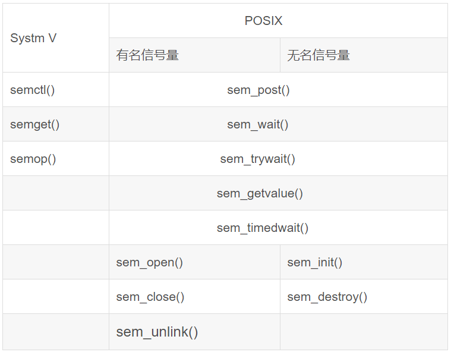

# 信号量

信号量（Semaphore）是一种用于进程通信的机制，可以使用在多个进程之间共享数据、共享资源或协调任务完成顺序等场景下，从而使得所有相关进程能够正确的完成任务。信号量也是一种进程同步和互斥机制，用于解决进程之间的竞争条件问题，并且允许进程以异步的方式通信。

信号量操作包括两个主要函数：P（Wait）和V（Signal）。这两个函数会分别降低/修改和增加/释放信号量的值。具体来说，

- P（Wait）操作会将信号量的计数器减少1，如果计数器为负数，则说明当前有别的进程正在访问临界资源，该进程就需要等待；
- V（Signal）操作会将信号量的计数器增加1，这样其他进程便可以访问临界资源。

在实际应用中，信号量一般会采用二元信号量（binary semaphore）和计数信号量（counting semaphore）两种类型。

- 二元信号量（binary semaphore）仅取0和1两个值，常被用于实现互斥锁（mutual exclusion lock），即确保一次只能有一个进程访问临界资源。
- 计数信号量（counting semaphore）则可取任何正整数，它可以被用作资源的管理计数器。例如，给一个文件资源分配了10个信号量，那么就最多能有10个不同的进程同时访问该文件（这也可看做是一种限流控制）。

需要注意的是，在并发编程中，使用信号量来进行进程间通信时，必须遵循以下三条原则：

- 不得将锁保持时间过长。如果一个进程持有当前锁超过合理时间，就会导致其他进程出现饥饿问题（Starvation）。
- 不得在可能存在死锁的情况下等待以获取锁资源。如果两个或多个进程都想要获取某一共享数据或资源，并且都尝试使用P（Wait）操作锁定该数据/资源，但是对方进程拥有锁资源并且处于等待状态，这将会导致死锁问题。
- 不得强制解开另一个持有相同锁资源的线程。只有当在线程持有锁资源并出错以致无法继续执行时，才考虑使用强制解锁技术。否则，这样做会破坏进程中的协调机制。

## 信号量的分类

 

POSIX 信号量允许进程和线程同步它们的操作。

信号量是一个整数，其值永远不会低于零。信号量可以进行两种操作：将信号量的值加1（sem_post(3)），将信号量的值减1（sem_wait(3)）。如果信号量的当前值为零，则 sem_wait(3) 操作将会阻塞，直到该值变得大于零为止。

POSIX 信号量分为两种形式：

**有名信号量（named semaphores）：**
- 命名信号量通过形如 `/somename` 的名称来标识，即以斜线开头、由一或多个字符组成（不能包含斜线）的长度不超过 `NAME_MAX-4` (即251) 个字符的空结束字符串。
- 使用同一名称调用 `sem_open(3)` 函数的两个进程可以操作同一个命名信号量。`sem_open(3)` 函数创建新的命名信号量或打开现有的命名信号量。
- 打开后，可以使用 `sem_post(3)` 和 `sem_wait(3)` 操作该信号量。
- 当一个进程使用完信号量后，可以使用 `sem_close(3)` 函数关闭该信号量。当所有进程都使用完信号量后，可以使用 `sem_unlink(3)` 函数将其从系统中删除。

**匿名信号量（unnamed semaphores）：**
- 未命名信号量没有名称。相反，该信号量被放置在共享多个线程（线程共享信号量）或进程（进程共享信号量）的内存区域中。线程共享信号量被放置在进程线程之间共享的内存区域中，例如全局变量。进程共享信号量必须放置在共享内存区域中（例如使用 `shmget(2)` 创建的 `System V` 共享内存段或使用 `shm_open(3)` 创建的 `POSIX` 共享内存对象）。
- 在使用未命名信号量之前，必须使用 `sem_init(3)` 函数进行初始化。然后，可以使用 `sem_post(3)` 和 `sem_wait(3)` 对其进行操作。当不再需要信号量并且在其中的内存被释放之前，应使用 `sem_destroy(3)` 销毁信号量。

**SYSTEM V 信号量操作函数为`semget (2)`、 `semop (2)`、`semctl (2)`，属于IPC的一种，主要用于进程间通信，头文件为<sys/sem.h>。**

### 注意
- 在内核2.6之前，Linux 只支持未命名的线程共享信号量。在使用 Linux 2.6和 glibc 提供 NPTL 线程实现的系统上，提供了 POSIX 信号量的完整实现。
- POSIX 命名的信号量具有内核持久性: 如果没有被 `sem_unlink(3)` 删除，信号量将一直存在，直到系统关闭。
- 使用 `POSIX` 信号量的API，编译时必须得使用 cc `-pthread` 去链接实时库 `librt`。
- `System V` 信号量(`semget (2)`、 `semop (2)`等)是一个较老的信号量 API。与 `System V` 信号量相比，`POSIX` 信号量提供了一个更简单、设计更好的接口; 另一方面，与 `System V` 信号量相比，`POSIX` 信号量的可用范围较小(特别是在较老的系统上)。
- 在Linux系统中，命名信号量通常存在于虚拟文件系统中，通常挂载在 `/dev/shm` 目录下，名字是 `sem.someone` . 自从 Linux 2.6.19 以来，ACL 可以放置在这个目录下的文件上，以便根据每个用户和每个组控制对象权限。

## POSIX 有名信号量
### 创建/打开函数 sem_open()
```C
#include <fcntl.h>           /* For O_* constants */
#include <sys/stat.h>        /* For mode constants */
#include <semaphore.h>

sem_t *sem_open(const char *name, int oflag);
sem_t *sem_open(const char *name, int oflag,
                mode_t mode, unsigned int value);
Link with -pthread.
/*
功能：
    初始化并打开命名信号量。
参数：
    name：给信号量起的名字
    oflag：调用方式，常用O_CREAT。如果使用了O_EXCL且命名信号量已存在，将会直接返回文件已存在的错误。
    mode：设置文件权限。如果信号量已经存在，第三和第四个参数都会被忽略。
    value：信号量的初始值，即资源数目。如果信号量已经存在，mode和value参数都会被忽略。
返回值：
    成功：如果信号量不存在，则返回创建好的信号量的地址，如果存在，则返回已有信号量的地址
    失败：返回 SEM_FAILED，并将错误放置在errno
*/
```

**概述**
- 函数作用是创建或者打开一个信号量文件：
  - 如果信号量文件不存在，那就会给该信号量文件命名并设置权限（创建好的信号量文件会被放到 /dev/shm 目录下）
  - 如果信号量文件已存在，那就直接打开。

### 关闭函数 sem_close()
```C
#include <semaphore.h>

int sem_close(sem_t *sem);
Link with -pthread.
/*
功能：
    通过sem参数关闭对应的有名信号量，允许释放系统为此信号量分配给调用进程的任何资源。
参数：
    sem：被关闭的有名信号量地址
返回值：
    成功：0
    失败：返回 -1 ，并将错误放置在errno
*/
```

### 删除函数 sem_unlink()
```C
#include <semaphore.h>

int sem_unlink(const char *name);
Link with -pthread.
/*
功能：
    移除名字为name的有名信号量，一旦打开这个信号量的所有进程都关闭操作，这个信号量就会被销毁。
参数：
    name：有名信号量名字
返回值：
    成功：0
    失败：返回 -1 ，并将错误放置在errno
*/
```

## POSIX 无名信号量
### 创建/打开函数 sem_open()
```C
#include <semaphore.h>

int sem_init(sem_t *sem, int pshared, unsigned int value);
Link with -pthread.
/*
功能：
    通过sem地址指针初始化无名信号量。
参数：
    sem：无名信号量地址指针
    pshared：选择线程间共享这个信号量 or 进程间共享这个信号量。如果 pshared = 0，线程间共享；pshared = 1，进程间共享。
    value：指定信号量的初始值，即资源数目。如果信号量已经存在，mode和value参数都会被忽略。
返回值：
    成功：如果信号量不存在，则返回创建好的信号量的地址，如果存在，则返回已有信号量的地址
    失败：返回 SEM_FAILED，并将错误放置在errno
*/
```

### 关闭/销毁函数 sem_destroy()
```C
#include <semaphore.h>

int sem_destroy(sem_t *sem);
Link with -pthread.
/*
功能：
    通过sem地址指针初始化无名信号量。
参数：
    sem：无名信号量地址指针
返回值：
    成功：0
    失败：返回 -1，并将错误放置在errno
*/
```

**概述**
- 只有被 `sem_init()` 过后的无名信号量才可以使用 `sem_destroy()` 函数销毁，
- 销毁一个被其他线程或进程正在阻塞（正在`sem_wait(3)`）的信号量会产生不可预料的行为。
- 使用已销毁的信号量会产生未定义的结果，直到使用 `sem_init(3)` 重新初始化该信号量。
- 一个未命名的信号量应该在释放它所在的内存之前用 `sem_destroy()` 销毁。如果不这样做，可能会导致某些实现上的资源泄漏。

## POSIX 信号量操作函数
### V 操作函数 sem_post()
```C
#include <semaphore.h>

int sem_post(sem_t *sem);
Link with -pthread.
/*
功能：
    增加(解锁) sem 指向的信号量。如果信号量的值因此变得大于零，那么在 sem_wait(3) 调用中阻塞的另一个进程或线程将被唤醒并继续锁定信号量。
    函数是异步信号安全的: 可以在信号处理程序中安全地调用它。
参数：
    sem：无名信号量地址指针
返回值：
    成功：0
    失败：返回 -1，信号量保持不变，并将错误放置在errno
*/
```

### P 操作函数 sem_wait()
```C
#include <semaphore.h>

int sem_wait(sem_t *sem);
int sem_trywait(sem_t *sem);
int sem_timedwait(sem_t *sem, const struct timespec *abs_timeout);
Link with -pthread.

Feature Test Macro Requirements for glibc (see feature_test_macros(7)):
sem_timedwait(): _POSIX_C_SOURCE >= 200112L
/*
功能：
    sem_wait() 函数会对指向的信号量进行减一操作（锁定）。如果信号量的值大于零，那么减法将继续进行，并且函数立即返回。如果信号量当前的值为零，则调用将阻塞，直到可以执行减法（即信号量值上升超过零），或者一个信号处理程序中断调用。
参数：
    sem：无名信号量地址指针
返回值：
    成功：0
    失败：返回 -1，信号量保持不变，并将错误放置在errno
*/
```
**概述**
- `sem_trywait()` 与 `sem_wait()` 相同，只是如果不能立即执行减法，则调用会返回错误（`errno` 设置为 `EAGAIN`），而不是阻塞。
- `sem_timedwait()` 与 `sem_wait()` 相同，只是 `abs_timeout` 指定了调用在不能立即执行减法时应该阻塞的时间限制。`abs_timeout` 参数指向一个结构体，该结构体指定了自纪元（`1970-01-01 00:00:00 +0000（UTC）`）以来以秒和纳秒为单位的绝对超时时间。该结构定义如下：
  >```c
  >struct timespec {
  >             time_t tv_sec;      /* Seconds */
  >             long   tv_nsec;     /* Nanoseconds [0 .. 999999999] */
  >         };
  >```
- 如果调用时已经超时，并且信号量无法立即被锁定，那么 `sem_timedwait()` 将因超时错误失败（`errno` 设置为 `ETIMEDOUT`）。
- 如果操作可以立即执行，则无论 `abs_timeout` 的值如何，`sem_timedwait()` 永远不会因超时错误而失败。此外，在这种情况下不检查 `abs_timeout` 的有效性。

## SYSTEM V信号量集
### 创建信号量集 semget()
```C
#include <sys/types.h>
#include <sys/ipc.h>
#include <sys/sem.h>

int semget(key_t key, int nsems, int semflg);
/*
功能：
    获取 System V 信号量集标识符。
参数：
    key：专属密钥，不使用key可以设置为IPC_PRIVATE；
    nsems：信号量的个数；
    semflg：操作标志位，通常为IPC_CREAT
返回值：
    成功：返回信号量集标识符
    失败：返回 -1，信号量保持不变，并将错误放置在errno
*/
```

**概述**
1. semget() 系统调用返回与参数 key 相关联的 System V 信号量集标识符。它可以用于获取先前创建的信号量集的标识符（当 semflg 为零时，且 key 不具有 IPC_PRIVATE 值），也可以用于创建新集合。
2. 如果 key 的值为 IPC_PRIVATE 或者没有与 key 相关联的现有信号量集并且在 semflg 中指定了 IPC_CREAT，则将创建一个由nsems个信号量组成的新集合。
3. 如果 semflg 同时指定了 IPC_CREAT 和 IPC_EXCL，并且已经存在一个信号量集与 key 相关联，则 semget() 将失败，errno 设置为 EEXIST。（这类似于 open(2) 中 O_CREAT | O_EXCL 的组合的效果）。
4. 在创建时，semflg 参数的最低有效9位定义了信号量集的权限（对于所有者、组和其他人）。这些位具有相同的格式和相同的含义，如 open(2) 的 mode 参数（尽管对于信号量，执行权限无意义，写入权限表示允许更改信号量值）。
5. 在创建新的信号量集时，semget() 如下初始化它的关联数据结构 semid_ds （参见 semctl(2)）：
  - sem_perm.cuid 和 sem_perm.uid 设置为调用进程的有效用户 ID。
  - sem_perm.cgid 和 sem_perm.gid 设置为调用进程的有效组 ID。
  - sem_perm.mode 的最低有效9位设置为 semflg 的最低有效9位。
  - sem_nsems 设置为 nsems 的值。
  - sem_otime 设置为 0。
  - sem_ctime 设置为当前时间。
6. 当不创建信号量集时，参数 nsems 可以为 0（不管）。否则，nsems 必须大于 0 且小于或等于每个信号量集的信号量的最大数量（SEMMSL）。
7. 如果信号量集已经存在，则验证权限。

**注意事项**
1. 在 Linux 或任何 POSIX 版本中，不需要包含 <sys/types.h> 和 <sys/ipc.h>。但是，一些旧的实现需要包括这些头文件，而 SVID 也记录了它们的包含。为了使应用程序可移植到这些旧系统上，可能需要包括这些头文件。
2. IPC_PRIVATE 不是一个标志字段，而是一个 key_t 类型。如果将该特殊值用于 key，则系统调用忽略除 semflg 的最低有效9位之外的所有内容，并创建新的信号量集（成功时）。
3. 信号量初始化：
  - 新创建的集合中的信号量的值是不确定的。（尽管 POSIX.1-2001 和 POSIX.1-2008 明确指出了这一点，但 POSIX.1-2008 指出，标准的未来版本可能需要实现将信号量初始化为 0。）尽管像许多其他实现一样，Linux 将信号量值初始化为 0，但移植应用程序不能依赖于此：应明确地将信号量初始化为所需的值。
  - Initialization 可以使用 semctl (2) SETVAL 或 SETALL 操作完成。其中，如果有多个对等方不知道谁将是第一个初始化集合，可以通过检查由 semctl(2) IPC_STAT 操作检索到的关联数据结构中的非零 sem_otime 来避免竞争。
4. 信号量限制：
影响 semget() 调用的信号量集资源的以下限制：
  - SEMMNI：信号量集数量的系统范围限制。在 Linux 3.19 版本之前的 Linux 系统上，该限制的默认值为 128。从 Linux 3.19 开始，该默认值为 32,000。在 Linux 中，可以通过 /proc/sys/kernel/sem 的第四个字段读取和修改该限制。
  - SEMMSL：每个信号量 ID 的最大信号量数。在 Linux 3.19 版本之前的 Linux 系统上，此限制的默认值为 250。从 Linux 3.19 开始，该默认值为 32,000。在 Linux 中，可以通过 /proc/sys/kernel/sem 的第一个字段读取和修改该限制。
  - SEMMNS：系统范围内的信号量数量的限制：策略相关（在 Linux 上，该限制可以通过 /proc/sys/kernel/sem 的第二个字段进行读取和修改）。请注意，系统范围内的信号量数量也受 SEMMSL 和 SEMMNI 的乘积的限制。

### 操作信号量集 semop()
```C
#include <sys/types.h>
#include <sys/ipc.h>
#include <sys/sem.h>

int semop(int semid, struct sembuf *sops, size_t nsops);
int semtimedop(int semid, struct sembuf *sops, size_t nsops,
                const struct timespec *timeout);

Feature Test Macro Requirements for glibc (see feature_test_macros(7)):
semtimedop(): _GNU_SOURCE
/*
功能：
    获取 System V 信号量集标识符。
参数：
    semid：信号量集标识符
    sops：信号量执行操作的结构体；
    nsops：操作的信号量数量
返回值：
    成功：返回0
    失败：返回 -1，并将错误放置在errno
*/
```

**概述**
1. 在 System V 信号量集中，每个信号量都有以下相关值：
    - unsigned short semval;     /* 信号量的值 */
    - unsigned short semzcnt;    /* 等待值为 0 的进程数量 */
    - unsigned short semncnt;    /* 等待递增的进程数量 */
    - pid_t sempid;             /* 上一个对 semop() 操作的进程的 PID */

2. semop() 对 semid 指示的信号量集中的选定信号量执行操作。由 sops 指针指向的数组中的 nsops 元素中每个元素都是一个结构体，指定要对单个信号量执行的操作。此结构的元素类型为 struct sembuf，包含以下成员：
    - unsigned short sem_num;  /* 信号量编号 */
    - short sem_op;            /* 信号量操作 */
    - short sem_flg;           /* 操作标志 */

    sem_flg 中识别的标志为 IPC_NOWAIT 和 SEM_UNDO。如果一个操作指定了 SEM_UNDO，则当进程终止时，它将自动撤消。

    sops 中包含的操作按数组顺序、原子方式执行，即这些操作要么作为一个完整单元执行，要么根本不执行。 如果无法立即执行所有操作，则系统调用的行为取决于各个 sem_flg 字段中是否存在 IPC_NOWAIT 标志，如下所述。

    每个操作都执行在信号量集的第 sem_num 个信号量上，其中第一个信号量编号为 0。操作分为三种类型，由 sem_op 的值区分。

    - 如果 sem_op 是正整数，则该操作将此值添加到信号量值 (semval)。此外，如果对于此操作指定了 SEM_UNDO，则系统会从此信号量的信号量调整（semadj）值中减去值 sem_op。该操作总是可以进行-它永远不会强制线程等待。调用进程必须在信号量集上具有对应权限。

    - 如果 sem_op 为零，则进程必须在信号量集上具有读权限。这是一个“wait-for-zero”操作：如果 semval 为零，则操作可以立即进行。否则，如果在 sem_flg 中指定了 IPC_NOWAIT，则 semop() 失败，并将 errno 设置为 EAGAIN（并且没有执行 sops 中的任何操作）。否则，semzcnt（等待直到该信号量的值变为零的线程数量）增加一，并且线程休眠，直到以下情况之一发生：
        - semval 变为 0，此时会将 semzcnt 的值减小。
        - semaphore set 已被删除：semop() 失败，并将 errno 设置为 EIDRM。
        - 调用线程捕获到一个信号：semzcnt 的值减小，semop() 失败，并将 errno 设置为 EINTR。

    - 如果 sem_op 小于零，则进程必须在信号量集上具有 alter permission。如果 semval 大于或等于 sem_op 值的绝对值，则该操作可以立即进行：从 semval 中减去 sem_op 的绝对值，如果对于此操作指定了 SEM_UNDO，则系统将 semains 的值增加到此信号量的信号量调整（semadj）中。如果 sem_op 的绝对值大于 semval，并且在 sem_flg 中指定了 IPC_NOWAIT，则 semop() 失败，并将 errno 设置为 EAGAIN（并且没有执行 sops 中的任何操作）。否则，semncnt（等待此信号量的值增加的线程计数）增加一，线程休眠，直到以下情况之一发生：
        - semval 变为大于或等于 sem_op 的绝对值：现在可以如上所述继续该操作。
        - semaphore set 已从系统中删除：semop() 失败，并将 errno 设置为 EIDRM。
        - 调用线程捕获一个信号：semncnt 的值减小，semop() 失败，并将 errno 设置为 EINTR。

    成功完成后，在 sops 指向的数组中指定的每个信号量的 sempid 值都设置为调用进程的进程 ID。另外，sem_otime 设置为当前时间。

3. semtimedop() 的行为与 semop() 完全相同，但在调用线程需要睡眠的情况下，由 timeout 参数传递的 timespec 结构指定了已流逝时间的持续时间。 （此睡眠间隔将四舍五入到系统时钟粒度，并且内核调度延迟意味着该间隔可能超时一小段时间。） 如果达到指定的时间限制，semtimedop() 失败，并将 errno 设置为 EAGAIN（并且不执行 sops 中的任何操作）。如果 timeout 参数为 NULL，则 semtimedop() 的行为与 semop() 完全相同。

4. 请注意，如果 semtimedop() 被信号中断，导致调用失败并出现错误 EINTR，则 timeout 的内容保持不变。

**注意事项**
- 在 Linux 或任何版本的 POSIX 中，不需要包含 <sys/types.h> 和 <sys/ipc.h>。然而，一些旧实现要求包含这些头文件，并且 SVID 也记录了它们的包含。对于那些需要移植到这些旧系统的应用程序，可能需要包括这些头文件。

- 进程的 sem_undo 结构体不会被 fork(2) 创建的子进程继承，但会在 execve(2) 系统调用时传递下去。

- 无论在设置信号处理程序时是否使用 SA_RESTART 标志，使用信号处理程序中断的 semop() 操作永远不会自动重启。

- 信号量调整 (semadj) 值是每个进程每个信号量的整数值，指定了 SEM_UNDO 标志的所有操作的求和的负值。每个进程都有一个 semadj 值列表，为使用 SEM_UNDO 对其进行操作的每个信号量维护一个值。当进程终止时，该进程每个信号量的 semadj 值都会添加到相应的信号量上，从而撤消该进程对信号量的操作效果（但请参阅 BUGS）。当使用 semctl(2) 的 SETVAL 或 SETALL 请求直接设置信号量的值时，所有进程中相应的 semadj 值都会被清除。clone(2) 中的 CLONE_SYSVSEM 标志允许多个进程共享 semadj 列表，详情请参阅 clone(2)。

- 可以使用适当的 semctl(2) 调用检索信号量的 semval、sempid、semzcnt 和 semncnt 值。

**信号量限制：**

以下信号量集资源限制影响 semop() 调用：
- SEMOPM：一个 semop() 调用中允许的最大操作数。在 Linux 3.19 之前，默认值为 32，在 Linux 3.19 后，其默认值为 500。在 Linux 上，可以通过 /proc/sys/kernel/sem 的第三个字段读取并修改此限制。注意：此限制不应超过 1000，因为存在内核内存分片导致分配 sops 数组的内存时 semop() 失败的风险。
- SEMVMX：semval 的最大可允许值：实现相关（32767）。
- 实现对 adjust on exit 最大值 (SEMAEM)，系统范围的撤消结构体最大数量 (SEMMNU) 和每个进程的撤消条目最大数量等，没有固有的限制。

### 控制信号量集 semctl()
```C
#include <sys/types.h>
#include <sys/ipc.h>
#include <sys/sem.h>

int semctl(int semid, int semnum, int cmd, ...);
/*
功能：
    获取 System V 信号量集标识符。
参数：
    key：专属密钥，不使用key可以设置为IPC_PRIVATE；
    nsems：信号量的个数；
    semflg：操作标志位，通常为IPC_CREAT
返回值：
    成功：除一下命令，其余命令都返回0
    GETNCNT   the value of semncnt.
    GETPID    the value of sempid.
    GETVAL    the value of semval.
    GETZCNT   the value of semzcnt.
    IPC_INFO  the index of the highest used entry in the kernel's internal array recording information about all semaphore sets.  (This information can be used with repeated SEM_STAT or SEM_STAT_ANY operations to obtain  information about all semaphore sets on the system.)
    SEM_INFO  as for IPC_INFO.
    SEM_STAT  the identifier of the semaphore set whose index was given in semid.
    SEM_STAT_ANY   as for SEM_STAT.
    失败：返回 -1，并将错误放置在errno
*/
```

**概述**

- semctl() 函数在 System V 信号量集上执行由 cmd 指定的控制操作，该信号量集由 semid 标识，或者在该集合中根据 semnum-th 信号量执行该操作（信号量集中的信号量从 0 开始编号）。

- 此函数有三个或四个参数，取决于 cmd。当有四个参数时，第四个参数具有 union semun 类型。调用程序必须将此联合定义如下：
```c
    union semun {
       int              val;    /* SETVAL 的值 */
       struct semid_ds *buf;    /* IPC_STAT、IPC_SET 的缓冲区 */
       unsigned short  *array;  /* GETALL、SETALL 的数组 */
       struct seminfo  *__buf;  /* IPC_INFO 的缓冲区（仅适用于 Linux） */
    };

semid_ds 数据结构在 <sys/sem.h> 中定义如下：

    struct semid_ds {
       struct ipc_perm sem_perm;  /* 所有权和权限 */
       time_t          sem_otime; /* 上次 semop 时间 */
       time_t          sem_ctime; /* 上次修改时间 */
       unsigned long   sem_nsems; /* 集合内的信号量数量 */
    };

ipc_perm 结构体定义如下 （粗体标注部分可以使用 IPC_SET 进行设置）：

   struct ipc_perm {
       key_t          __key; /* 用于 semget(2) 的键值 */
       uid_t          uid;   /* 拥有者的有效 UID */
       gid_t          gid;   /* 拥有者的有效 GID */
       uid_t          cuid;  /* 创建者的有效 UID */
       gid_t          cgid;  /* 创建者的有效 GID */
       unsigned short mode;  /* 权限 */
       unsigned short __seq; /* 序列号 */
   };
```

- cmd 的有效值为：

   - **IPC_STAT**    
    将与 semid 相关联的内核数据结构中的信息复制到由 arg.buf 指向的 semid_ds 结构体中。semnum 参数被忽略。调用进程必须对信号量集拥有读取权限。

   - **IPC_SET**  
    将 arg.buf 指向的 semid_ds 结构体的某些成员值写入到此信号量集关联的内核数据结构中，并更新其 sem_ctime 成员。更新的结构体成员包括：sem_perm.uid、sem_perm.gid 和（最低有效比特位数的）sem_perm.mode。调用进程的有效 UID 必须匹配信号量集的所有者（sem_perm.uid）或创建者 （sem_perm.cuid），或者调用程序必须具有特权。semnum 参数被忽略。

   - **IPC_RMID**  
    立即删除信号量集，唤醒所有在 set上被阻塞的 semop(2) 调用的进程（返回错误并将 errno 设置为 EIDRM）。调用进程的有效用户 ID 必须与信号量集的创建者或所有者相匹配，或者调用程序必须具有特权。semnum 参数被忽略。

   - **IPC_INFO**（仅适用于 Linux）
    返回指向 arg.__buf 的结构体中有关系统范围内信号量限制和参数的信息。如果定义了 _GNU_SOURCE 特性宏，则该结构体的类型为 seminfo，定义在 <sys/sem.h> 中。
    ```c
    struct  seminfo {
                         int semmap;  /* Number of entries in semaphore
                                         map; unused within kernel */
                         int semmni;  /* Maximum number of semaphore sets */
                         int semmns;  /* Maximum number of semaphores in all
                                         semaphore sets */
                         int semmnu;  /* System-wide maximum number of undo
                                         structures; unused within kernel */
                         int semmsl;  /* Maximum number of semaphores in a
                                         set */
                         int semopm;  /* Maximum number of operations for
                                         semop(2) */
                         int semume;  /* Maximum number of undo entries per
                                         process; unused within kernel */
                         int semusz;  /* Size of struct sem_undo */
                         int semvmx;  /* Maximum semaphore value */
                         int semaem;  /* Max. value that can be recorded for
                                         semaphore adjustment (SEM_UNDO) */
                     };

                 The semmsl, semmns, semopm, and semmni settings can be changed via /proc/sys/kernel/sem; see proc(5) for details.
    ```
- semmsl, semmns, semopm, 和 semmni 的设置可以通过 /proc/sys/kernel/sem 改变; see proc(5) for details.
    - **SEM_INFO** (特定于Linux系统)  
    返回一个seminfo结构，其中包含与IPC_INFO相同的信息，但以下字段返回有关信号量消耗的系统资源的信息：semusz字段返回当前存在于系统上的信号量集数；semaem字段返回系统上所有信号量集中的信号量总数。

    - **SEM_STAT** (特定于Linux系统)  
    返回一个semid_ds结构，类似于IPC_STAT。然而，semid参数不是信号量标识符，而是内核维护有关所有信号量集的信息的内部数组中的索引。

    - **SEM_STAT_ANY** (特定于Linux系统，自Linux 4.17以来)  
    返回一个seminfo结构，其中包含与SEM_STAT相同的信息。但是，不检查sem_perm.mode对semid的读取权限，这意味着任何用户都可以使用此操作（就像任何用户都可以读取/proc/sysvipc/sem来获得相同的信息）。

    - **GETALL**  
    将该组所有信号量的semval（即当前值）返回到arg.array中。参数semnum被忽略。调用进程必须具有信号量集的读取权限。

    - **GETNCNT**  
    返回集合中第semnum个信号量的semncnt的值（即等待为第semnum个信号量增加semval的进程数）。调用进程必须具有信号量集的读取权限。

    - **GETPID**  
    返回集合中第semnum个信号量的sempid的值。这是最后在该信号量上执行操作的进程的PID（但请参阅注意事项）。调用进程必须具有信号量集的读取权限。

    - **GETVAL**  
    返回集合中第semnum个信号量的semval的值。调用进程必须具有信号量集的读取权限。

    - **GETZCNT**  
    返回集合中第semnum个信号量的semzcnt的值（即等待将集合中第semnum个信号量的semval变为0的进程数）。调用进程必须具有信号量集的读取权限。

    - **SETALL**  
    使用arg.array设置集合的所有信号量的semval，并更新与集合关联的semid_ds结构的sem_ctime成员。在所有进程中清除已更改信号量的Undo条目。如果信号量值的更改允许其他进程中的阻塞semop（2）调用继续进行，则唤醒这些进程。参数semnum被忽略。调用进程必须在信号量集上拥有更改（写入）权限。

    - **SETVAL**  
    将semval的值设置为arg.val，以便于集合中的第semnum个信号量，并更新与集合关联的semid_ds结构的sem_ctime成员。在所有进程中清除已更改信号量的Undo条目。如果信号量值的更改允许其他进程中的阻塞semop（2）调用继续进行，则唤醒这些进程。调用进程必须在信号量集上拥有更改权限。

**注意**
- 在Linux或任何版本的POSIX中，不需要包含<sys/types.h>和<sys/ipc.h>。但是，一些旧的实现需要包含这些标头文件，并且SVID也记录了它们的包含方式。旨在可移植到这些旧系统的应用程序可能需要包含这些标头文件。

- IPC_INFO、SEM_STAT和SEM_INFO操作由ipcs(1)程序用于提供有关分配资源的信息。将来可能会修改或将其移动到/proc文件系统接口。

- 在Linux 2.2下，struct semid_ds中的各个字段被标记为short，并在Linux 2.4下成为long。要利用此功能，应重新编译glibc-2.1.91或更高版本。 （内核通过cmd中的IPC_64标志区分旧调用和新调用。）

- 在早期版本的glibc中，semun联合定义在<sys/sem.h>中，但POSIX.1要求调用者定义此联合。在未定义此联合的glibc版本上，宏_SEM_SEMUN_UNDEFINED在<sys/sem.h>中定义。

- 信号量集上的以下系统限制影响semctl()调用：

SEMVMX：semval的最大值：实现相关（32767）。

- 为了更好地实现可移植性，最好始终以四个参数调用semctl()。

- sempid值  
    POSIX.1将sempid定义为信号量上“最后一次操作的进程ID”，并明确指出此值由成功的semop(2)调用设置，暗示没有其他接口会影响sempid值。

- 虽然某些实现符合POSIX.1中规定的行为，但其他实现则不一定。 （这里可能是POSIX.1的错误，因为它很可能未能捕捉到现有实现行为的全部范围。）其他各种实现也会更新sempid以更新信号量值的其他操作：SETVAL和SETALL操作，以及由于使用SEM_UNDO标志（请参见semop(2)）而在进程终止时执行的信号量调整。

- Linux还更新SETVAL操作和信号量调整的sempid。但是，略微不一致的是，在4.5版本及以下，Linux未更新SETALL操作的sempid。这在Linux 4.6中得到纠正。

## POSIX 和 SYSTEM V 信号量的区别
1. System V的信号量是信号量集，可以包括多个信号灯（有个数组），每个操作可以同时操作多个信号灯。Posix是单个信号灯
2. Posix信号量在有些平台并没有被实现，比如：SUSE8而System V信号量大多数LINUX/UNIX都已经实现。两者都可以用于进程和线程间通信。
3. 一般来说，System V信号量用于进程间同步、Posix 有名信号灯既可用于线程间的同步，又可以用于进程间的同步、Posix无名信号灯用于同一个进程的不同线程间，如果无名信号量要用于进程间同步，信号量要放在共享内存中。
4. Posix有两种类型的信号量，有名信号量和无名信号量。有名信号量像System V信号量一样由一个名字标识。
5. Posix通过`sem_open`单一的调用就完成了信号量的创建、初始化和权限的设置，而System V要两步。也就是说Posix信号是多线程，多进程安全的，而System V不是，可能会出现问题。
6. SystemV信号量通过一个int类型的值来标识自己（类似于调用open()返回的fd），而`sem_open`函数返回`sem_t`类型（长整形）作为Posix信号量的标识值。
7. 对于System V信号量你可以控制每次自增或是自减的信号量计数，而在Posix里面，信号量计数每次只能自增或是自减1。
8. Posix无名信号量提供一种非常驻的信号量机制。
9. Posix有名信号灯的值是随内核持续的。也就是说，一个进程创建了一个信号灯，这个进程结束后，这个信号灯还存在，并且信号灯的值也不会改变。当持有某个信号灯锁的进程没有释放它就终止时，内核并不给该信号灯解锁.
10. Posix有名信号灯是通过内核持续的，一个进程创建一个信号灯，另外的进程可以通过该信号灯的外部名（创建信号灯使用的文件名）来访问它。Posix基于内存的无名信号灯的持续性却是不定的，如果基于内存的信号灯是由单个进程内的各个线程共享的，那么该信号灯就是随进程持续的，当该进程终止时它也会消失。如果某个基于内存的信号灯是在不同进程间同步的，该信号灯必须存放在共享内存区中，这要只要该共享内存区存在，该信号灯就存在。

## POSIX 和 SYSTEM V 信号量的使用环境对比
1. System V的信号量一般用于进程同步, 且是内核持续的, api为：semget、semctl、semop

2. Posix的有名信号量一般用于进程同步, 有名信号量是内核持续的. 有名信号量的api为：sem_open、sem_close、sem_unlink

3. Posix的无名信号量一般用于线程同步, 无名信号量是进程持续的, 无名信号量的api为：sem_init、sem_destroy
