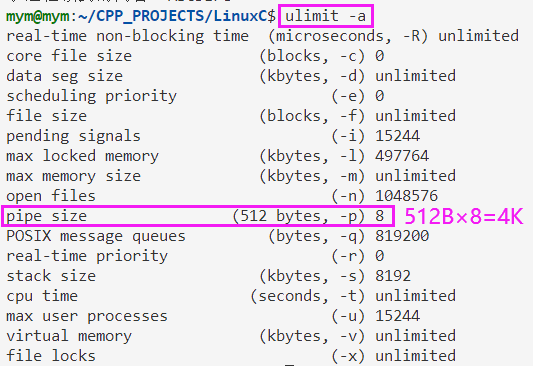

# 无名管道

## 无名管道特点
1. 半双工。数据同一时刻只能单向传输，如果需要双向通信，需要创建两个无名管道；

2. 数据从管道一端写入，另一端读出，被读出的管道中数据会被自动删除；

3. 写入管道的数据遵循先进先出；

4. 管道非普通文件，不属于某个文件系统，只存在于内存，所以不需要文件操作中的设置文件名，读写方式，和权限；

5. **无名管道只能在具有公共祖先（亲缘关系）的进程（父子进程、兄弟进程等）之间使用。**

## 无名管道的使用
### 无名管道创建函数
```C
#include<unistd.h>
int pipe(int pipefd[2]);
/*
功能：
    创建无名管道。
参数：
    pipefd：int型数组的首地址，存放了管道文件描述符pipefd[0]、pipefd[1]。
            pipefd[0]用于读管道，pipefd[1]用于写管道。
            一般的文件I/O函数都可用来操作管道（lseek除外）。
返回值：
    成功：0
    失败：-1
可移植性：
    满足POSIX.1标准，移植性强。
*/

#define _GNU_SOURCE             /* See feature_test_macros(7) */
#include <fcntl.h>              /* Obtain O_* constant definitions */
#include <unistd.h>
int pipe2(int pipefd[2], int flags);
/*
功能：
    创建无名管道。
参数：
    pipefd：int型数组的首地址，存放了管道文件描述符pipefd[0]、pipefd[1]。
            pipefd[0]用于读管道，pipefd[1]用于写管道。
            一般的文件I/O函数都可用来操作管道（lseek除外）。
    flags: flag为 0 时与 ‘int pipe(int pipefd[2]);’ 功能相同，不为0时有几个可选项：
            - O_CLOEXEC：防止产生竞争。
            - O_DIRECT (since Linux 3.4)：设置为数据包模式读写，读写都一次读取一个数据包，且
                在写入时若大于PIPE_BUF（<limites.h>中定义）时会自动分包；如果read指定的缓存
                区大小小于下一个数据包，则读取请求的字节数，并丢弃数据包中多余的字节；不支持长
                度为零的数据包，不支持此标志的旧内核将通过EINVAL错误指示这一点。Linux 4.5以后
                可用fcntl()函数实现。
            - O_NONBLOCK：设置为非阻塞，也可以用‘fcntl()’函数实现。
返回值：
    成功：0
    失败：-1
可移植性：
    为Linux特有。自 Linux 2.6.27 增加; glibc 开始支持版本为 2.9.
*/
```

## 无名管道的原理
进程间通信需要依赖内核，进程A与进程B通信，需要先写入信息到内核中的对象，再由进程B读出内核对象中的信息。

根据对象类型的不同，有不同的通信方式。


1. **需要在fork之前创建无名管道**，然后子进程也有自己的读写管道描述符关联无名管道；如果放在创建子进程后，那子进程也会创建一个无名管道，会导致父进程和子进程中的两个无名管道文件操作符不一致，导致无法通信。

2. 父进程给子进程发消息：父进程写管道、子进程读管道；需要关闭父进程的读端文件描述符(fds[0])、子进程的写端文件描述符(fds[1])。 反之类似。

3. 无名管道创建完成后，通过read()和write()函数利用pipe创建的文件描述符进行无名管道的读和写操作。

4. **管道默认为阻塞，读不到内容则阻塞等待有内容可读；可设置为非阻塞。**

5. `read()`函数使用过程中，如果读不到数据就会进入阻塞等待状态，管道阻塞即在 `read()` 函数处停止，不在进行后面的语句，进程进入睡眠。

6. 使用`write()` 写入数据时，如果写入字节数超过 `pipe` 设定的内存大小后，也会产生写阻塞，进程进入睡眠。

7. 无名管道创建在内存中，进程结束后会将申请的内存释放，无名管道就不存在了。

## 无名管道大小查看



## 无名管道测试代码

```C
#include <stdio.h>
#include <stdlib.h>
#include <unistd.h>
#include <string.h>

int
main(int argc, char *argv[])
{
    int pipefd[2];
    pid_t cpid;
    char sendbuf[] = "hello world!";
    char readbuf[128];

    /* 一定要在fork之前申请pipe，否则子进程与父进程之间无法通信 */
    if (pipe(pipefd) == -1) {
        perror("pipe");
        exit(EXIT_FAILURE);
    }

    /* fork出一个子进程，子进程拥有单独的内存执行空间，父子进程都会运行此行往后的所有语句 */
    cpid = fork();

    if (cpid == -1) {
        perror("fork 生成子进程失败");
        exit(EXIT_FAILURE);
    }
    if (cpid == 0) {    /* Child reads from pipe */
        close(pipefd[1]);          /* Close unused write end */
        read(pipefd[0], readbuf, sizeof(sendbuf));
        printf("子进程读取字符串结束：%s！\n",readbuf);
        close(pipefd[0]);
    } else {            /* Parent writes argv[1] to pipe */
        close(pipefd[0]);          /* Close unused read end */
        write(pipefd[1], sendbuf, sizeof(sendbuf));
        printf("父进程写入字符串结束:%s！\n",sendbuf);
        close(pipefd[1]);          /* Reader will see EOF */
    }
    while(1);
}

```

## fpathconf函数：查看无名管道缓冲区
```C
#include<unistd.h>
 
long fpathconf(int fd, int name);
/*
功能：
    通过name查看管道缓冲区的不同属性
参数：
    fd：读端或写端文件描述符
    name：
        _PC_PIPE_BUF：查看管道缓冲区大小
        _PC_NAME_MAX：文件名字节数上限
返回值：
    成功：属性值
    失败：-1
*/
```
## fpathconf示例：
```C
#include<stdio.h>
#include<stdlib.h>
#include<string.h>
#include<unistd.h>
#include<sys/types.h>
 
int main(int argc, const char* argv[]) {
 
    int fds[2];
    int ret = -1;
 
    ret = pipe(fds);
    if (-1 == ret) {
        perror("pipe");
        return 1;
    }
 
    printf("读端缓冲区大小：%ld,\n写端缓冲区大小：%ld,\n读端文件名字节数上限：%ld,\n写端文件名字节数上限：%ld\n",
        fpathconf(fds[0], _PC_PIPE_BUF), fpathconf(fds[1], _PC_PIPE_BUF),
        fpathconf(fds[0], _PC_NAME_MAX), fpathconf(fds[1], _PC_NAME_MAX));
 
    return 0;
}
```

## 管道读端缓冲区设置为非阻塞的方法：
```C
// 获取读端缓冲区原先的状态标记flags 
int flags = fcntl(fd[0], F_GETFL); 
 
// 设置新状态标记flags加入非阻塞状态
flags |= O_NONBLOCK;
 
// 给读端缓冲区设置新状态标记
fcntl(fd[0], F_SETFL, flags);
```

读端设置为非阻塞，若无数据，读进程直接返回-1.

## 读端以非阻塞的方式读管道示例：

```c
#include<stdio.h>
#include<stdlib.h>
#include<string.h>
#include<unistd.h>
#include<fcntl.h>
#include<sys/types.h>
 
#define SIZE 64
 
int main(int argc, const char* argv[]) {
 
    int ret = -1;
    int fds[2];
    pid_t pid = -1;
    char buf[SIZE];
 
    // 1. 创建无名管道
    ret = pipe(fds);
    if (-1 == ret) {
        perror("pipe");
        return 1;
    }
 
    // 2. 创建子进程。需要在创建无名管道之后
    pid = fork();
    if (-1 == pid) {
        perror("fork");
        return 1;
    }
 
    // 子进程 读管道
    if (0 == pid) {
        close(fds[1]);  // 关闭写端
 
        /*设置读端非阻塞*/
        ret = fcntl(fds[0], F_GETFL);  // 获取读端缓冲区状态
        ret |= O_NONBLOCK; //将读端缓冲区加入非阻塞状态
        fcntl(fds[0], F_SETFL, ret); // 将新状态设置进入
 
        ret = read(fds[0], buf, SIZE); // 读管道
        if (ret < 0) {
            perror("read");
            exit(-1);
        }
 
        printf("子进程读到的内容：%s\n", buf);
 
        close(fds[0]);  // 关闭读端
        exit(0); // 子进程退出
    }
 
    // 父进程 写管道
    sleep(1);
    close(fds[0]); // 关闭读端
 
    ret = write(fds[1], "ABCDEFG", 7);  // 写管道
    if (-1 == ret) {
        perror("write");
        return 1;
    }
    printf("父进程写了%d字节.\n", ret);
    close(fds[1]);  // 关闭写端
 
    return 0;
}
```
