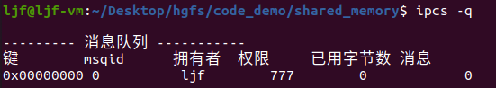
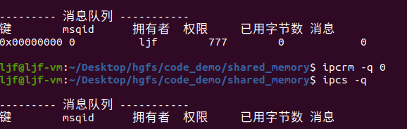

# 消息队列

System V 消息队列，是用于实现不同进程之间的数据传递。

它通过系统调用来创建和管理消息队列，以及向消息队列中添加和提取消息，从而实现进程间的通讯。

## 消息队列描述

消息队列是一个由内核维护的消息链表，每个节点包含了消息类型、发送者标识符、消息内容等信息。多个进程可以使用同一个消息队列进行通讯，进程可以使用特定的系统调用将消息写入到队列中，也可以从队列中读取消息。消息队列的读取消息操作分为两种：

- 选取首个消息：即最先被放入消息队列中的消息。
- 选取指定类型的消息：在消息队列中按照给定消息类型的顺序读取消息。
发送方进程将消息发送到消息队列后，就可以离开该队列，不必等待接收者进程的响应。这种异步通讯方式使得发送进程和接收进程实现松耦合，并且可以提高进程间通讯效率。

## 消息队列的特点

消息队列的主要特点如下：

- 双向通讯：消息队列可以支持多个进程同时向其中写入或读取消息，因此它具有双向通讯的特性。
- 异步通讯：消息的发送和接收是异步的，即发送方和接收方之间具有时间上的松耦合性。
- 分离数据和通讯：通过使用消息队列，可以实现进程间的数据传送，同时将数据和通讯过程分离开来，从而有助于提高程序的可维护性和可移植性。
  
消息队列在Linux/Unix系统中被广泛应用，例如在系统启动脚本中，守护进程与其他进程之间等场景中，都可以使用消息队列进行进程间通信。同时也存在着一些需要注意的问题，例如如何处理消息队列的阻塞、超时和消息队列容量、优先级不同消息等方面的问题。

## 消息队列的查看和删除

查看命令：`ipcs -q` ，其中 `-q` 指的是查看消息队列的IPC对象信息。  
- 示例：  
  

删除命令：`ipcrm -q msgid` ，其中 `-q` 指的是查看消息队列的IPC对象信息；`msgid`是要删除的消息队列的id。 
- 示例：  
  

## 消息队列的使用

### 消息队列的创建函数 msgget()
```C
#include <sys/types.h>
#include <sys/ipc.h>
#include <sys/msg.h>
 
int msgget(key_t key, int msgflg);
/*
功能：
    获取到与key相关的 System V 消息队列标识符。用于获取已存在的消息队列标识符（当msgflag是0且key不存在IPC_PRIVATE值时），或者创建新的消息队列。
参数：
    key：创建消息队列的唯一关键字,亲缘关系进程通信可指定为IPC_PRIVATE。
    msgflg：指定操作方式：
        #define IPC_CREAT	01000		// Create key if key does not exist.
        #define IPC_EXCL	02000		// Fail if key exists. 
        #define IPC_NOWAIT	04000		// Return error on wait. 
返回值：
    成功：返回创建的消息队列标识符（非负整数）
    失败：返回-1且错误设置到errno中
*/
```

**拓展描述**
- 如果`key`的值是`IPC_PRIVATE`，或者`key`的值不是`IPC_PRIVATE`但是不存在与`key`对应的消息队列，并且在 `msgflag` 中指定了`IPC_CREAT`，则会创建一个新的消息队列。
- 如果`msgflag`同时指定了`IPC_CREAT`和`IPC_EXCL`，并且这个 `key`的消息队列已经存在，那么`msgget()`将返回失败，并将`errno`设置为`EEXIST`。（类似于组合`O_CREAT|O_EXCL`对`open(2)`的效果）。
- 当创建新的消息队列时，并且其相关的数据结构`msgid_ds`（see msgctl(2)）会被初始化为如下结构：
  - `msg_perm.cuid` 和` msg_perm.uid` 设置为调用进程的有效用户ID；
  - `msg_perm.cgid` 和 `msg_perm.gid` 设置为调用进程的有效用户组ID；
  - `msg_perm.mode` 的最低9位有效位设置为 `msgflg` 的最低9位有效位；
  - `msg_qnum`, `msg_lspid`, `msg_lrpid`, `msg_stime`和 `msg_rtime` 设置为 0；
  - `msg_ctime` 设置为当前时间；  
  - `msg_qbytes` 设置为系统限值 `MSGMNB`。
如果消息队列已经存在，则验证权限，并检查是否标记为要销毁。

**使用注意事项**
- `Linux`或任何版本的`POSIX`都不需要包含`<sys/types.h>`和`<sys/ipc.h>`头文件。然而，一些旧的实现需要包含这些头文件，SVID也记录了它们的集群。旨在可移植到这种旧系统的应用程序可能需要包括这些头文件。
- `IPC_PRIVATE` 不是一个标志字段，而是一个 `key_t` 类型。如果这个特殊值用于 `key` ，则系统调用将忽略 `msgflg` 中除最低有效位9位之外的所有位，并创建一个新的消息队列。
- **`MSGMNI`**:是系统消息队列数量限值。在Linux 3.19之前，缺省值是根据当前系统内存计算出来的值；在Linux 3.19之后，缺省值是32000，可以在 `/proc/sys/kernel/msgmni` 文件更改。

### 消息队列的发送函数 msgsnd()
```C
#include <sys/types.h>
#include <sys/ipc.h>
#include <sys/msg.h>
 
int msgsnd(int msqid, const void *msgp, size_t msgsz, int msgflg);
// ssize_t msgrcv(int msqid, void *msgp, size_t msgsz, long msgtyp, int msgflg);
/*
功能：
    向 System V 消息队列发送消息。调用进程需要有写权限以访问目标消息队列。
    用于将指针 `msgp` 所指的消息副本追加到由 `msqid` 指定的消息队列中。
参数：
    msqid：消息队列标识符；
    msgp：是下面结构体类型的指针。
        struct msgbuf {
               long mtype;       // message type, must be > 0
               char mtext[1];    // message data
           };
        mtext 字段是一个大小为 msgsz（非负整数） 的数组（或其他结构）。长度为 0 的消息也是允许的。
        mtype 字段必须是严格的正整数值，这个值可被用于接收进程的消息选择。
    msgsz：msgp大小；
    msgflg：操作字；

返回值：
    成功：0
    失败：返回-1且错误设置到errno中
*/
```

**拓展描述**
- `msgsnd()` 函数用于将指针 `msgp` 所指的消息副本追加到由 `msqid` 指定的消息队列中。
- 如果有足够的空间，`msgsnd()` 将立即成功。队列容量由消息队列关联结构体中的 `msg_qbytes` 控制。在队列创建时，`msg_qbytes` 字段被初始化为 `MSGMNB` 字节大小，这个大小限值可以通过 `msgctl(2)` 函数修改。
- 一下情况时，消息队列可能被认为已满：
  - 队列中新增的消息导致总字节大小超过队列最大字节数限制，即超过 `msg_qbytes`;
  - 将另一个消息添加到队列中会导致队列中消息的总数量超过队列的最大大小(`msg_qbytes`字段)。为了为了防止无限数量的零长度消息被放置在队列上，这是必要的检查。尽管此类消息不包含数据，但它们仍然消耗(锁定)内核内存。
- 如果队列中没有足够的空间，`msgsnd()` 的缺省动作是保持阻塞直到有足够空间。当 `msgflg` 指定了 `IPC_NOWAIT` ，则会直接返回 `EAGAIN` 错误。
- `msgsnd()` 处于阻塞时，在以下情况也会直接返回错误：
  - 队列被删除，此时系统调用将以errno设置为EIDRM失败；
  - 捕获信号，此时系统调用将以`errno`设置为`EINTR`失败(请参见`signal(7)`)。(无论在建立信号处理程序时是否设置了`SA_RESTART`标志，由于信号处理程序中断而中断的`msgsnd()`调用永远不会自动重新启动。)
- 成功完成时，消息队列数据结构将更新如下：
  - `msg_lspid`设置为调用进程的PID。
  - `msg_qnum`递增1。
  - `msg_stime`设置为当前时间。

**使用注意事项**
- `Linux`或任何版本的`POSIX`都不需要包含`<sys/types.h>`和`<sys/ipc.h>`头文件。然而，一些旧的实现需要包含这些头文件，SVID也记录了它们的集群。旨在可移植到这种旧系统的应用程序可能需要包括这些头文件。
- 参数 `msgp` 在 `glibc 2.0` 和 `2.1` 指定为 `struct msgbuf *` 结构体指针的，在 `glibc 2.2` 及以后版本指定为 `void *` 类型，这是`SUSv2` 和 `SUSv3` 要求的。
- 以下对消息队列资源的限制会影响`msgsnd()`调用：
  - `MSGMAX` 消息文本的最大大小(以字节为单位)(默认值：8192字节)。  
    在Linux上，可以通过`/proc/sys/kernel/msgmax`读取和修改此限制。
  - `MSGMNB` 可以存储在消息队列中的字节数的最大数量(默认值：16384字节)。
    在Linux上，可以通过`/proc/sys/kernel/msgmnb`读取和修改此限制。特权进程(Linux:具有`CAP_SYS_RESOURCE`权限的进程)可以使用`msgctl(2)` `IPC_SET`操作将消息队列的大小增加到`MSGMNB`以上。
- 实现对消息头的数量(`MSGTQL`)和消息池中的字节数(`MSGPOOL`)没有内在的系统级限制。

### 消息队列的接收函数 msgrcv()
```C
#include <sys/types.h>
#include <sys/ipc.h>
#include <sys/msg.h>
 
// int msgsnd(int msqid, const void *msgp, size_t msgsz, int msgflg);
ssize_t msgrcv(int msqid, void *msgp, size_t msgsz, long msgtyp, int msgflg);
/*
功能：
    从 System V 消息队列接收消息。调用进程需要有读权限以访问目标消息队列。
    从指定的消息队列中删除消息并将其放入 msgp 指向的结构体的缓冲区中。
参数：
    msqid：消息队列标识符；
    msgp：是下面结构体类型的指针。
        struct msgbuf {
               long mtype;       // message type, must be > 0
               char mtext[1];    // message data
           };
        mtext 字段是一个大小为 msgsz（非负整数） 的数组（或其他结构）。长度为 0 的消息也是允许的。
        mtype 字段必须是严格的正整数值，这个值可被用于接收进程的消息选择。
    msgsz：参数指定了 msgp 所指的结构体 mtext 成员的最大字节数。
    msgtyp:
    msgflg：操作字；

返回值：
    成功：0
    失败：返回-1且错误设置到errno中
*/
```

**拓展描述**
- 如果消息文本的长度大于 `msgsz`,则其行为取决于 `msgflg` 是否包含 `MSG_NOERROR` 。如果`MSG_NOERROR` 被包含，则消息文本将被截断(截断的部分将丢失);如果 `MSG_NOERROR` 没有被包含，则消息不会从队列中删除，系统调用将返回 `-1`,并将 `errno` 设置为 `E2BIG`。除非在 `msgflg` 中包含 `MSG_COPY`,否则 `msgtyp` 参数指定请求的消息类型，如下所示：
  - 如果 msgtyp 为 0,则读取队列中的第一个消息。
  - 如果 msgtyp 大于 0,则读取类型为 msgtyp 的第一个消息，除非 msgflg 包含 MSG_EXCEPT,在这种情况下，将读取与 msgtyp 不相等的队列中第一个消息。
  - 如果 msgtyp 小于 0,则将读取类型小于等于绝对值 msgtyp 的最接近负值的消息。
- msgflg 参数是由零个或多个以下标志构造的位掩码：
  - **`IPC_NOWAIT`** (自 Linux 3.8)：如果没有请求类型的消息在队列中，则立即返回。系统调用将设置 errno 为 ENOMSG。
  - **`MSG_COPY`** (自 Linux 3.8)：非破坏性地获取队列中指定位置(按顺序编号为0)的指定消息的副本。
  - 由于 `MSG_COPY` 和 `MSG_EXCEPT` 以正交的方式修改了 `msgtyp` 的含义，因此它们不能同时存在于 `msgflg` 中。`MSG_COPY` 标志是为实现内核检查点恢复功能而添加的，仅在内核构建了 `CONFIG_CHECKPOINT_RESTORE` 选项时可用。
  - **`MSG_EXCEPT`**：用于读取队列中第一个消息类型与 `msgtyp` 不同的消息。
  - **`MSG_NOERROR`**：如果消息文本的长度超过 `msgsz` 字节，则截断消息文本。
- 如果没有请求类型的消息且未在 `msgflg` 中包含 `IPC_NOWAIT`,则调用进程将被阻塞，直到以下条件之一发生：
  - 所需的消息类型已放入队列中;
  - 消息队列已从系统中删除。在这种情况下，系统调用将设置 `errno` 为 `EIDRM`。
  - 调用进程捕获信号。在这种情况下，系统调用将设置 `errno` 为 `EINTR`。(`msgrcv()` 在信号处理程序自动重新启动之前从未因信号中断而自动重新启动，无论在建立信号处理程序时是否设置了 `SA_RESTART` 标志。)
- 成功完成时，消息队列数据结构将更新如下：
  - `msg_lrpid` 将设置为调用进程的进程 ID。
  - `msg_qnum` 将减去1。
  - `msg_rtime` 将设置为当前时间。

**使用注意事项**
- `Linux`或任何版本的`POSIX`都不需要包含`<sys/types.h>`和`<sys/ipc.h>`头文件。然而，一些旧的实现需要包含这些头文件，SVID也记录了它们的集群。旨在可移植到这种旧系统的应用程序可能需要包括这些头文件。
- 参数 `msgp` 在 `glibc 2.0` 和 `2.1` 指定为 `struct msgbuf *` 结构体指针的，在 `glibc 2.2` 及以后版本指定为 `void *` 类型，这是`SUSv2` 和 `SUSv3` 要求的。
- 以下对消息队列资源的限制会影响`msgsnd()`调用：
  - `MSGMAX` 消息文本的最大大小(以字节为单位)(默认值：8192字节)。  
    在Linux上，可以通过`/proc/sys/kernel/msgmax`读取和修改此限制。
  - `MSGMNB` 可以存储在消息队列中的字节数的最大数量(默认值：16384字节)。
    在Linux上，可以通过`/proc/sys/kernel/msgmnb`读取和修改此限制。特权进程(Linux:具有`CAP_SYS_RESOURCE`权限的进程)可以使用`msgctl(2)` `IPC_SET`操作将消息队列的大小增加到`MSGMNB`以上。
- 实现对消息头的数量(`MSGTQL`)和消息池中的字节数(`MSGPOOL`)没有内在的系统级限制。

### 消息队列的控制函数 msgctl()
```C
#include <sys/types.h>
#include <sys/ipc.h>
#include <sys/msg.h>
 
int msgctl(int msqid, int cmd, struct msqid_ds *buf);
/*
功能：
    在 System V 消息队列中执行由 cmd 指定的控制操作。
    从指定的消息队列中删除消息并将其放入 msgp 指向的结构体的缓冲区中。
参数：
    msqid：消息队列标识符；
    msgp：是下面结构体类型的指针。
        struct msgbuf {
               long mtype;       // message type, must be > 0
               char mtext[1];    // message data
           };
        mtext 字段是一个大小为 msgsz（非负整数） 的数组（或其他结构）。长度为 0 的消息也是允许的。
        mtype 字段必须是严格的正整数值，这个值可被用于接收进程的消息选择。
    msgsz：参数指定了 msgp 所指的结构体 mtext 成员的最大字节数。
    msgtyp:
    msgflg：操作字；

返回值：
    成功：0
    失败：返回-1且错误设置到errno中
*/
```

**拓展描述**
- msqid_ds 数据结构在 <sys/msg.h> 中定义如下：
  >```c
  >struct msqid_ds {
  >             struct ipc_perm msg_perm;     /* Ownership and permissions */
  >             time_t          msg_stime;    /* Time of last msgsnd(2) */
  >             time_t          msg_rtime;    /* Time of last msgrcv(2) */
  >             time_t          msg_ctime;    /* Time of last change */
  >             unsigned long   __msg_cbytes; /* Current number of bytes in
  >                                              queue (nonstandard) */
  >             msgqnum_t       msg_qnum;     /* Current number of messages
  >                                              in queue */
  >             msglen_t        msg_qbytes;   /* Maximum number of bytes
  >                                              allowed in queue */
  >             pid_t           msg_lspid;    /* PID of last msgsnd(2) */
  >             pid_t           msg_lrpid;    /* PID of last msgrcv(2) */
  >         };
  >```
- ipc_perm 结构体定义如下(使用 IPC_SET 可以设置高亮字段):
  >```c
  >struct ipc_perm {
  >             key_t          __key;       /* Key supplied to msgget(2) */
  >             uid_t          uid;         /* Effective UID of owner */
  >             gid_t          gid;         /* Effective GID of owner */
  >             uid_t          cuid;        /* Effective UID of creator */
  >             gid_t          cgid;        /* Effective GID of creator */
  >             unsigned short mode;        /* Permissions */
  >             unsigned short __seq;       /* Sequence number */
  >         };
  >```
- 有效的cmd命令有：
  - **IPC_STAT**  
    将与`msgid`相关联的内核数据结构中的信息复制到指向`buf`的`msqid_ds`结构体中。调用者必须具有消息队列的读取权限。
    
  - **IPC_SET**   
    将指向`buf`的`msqid_ds`结构体中一些成员的值写入到与此消息队列相关联的内核数据结构中，并更新其`msg_ctime`成员。可以更改以下字段：`msg_perm.uid`、`msg_perm.gid`和（`msg_perm.mode`的最低9位）。调用进程的有效用户ID必须匹配消息队列的所有者(`msg_perm.uid`)或创建者(`msg_perm.cuid`)，或者调用者必须具备特权。

  - **IPC_RMID**  
    标记内存段以便被销毁。只有在最后一个进程分离此内存段（即当与之相关的`msqid_ds`结构体中的`msg_nattch`成员为0时）才会实际删除该内存段。调用者必须是该内存段的所有者或创建者，或拥有对该内存段相应权限的用户。缓冲区参数`buf`将被忽略。

    如果一个内存段被标记为待销毁状态，则在`IPC_STAT`所检索的相关数据结构中，`msg_perm.mode`字段中（非标准）`msg_DEST`标志将被设置。

    调用者必须确保最终销毁该内存段；否则，该内存段中已经加载到内存或交换空间中的页面将会一直存在。

    另请参见`proc(5)`中关于`/proc/sys/kernel/msg_rmid_forced`的描述。

  - **IPC_INFO (Linux-specific)**  
    将系统范围内的共享内存限制和参数的信息返回到指向`buf`的结构体中。如果定义了`_GNU_SOURCE`特性测试宏，则该结构体的类型为`msginfo`（因此需要进行转换），其在`<sys/msg.h>`中定义：
    >```c
    >struct msginfo {
    >                  int msgpool; /* Size in kibibytes of buffer pool
    >                                  used to hold message data;
    >                                  unused within kernel */
    >                  int msgmap;  /* Maximum number of entries in message
    >                                  map; unused within kernel */
    >                  int msgmax;  /* Maximum number of bytes that can be
    >                                  written in a single message */
    >                  int msgmnb;  /* Maximum number of bytes that can be
    >                                  written to queue; used to initialize
    >                                  msg_qbytes during queue creation
    >                                  (msgget(2)) */
    >                  int msgmni;  /* Maximum number of message queues */
    >                  int msgssz;  /* Message segment size;
    >                                  unused within kernel */
    >                  int msgtql;  /* Maximum number of messages on all queues
    >                                  in system; unused within kernel */
    >                  unsigned short int msgseg;
    >                               /* Maximum number of segments;
    >                                  unused within kernel */
    >              };
    >```
  - **MSG_INFO (Linux-specific)**  
    返回一个包含与 `IPC_INFO` 相同信息的 `msginfo` 结构体，但返回了以下系统资源消耗相关的字段：`msgpool` 字段返回当前存在于系统中的消息队列数量；`msgmap` 字段返回系统中所有队列中总共的消息数量；`msgtql` 字段返回系统中所有队列中所有消息的总字节数。

  - **MSG_STAT (Linux-specific)**  
    返回类似于 `IPC_STAT` 的结构体 `msqid_ds`。但是，`msqid` 参数不是队列标识符，而是索引到内核内部数组中的信息，该数组维护着系统中所有消息队列的信息。

  - **MSG_STAT_ANY (Linux-specific, since Linux 4.17)**  
    返回类似于 `MSG_STAT` 的结构体 `msqid_ds`。但是，对于 `msqid` 没有检查 `msg_perm.mode` 的读取访问权限，这意味着任何用户都可以使用此操作(就像任何用户都可以读取 `/proc/sysvipc/msg` 以获取相同的信息一样)。  

**使用注意事项**
- `Linux`或任何版本的`POSIX`都不需要包含`<sys/types.h>`和`<sys/ipc.h>`头文件。然而，一些旧的实现需要包含这些头文件，SVID也记录了它们的集群。旨在可移植到这种旧系统的应用程序可能需要包括这些头文件。
- `IPC_INFO`、`MSG_STAT` 和 `MSG_INFO` 操作由 `ipcs(1)` 程序用于提供有关分配的资源的信息。将来可能会修改或将其移动到 `/proc` 文件系统接口中。
- 在 Linux 2.2 中，`msqid_ds` 结构体中的各个字段类型为短整型，在 Linux 2.4 中已成为长整型。为了利用这一点，应在 `glibc-2.1.91` 或更高版本下重新编译即可。(内核通过 cmd 中的 `IPC_64` 标志区分旧的新调用。
