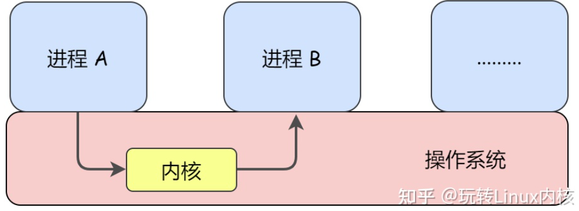
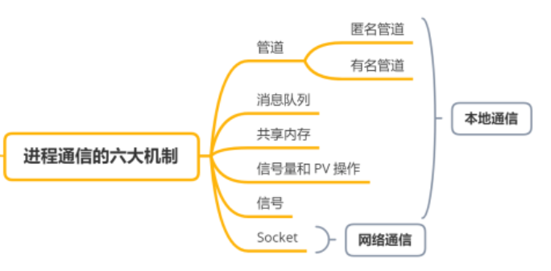

# 进程通信

## 进程通信的定义
进程通信（ InterProcess Communication，IPC）就是指进程之间的信息交换。

从操作系统层面直观的看：进程通信与线程不同，每个进程的用户地址空间都是独立的，一般而言一个进程不能直接访问另一个进程的地址空间，即进程之间无法像线程一样通过用户层面直接通信，也就无法通过全局变量的方式进行通信。

不过内核空间是每个进程都共享的，所以进程之间想要进行信息交换就必须通过内核。

## 进程通信的原理
进程间通信需要依赖内核，进程A与进程B通信，需要先写入信息到内核中的对象，再由进程B读出内核对象中的信息。

根据对象类型的不同，有不同的通信方式。

## 进程通信的类型

1. **管道**，也称作共享文件，分为无名管道和有名管道。管道在内存中是由队列实现的，入队为写，出队为读。  
    - **无名管道(pipe)**，调用 `pipe()` 函数，文件系统中没有文件名。
    - **有名管道(namedpipe)**，调用 `mkfifo()` 函数，文件系统中有文件名。。

2. **消息队列(messagequeue)**，UNIX下不同进程之间可实现共享资源的一种机制；UNIX允许不同进程将格式化的数据流以消息形式发送给任意进程。对消息队列具有操作权限的进程都可以使用msget完成对消息队列的操作控制。通过使用消息类型，进程可以按任何顺序读消息，或为消息安排优先级顺序。

3. **共享内存(shared memory)**，共享内存就是映射一段能被其他进程所访问的内存，这段共享内存由一个进程创建，但多个进程都可以访问。共享内存是最快的 IPC 方式，它是针对其他进程间通信方式运行效率低而专门设计的。它往往与其他通信机制，如信号量，配合使用，来实现进程间的同步和通信。

4. **信号量(semaphore)**，信号量是一个计数器，可以用来控制多个进程对共享资源的访问。它常作为一种锁机制，防止某进程正在访问共享资源时，其他进程也访问该资源。因此，主要作为进程间以及同一进程内不同线程之间的同步手段。

5. **信号(sinal)**，信号是一种比较复杂的通信方式，用于通知接收进程某个事件已经发生。

6. **套接字(socket)**，套接口也是一种进程间通信机制，与其他通信机制不同的是，它可用于不同设备及其间的进程通信。

## 几种通讯方式总结

1. **管道**：速度慢，容量有限，只有父子进程能通讯。

2. **有名管道**：任何进程间都能通讯，但速度慢。

3. **消息队列**：容量受到系统限制，且要注意第一次读的时候，要考虑上一次没有读完数据的问题。

4. **信号量**：不能传递复杂消息，只能用来同步。

5. **共享内存区**：能够很容易控制容量，速度快，但要保持同步，比如一个进程在写的时候，另一个进程要注意读写的问题，相当于线程中的线程安全，当然，共享内存区同样可以用作线程间通讯，不过没这个必要，线程间本来就已经共享了同一进程内的一块内存。
